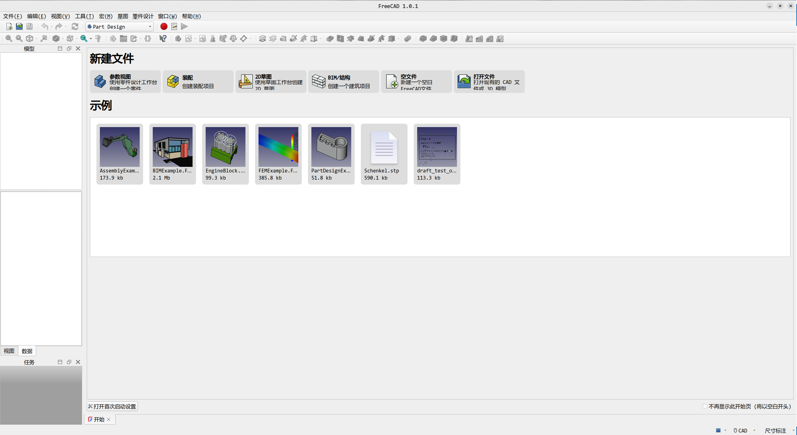

# 1. 编译安装
## 1.1. FreeCAD依赖
FreeCAD依赖比较多，单独安装每个依赖会遇到很多冲突问题，所以这里采取一种投机取巧的方式：   
1. 安装freecad-daily源。  
```bash
sudo add-apt-repository ppa:freecad-maintainers/freecad-daily
sudo apt update
```
2. 安装FreeCAD   
```bash
sudo apt install freecad-daily
```
如此，需要的依赖就全部安装好了。

## 1.2. 编译
### 1.2.1. 工程源码
下载FreeCAD源码，这里以FreeCAD-1.0.1为例，FreeCAD的有一些子模块在子Git仓库中，所以都要下载下来。    
```bash
zci@GEM:~/test/FreeCAD-1.0.1$ tree -L 1
.
├── cMake/
├── CMakeLists.txt
├── CMakePresets.json
├── CODE_OF_CONDUCT.md
├── conda/
├── contrib/
├── CONTRIBUTING.md
├── data/
├── LICENSE
├── package/
├── pixi.lock
├── pixi.toml
├── PRIVACY_POLICY.md
├── README.md
├── requirements.txt
├── rpkg.macros
├── SECURITY.md
├── src/
├── tests/
└── tools/

10 directories, 12 files
```


### 1.2.2. 编译
```bash
mkdir build
cd build  
cmake ..
make -j16
```
编译结果：  
```bash
zci@GEM:~/test/FreeCAD-1.0.1/build/bin$ tree 
.
├── FreeCAD
└── FreeCADCmd

1 directory, 2 files
```
运行：  
   

