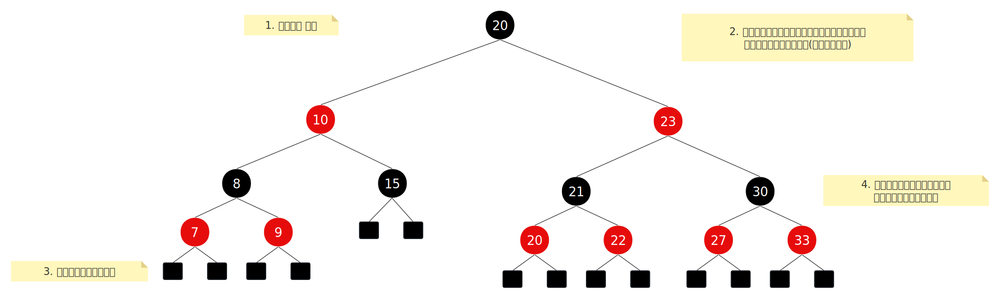

- [1. **什么是红黑树**](#1-什么是红黑树)
- [2. **Linux内核红黑树源码**](#2-linux内核红黑树源码)
	- [2.1. **节点**](#21-节点)
	- [2.2. **树**](#22-树)
	- [2.3. **红黑树操作**](#23-红黑树操作)


# 1. **什么是红黑树**
红黑树的基本形态如下：   
  
&emsp;&emsp;首先阅读一下比较正式的定义：“红黑树是一种平衡二叉查找树，它在二叉搜索树的基础上，通过附加的规则和操作（变色和旋转）来维持树的相对平衡，从而保证在最坏情况下基本操作（查找、插入、删除）的时间复杂度为O(log n)”。这里面有一些概念，例如`二叉树`、`二叉（搜索）树`、`平衡`。   

1. `搜索树`：&emsp;就是通过优化节点的排序，使得树可以使用二分法高效的搜索，说白了就是一种专门用于搜索的树结构。要想使用二分搜索，就需要节点满足：**左节点 < 当前节点 < 右节点**（中序遍历结果为升序），如此一来，在搜索中就可以选择进入左子树还是右子树。    
2. `平衡`：&emsp;二叉搜索树在数次插入和删除操作后，可能就变形了，变长了近似链表的结构，此时树的操作时间复杂度就可能变成了O(n)，也就是这颗树变成了一个高度为n，没有树杈的光杆司令，上图中的黄色背景是红黑树的特征，当树结构不符合特征时，就会触发修复操作（变色、旋转），修复的结果就是使得树更加的**矮胖**。   
3. `树高`: &emsp;红黑树的颜色规定，实际上是约束树的高度，尤其是**特征2**，任意一个节点，可能有多条路径到达叶子节点，由于黑色节点的数量必须相同，所以多条路径之间的高度相差不会不大(2倍)，最短路径就是没有红节点，最长路径就是红节点最多，但是由于红节不能连续，所以只能红黑相间，也就是数量一样多。


# 2. **Linux内核红黑树源码**
## 2.1. **节点**
源文件： /include/linux/rbtree_types.h    
```c
// 节点结构
struct rb_node {
	unsigned long  __rb_parent_color;   // 用最低位来表示本节点的颜色（0 表示红色，1 表示黑色），而其余高位用于存储父节点的地址。
	struct rb_node *rb_right;
	struct rb_node *rb_left;
} __attribute__((aligned(sizeof(long))));

// 根节点结构
struct rb_root {
	struct rb_node *rb_node;
};
```
- 节点定义的是树的链接关系，不包含用户数据。实际使用中需要定义一个用户结构（user_data），用户结构中包含节点(node)和用户数据(data)。   
- 同样，树结构中也是只有节点，树结构本身不管理用户数据，当我们遍历树并访问用户数据(data)时，就需要先找到树中的节点node，然后根据node地址找到user_data的地址，然后使用`.`/`->`来访问用户结构中的data成员。   


## 2.2. **树**
源文件: /include/linux/rbtree_types.h          
```c
#define RB_ROOT (struct rb_root) { NULL, } // 创建一个空树
```

## 2.3. **红黑树操作**
**提取出父节点的地址**（去除颜色信息），父节点地址和当前节点的颜色保存在一个unsigned long成员中：    

源文件： /include/linux/rbtree.h    
```c
/**
 *  r 是一个指向红黑树节点的指针。   
 *  3 的二进制表示为 000...0011，因此 ~3 是 111...1100，即掩码掉最低两位。
 */
#define rb_parent(r)   ((struct rb_node *)((r)->__rb_parent_color & ~3))
```

---

**从树节点指针获取包含它的用户结构体指针**： 通过树的节点地址获取用户节点地址：    
```c
/** 
 * 只是封装了container_of()
 */
#define	rb_entry(ptr, type, member) container_of(ptr, type, member)

// 安全版本，ptr为空指针时，直接返回NULL
#define rb_entry_safe(ptr, type, member) \
	({ typeof(ptr) ____ptr = (ptr); \
	   ____ptr ? rb_entry(____ptr, type, member) : NULL; \
	})
```
因为树的节点是用户节点的成员，所以知道树节点地址就可以使用container_of找到用户节点的地址，然后使用`.`/`->`方法访问用户节点的成员。   

---

 **判断树是否为空**：  
```c
/**   
 * READ_ONCE()使用volatile直接从内存中读取变量值。
 */
#define RB_EMPTY_ROOT(root)  (READ_ONCE((root)->rb_node) == NULL)
```

---

**判断给定节点是否已经插入树中**：   
```c
/** 
 *  当节点未被插入树时，__rb_parent_color 被设置为节点自身的地址（即 (unsigned long)(node)），因此通过比较可以判断节点状态。
 */
#define RB_EMPTY_NODE(node)  \
	((node)->__rb_parent_color == (unsigned long)(node))
```
---

**将节点标记为空节点**： 移除节点后使用：       
```c
/** 
 *  通常在节点被移除红黑树后调用此宏，确保其状态被重置，避免重复插入或未定义行为。
 */
#define RB_CLEAR_NODE(node)  \
	((node)->__rb_parent_color = (unsigned long)(node))
```

---

**插入新节点**：   
```c
// less: 用户节点的排序逻辑，
// 将node插入到树中，并修复平衡。
void rb_add(struct rb_node *node, struct rb_root *tree, bool (*less)(struct rb_node *, const struct rb_node *));
```

---

**移除节点**： 
```c
/** 
 * 从红黑树中删除指定节点，并修复树的平衡性。
 */
void rb_erase(struct rb_node *, struct rb_root *);  
```

---

**树遍历**：     
```c
/* 中序遍历 */
extern struct rb_node *rb_next(const struct rb_node *);   // 中序后继节点
extern struct rb_node *rb_prev(const struct rb_node *);   // 中序前驱节点
extern struct rb_node *rb_first(const struct rb_root *);  // 树中的第一个节点（最小值节点）
extern struct rb_node *rb_last(const struct rb_root *);   // 树中的最后一个节点（最大值节点）

/* 也提供了后序遍历 */
extern struct rb_node *rb_first_postorder(const struct rb_root *);  // 返回红黑树中后序遍历的第一个节点（最左的叶子节点）。  
extern struct rb_node *rb_next_postorder(const struct rb_node *);   // 返回当前节点的后序后继节点。   

/** 
 *  以 后序遍历 的方式安全地遍历红黑树（rb_root），允许在遍历过程中删除当前节点（pos，包含树节点的用户节点）。
 */
#define rbtree_postorder_for_each_entry_safe(pos, n, root, field) \
	for (pos = rb_entry_safe(rb_first_postorder(root), typeof(*pos), field); \
	     pos && ({ n = rb_entry_safe(rb_next_postorder(&pos->field), typeof(*pos), field); 1; }); \     // 判断当前用户节点是否为NULL，并且缓存下一个用户节点，以便于安全删除当前节点
	     pos = n)
```
- 后续遍历用于依赖子节点的处理顺序，例如释放资源，先释放子节点，再释放父节点。  
- 中序遍历用于有序访问（如最小值到最大值）。   
- { n = rb_entry_safe(rb_next_postorder(&pos->field), typeof(*pos), field); 1; }，使用了GCC的扩展语法 —— 复合语句表达式：`{expression; 1;};`,始终返回1。

---

**替换节点**： 直接替换节点，无需重新平衡树：  
```c
/** 
 *  将 victim 节点从红黑树中替换为 new 节点。
 *  内部使用原子操作，无需锁保护。
 *  适用于非 RCU 环境，用于普通上下文（如进程上下文）。
 *  new 必须与 victim 具有相同的子节点和颜色，否则可能破坏红黑树的性质。
 */
extern void rb_replace_node(struct rb_node *victim, struct rb_node *new,
			    struct rb_root *root);

/** 
 *  在 RCU（Read-Copy-Update）环境中替换节点。
 *  允许在替换过程中存在读者，通过 RCU 机制确保旧节点在读者完成访问后才被释放。
 * 适用于 RCU 上下文，如中断上下文或需要无锁并发的场景。
 */
extern void rb_replace_node_rcu(struct rb_node *victim, struct rb_node *new,
				struct rb_root *root);
```

---

**查找节点**  
```c
/**
 * 查找与 node 等价的节点
 * 若找到，返回匹配的节点。
 * 若未找到，将 node 插入树中，并返回 NULL。  
 */
static __always_inline struct rb_node *
rb_find_add(struct rb_node *node, struct rb_root *tree,
	    int (*cmp)(struct rb_node *, const struct rb_node *))
{
	struct rb_node **link = &tree->rb_node;
	struct rb_node *parent = NULL;
	int c;

	while (*link) {
		parent = *link;
		c = cmp(node, parent);

		if (c < 0)
			link = &parent->rb_left;
		else if (c > 0)
			link = &parent->rb_right;
		else
			return parent;
	}

	// 插入节点，并平衡
	rb_link_node(node, parent, link);
	rb_insert_color(node, tree);
	return NULL;
}
```

---

**仅查找**  
```c
/**
 *  返回匹配的节点指针，若未找到，返回 NULL。
 */
static __always_inline struct rb_node *
rb_find(const void *key, const struct rb_root *tree,
	int (*cmp)(const void *key, const struct rb_node *))
{
	struct rb_node *node = tree->rb_node;

	while (node) {
		int c = cmp(key, node);

		if (c < 0)
			node = node->rb_left;
		else if (c > 0)
			node = node->rb_right;
		else
			return node;
	}

	return NULL;
}
```

---

**查找红黑树中所有与 key 等价的节点，按中序顺序依次访问** 
```c
#define rb_for_each(node, key, tree, cmp) \
	for ((node) = rb_find_first((key), (tree), (cmp)); \
	     (node); (node) = rb_next_match((key), (node), (cmp)))
```

---

**查找与 key 等价的 最左边的节点**:
```c
/**
 * 若找到：  返回最左边的匹配节点指针。
 * 若未找到：返回 NULL
 */
static __always_inline struct rb_node *
rb_find_first(const void *key, const struct rb_root *tree,
	      int (*cmp)(const void *key, const struct rb_node *))
{
	struct rb_node *node = tree->rb_node;
	struct rb_node *match = NULL;

	while (node) {
		int c = cmp(key, node);

		if (c <= 0) {
			if (!c)
				match = node;
			node = node->rb_left;
		} else if (c > 0) {
			node = node->rb_right;
		}
	}

	return match;
}
```
- 处理重复键，与 rb_next_match 配合使用，实现完整的匹配项遍历。


---

**从当前节点 node 开始，查找与 key 等价的 下一个节点**
```c
/**
 *  若找到：  返回下一个匹配的节点指针。
 *  若未找到：返回 NULL。
 */
static __always_inline struct rb_node *
rb_next_match(const void *key, struct rb_node *node,
	      int (*cmp)(const void *key, const struct rb_node *))
{
	node = rb_next(node);
	if (node && cmp(key, node))
		node = NULL;
	return node;
}
```
- 处理重复键，与 rb_find_first 配合使用，实现完整的匹配项遍历。


