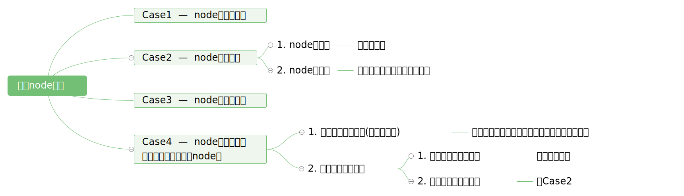
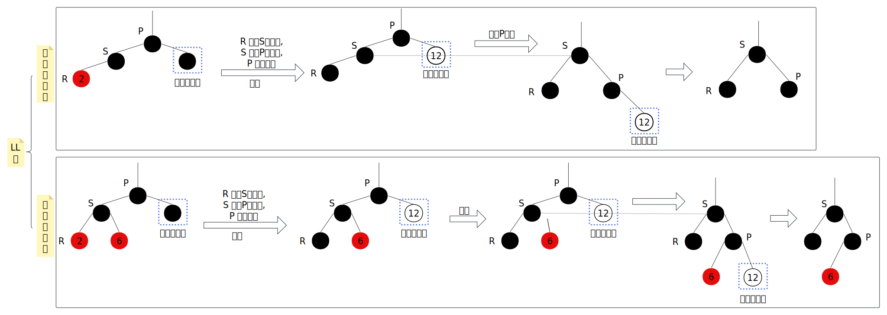
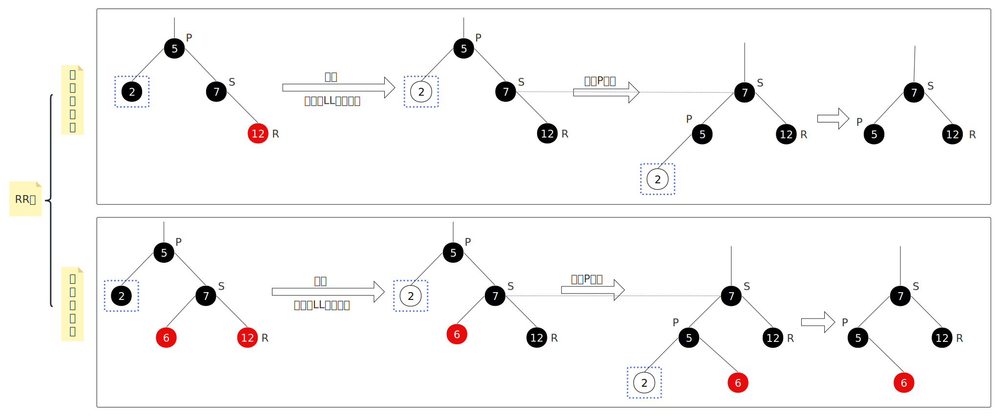
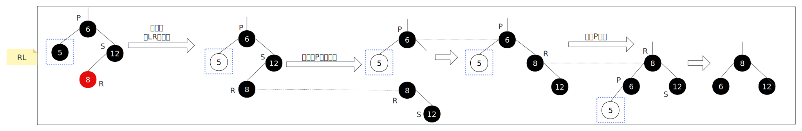
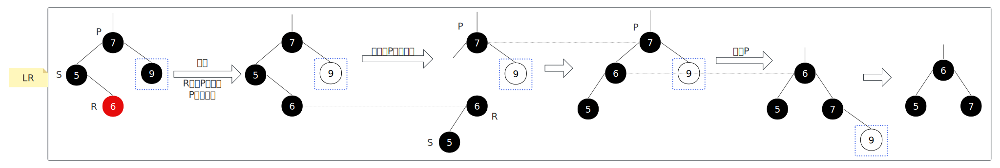
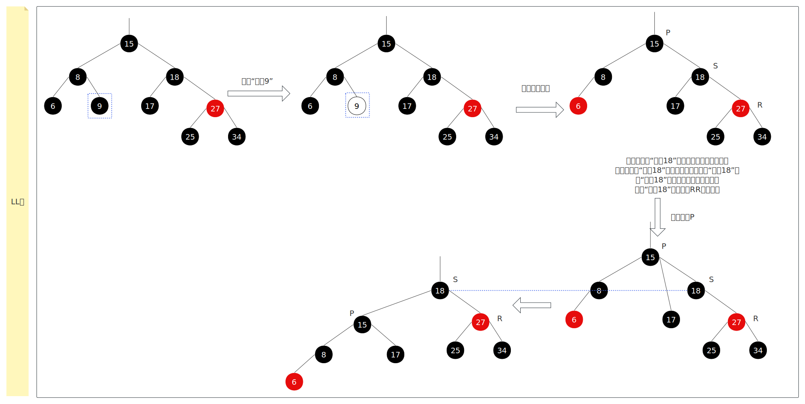
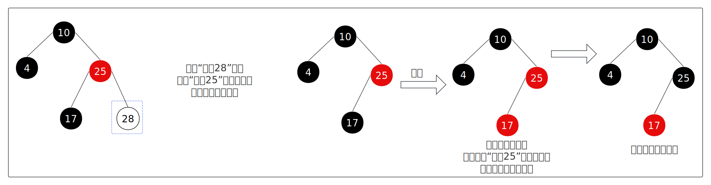
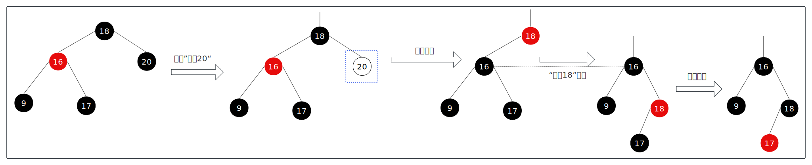

- [1. **删除节点的并平衡的整体思路**](#1-删除节点的并平衡的整体思路)
- [2. **删除黑色节点**](#2-删除黑色节点)
  - [2.1. **兄弟是黑色**](#21-兄弟是黑色)
  - [2.2. **兄弟是红的**](#22-兄弟是红的)
- [3. **其他**](#3-其他)

# 1. **删除节点的并平衡的整体思路**
移除节点分为集中情况，如下图所示：   

&emsp;&emsp;比较麻烦的是Case2-2和Case4-2-2，Case2-2就是删除一个黑色节点（node），导致经过node节点的路径中黑节点少了一个，这违反了红黑树的平衡特性。而Case4-2-2需要使用后继节点（successor）替补被删除的节点，相当将successor从它原本的位置删除，也就说转换为删除黑色节点的问题了。    

&emsp;&emsp;Case4中，后继节点就是node在右子树中的最大节点（最左节点），所以后继节点肯定没有左孩子，可能有右孩子，也可能孑然一身。如果有右孩子，那一定是“**黑——红**”布局，就是说successor是黑色的，它的右孩子是红色的，否则会破坏第一篇章的**特征2**。    

下面主要讲解删除黑色节点的情况。

# 2. **删除黑色节点**
删除后会破坏特征2，也就所说经过该节点的路径都少一个黑节点，此时要根据兄弟节点的颜色分为2种情况讨论： 兄弟是黑的、兄弟是红的。    

## 2.1. **兄弟是黑色**
**兄弟节点至少一个红孩子**：  

---
**兄弟节点两个孩子都是黑孩**： 
   
其他类型和前面的类似。    
前面展示的情形中，被删除节点的父节点都是黑色的，如果是红色的只需要变色即可，如下所示：     
      
 
---

## 2.2. **兄弟是红的**   
   
总结为：变色 + 旋转 + 变色。

# 3. **其他**
如果要删除的节点的父节点是根节点，此时只需要把要删除的节点的兄弟节点变成红色即可。  