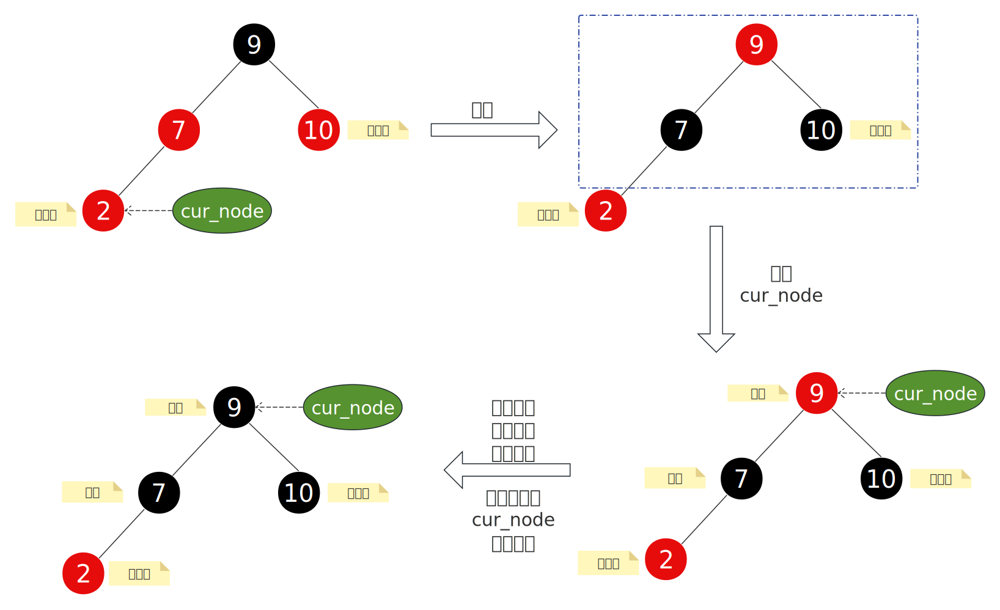
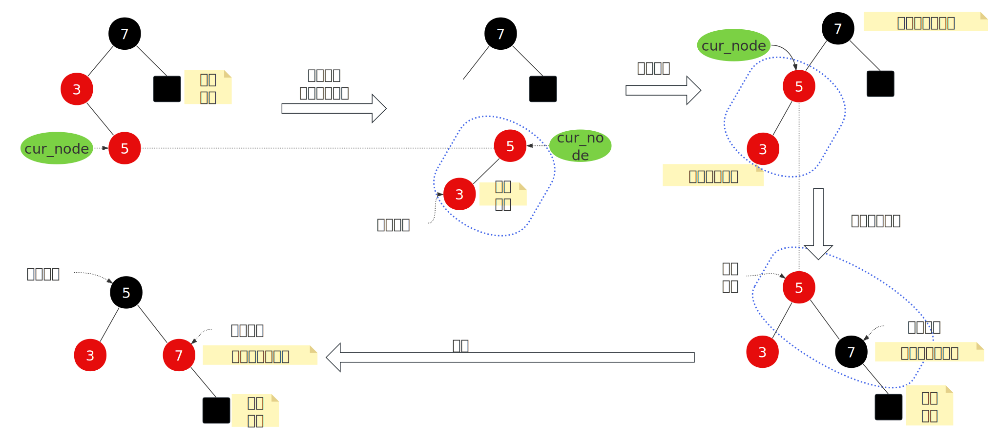
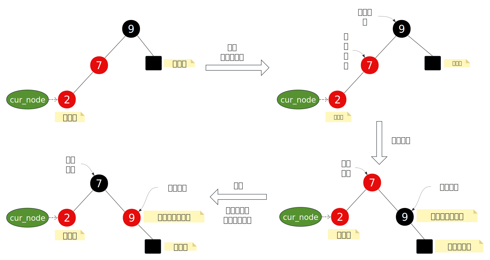
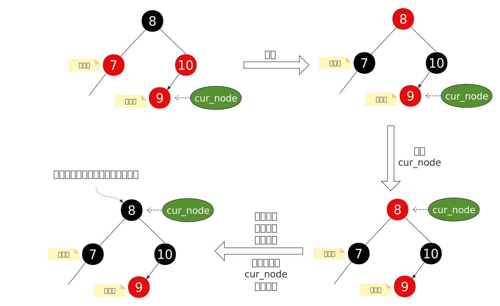
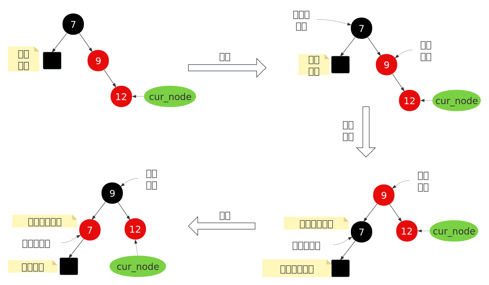
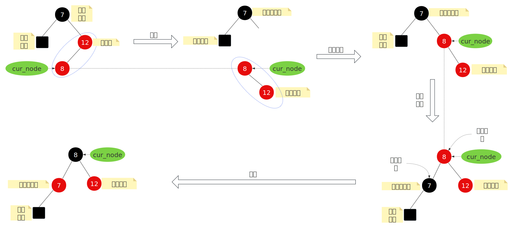

- [1. **增强型与非增强型**](#1-增强型与非增强型)
- [2. **插入节点**](#2-插入节点)
  - [2.1. **插入节点是根节点**](#21-插入节点是根节点)
  - [2.2. **父节点是黑色的**](#22-父节点是黑色的)
  - [2.3. **父节点是红色的**](#23-父节点是红色的)
    - [2.3.1. **父节点是祖父节点的左子节点**](#231-父节点是祖父节点的左子节点)
    - [2.3.2. **父节点是祖父节点的右子节点**](#232-父节点是祖父节点的右子节点)


# 1. **增强型与非增强型**
Linux 内核中的红黑树（Red-Black Tree）提供了两种实现方式：
- 非增强型（Non-augmented）：仅维护基本的树结构。
- 增强型（Augmented）：在节点中维护额外信息（如子树大小、区间范围等），支持更复杂操作。

为了统一接口并减少代码冗余，rb_insert_color() 和 rb_erase() 使用通用的增强型实现，但在非增强场景中通过 虚拟回调函数（dummy callbacks） 和 编译器优化 来避免性能开销。
```c
/**
 * 所有函数声明为 static inline，且函数体为空，用于在非增强场景中作为增强回调函数的占位符。
 */
static inline void dummy_propagate(struct rb_node *node, struct rb_node *stop) {}
static inline void dummy_copy(struct rb_node *old, struct rb_node *new) {}
static inline void dummy_rotate(struct rb_node *old, struct rb_node *new) {}
```
本片只记录非增强型。


# 2. **插入节点**
上一篇章的红黑树示意图中，提到4个特征，插入节点时可能会破坏这4个特征中的一个或多个，此时就需要进行恢复。考虑到新节点是红色的，我们分为下面三种情况（Linux红黑树平衡逻辑）进行讨论： 

- Case1  插入节点是根节点    
- Case2  插入节点的父节点是黑色的   
- Case3  插入节点的父节点是红色的   
  - Case3-1 父节点是祖父节点的左子节点   
    - Case3-1-1 叔叔是红色的   
    - Case3-1-2 叔叔是黑色的（Case3-1-2-1、Case3-1-2-2）   
  - Case3-2 父节点是祖父节点的右子节点   
    - Case3-2-1 叔叔是红色的  
    - Case3-2-2 叔叔是黑色的（Case3-2-2-1、Case3-2-2-2）  


##  2.1. **插入节点是根节点**
直接将节点改为黑色就完事了，如果插入节点不是根节点，那就看叔叔节点的颜色。  
##  2.2. **父节点是黑色的**  
平衡没有破坏，直接返回。   

## 2.3. **父节点是红色的**
根据父节点是祖父节点的左孩子还是右孩子分为两种情况讨论。   

### 2.3.1. **父节点是祖父节点的左子节点**

**Case3-1-1  叔叔节点是红色的**       
只需变色操作，每次修复后，cur_node都要更新到爷爷节点，并再次判断平衡是否有破坏，也就是将之前的祖父节点作为cur_node，同样parent，gparent也要更新。 
  

**Case3-1-2  叔叔节点是黑色的**    
此时有分为两种情况&emsp;：&emsp;新节点是父节点的左孩子、新节点是父节点的右还是。    

1. 新节点是父节点的右孩子&emsp;:&emsp; 左旋 + 右旋 + 变色      
    

-----------
2. 新节点是父节点的左孩子&emsp;:&emsp; 右旋 + 变色       



### 2.3.2. **父节点是祖父节点的右子节点**

**Case3-2-1  叔叔节点是红色的**     

只需变色操作，每次修复后，cur_node都要更新到爷爷节点，并再次判断平衡是否有破坏，也就是将之前的祖父节点作为cur_node，同样parent，gparent也要更新。 
   


**Case3-2-2  叔叔节点是黑色的**

1. 新节点是父节点的右孩子&emsp;:&emsp;左旋 + 变色


------
2. 新节点是父节点的左孩子



