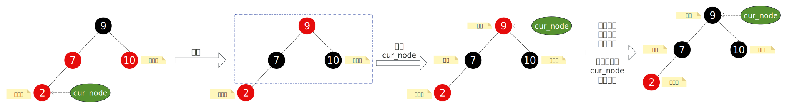
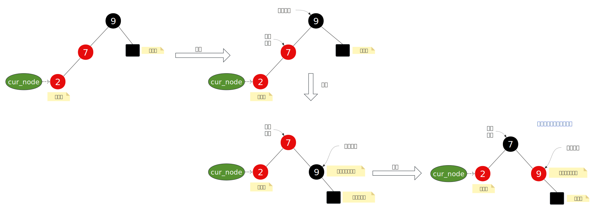
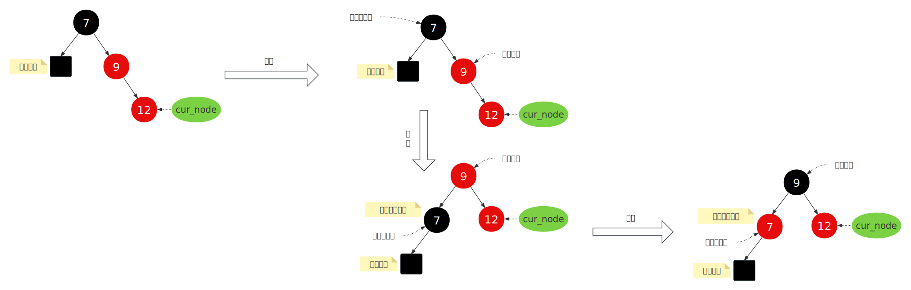
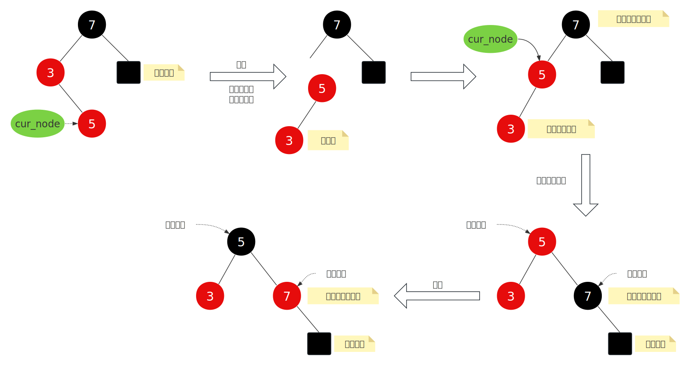
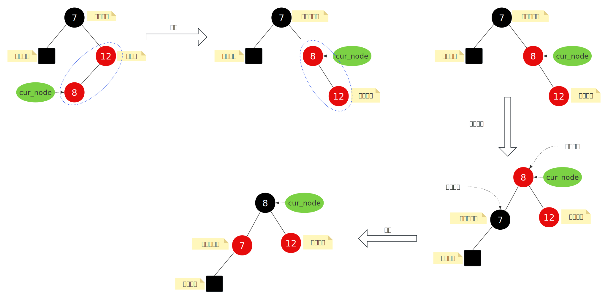

- [1. **增强型与非增强型**](#1-增强型与非增强型)
- [2. **平衡破坏与修复**](#2-平衡破坏与修复)
- [3. **插入节点源码**](#3-插入节点源码)
- [4.](#4)


# 1. **增强型与非增强型**
Linux 内核中的红黑树（Red-Black Tree）提供了两种实现方式：
- 非增强型（Non-augmented）：仅维护基本的树结构。
- 增强型（Augmented）：在节点中维护额外信息（如子树大小、区间范围等），支持更复杂操作。

为了统一接口并减少代码冗余，rb_insert_color() 和 rb_erase() 使用通用的增强型实现，但在非增强场景中通过 虚拟回调函数（dummy callbacks） 和 编译器优化 来避免性能开销。
```c
/**
 * 所有函数声明为 static inline，且函数体为空，用于在非增强场景中作为增强回调函数的占位符。
 */
static inline void dummy_propagate(struct rb_node *node, struct rb_node *stop) {}
static inline void dummy_copy(struct rb_node *old, struct rb_node *new) {}
static inline void dummy_rotate(struct rb_node *old, struct rb_node *new) {}
```
本片只记录非增强型。

# 2. **平衡破坏与修复**
上一篇章的红黑树示意图中，提到4个特征，插入节点时可能会破坏这4个特征中的一个或多个，此时就需要进行恢复。考虑到新节点是红色的，我们可以将破坏的情况分为3中： 
1. **插入节点是根节点**，直接将节点改为黑色就完事了，如果插入节点不是根节点，那就看叔叔节点的颜色。  
2. **插入节点的叔叔是红色**： 此时只需要变色。      
  
每次修复后，cur_node都要更新到爷爷节点，并再次判断平衡是否有破坏。        

3. **插入节点的叔叔是黑色**： 此时分为LL、RR、 LR、RL。        

**LL类型**： 右旋 + 变色 -----------------------------------------------------------------------------------------------------------------------------------------------------------------


**RR类型**：左旋 + 变色 -----------------------------------------------------------------------------------------------------------------------------------------------------------------
  

**LR类型**: 左旋 + 右旋 + 变色-----------------------------------------------------------------------------------------------------------------------------------------------------------------
   

**RL类型**:  右旋 + 左旋 + 变色-----------------------------------------------------------------------------------------------------------------------------------------------------------------



# 3. **插入节点源码** 
上节讲到调用`rb_add`插入节点时会调用两个重要函数，`rb_link_node`，`rb_insert_color`。其中rb_link_node用来将新节点链接到树中，而rb_insert_color用来修复平衡，本片章重点讲解该函数。    
  
```c
// tools/lib/rbtree.c
void rb_insert_color(struct rb_node *node, struct rb_root *root)
{
	__rb_insert(node, root, dummy_rotate);
}
```
插入节点不一定会破环平衡性，是否产生破环，要分为3中情况来分析：      
1. 插入节点是根节点。
2. 插入节点的叔叔是红色的。
3. 插入节点的叔叔是黑色的。

对于第1中情况，直接将插入节点设置为黑色即可，


```c
/**	
 *  最后一个参数（augment_rotate）是给增强型红黑树用的，在非增强型红黑树中只是传入一个占位符，无需理会。  
 */
static __always_inline void
__rb_insert(struct rb_node *node, struct rb_root *root,
	    void (*augment_rotate)(struct rb_node *old, struct rb_node *new))
{
	struct rb_node *parent = rb_red_parent(node);  // 获取红色节点的父节点指针，新节点默认初始化为红色。 
	struct rb_node *gparent, *tmp；

	while (true) {
		// 如果parent为NULL，则说明node是根节点，将其设为黑色，结束循环。
		if (unlikely(!parent)) {      // unlikely使用了linux上的一种性能优化手段，我们暂时理解为将“!parent”转换为bool值。
			rb_set_parent_color(node, NULL, RB_BLACK);
			break;
		}

		if(rb_is_black(parent))
			break;   // 父节点是黑色，无需修复（性质未被破坏），退出。

		// 代码能走到这里，说明父节点是红色（需修复），此时需要获取祖父节点和叔节点
		gparent = rb_red_parent(parent);
		tmp = gparent->rb_right; // 获取叔节点

		if (parent != tmp) {  /* 情况1： 父节点是祖父节点的左子节点 */ 
			
			/* 情况1-1： 叔节点也是红色的 */
			if (tmp && rb_is_red(tmp)) {   
				// 进行颜色平衡
				rb_set_parent_color(tmp, gparent, RB_BLACK);     // 将叔节点设置为黑色。  
				rb_set_parent_color(parent, gparent, RB_BLACK);  // 将父节点设置为黑色。  
				
				// 设置了叔节点和父节点的颜色，相应也要更新祖父节点的颜色
 
				node = gparent;             // 当前节点更新到祖父节点
				parent = rb_parent(node); 
				rb_set_parent_color(node, parent, RB_RED); // 将祖父节点设置为红色。

				continue; // 上面是这种局部修复可能会导致整体的不平衡，所以还要继续向上递归检查。
			}

			/* 情况1-2： 叔节点是黑色的，新插入的节点是父节点的右子节点 */
			tmp = parent->rb_right;
			if (node == tmp) {  
				tmp = node->rb_left;
				// 左旋(中序遍历结果不变)，n为新插入节点，p为父节点
				WRITE_ONCE(parent->rb_right, tmp);  // 新节点n与父节点p交换位置
				 /**
				 *      G             G      G      G
				 *     / \           / \    / \    / \
				 *    p   U  -->    n   U   p  U    
				 *     \             \      \
				 *      n             p     null
				 */
				WRITE_ONCE(node->rb_left, parent);  // 将p设置为n的左子节点
				 /**
				 *      G             G
				 *     / \           / \
				 *    n   U  -->    n   U
				 *     \           /
				 *      p         p
				 */
				 // 经过上面的操作，中序遍历的顺序没有改变。


				if (tmp) 
				{
					rb_set_parent_color(tmp, parent, RB_BLACK);  // 新节点设置为黑色
				}
				rb_set_parent_color(parent, node, RB_RED);       // 原来的父节点设置为红色，此时可能违反红黑树性质，会在“情况1-3” 修复。
				augment_rotate(parent, node);
				parent = node;
				tmp = node->rb_right;
			}

			/* 情况1-3： 父节点是红色，叔节点是黑色，且当前节点是父节点的左子节点 */
			// 右旋
			WRITE_ONCE(gparent->rb_left, tmp);    /* == parent->rb_right */
			/*
			 *        G           P
			 *       / \         / \
			 *      p   U  -->  n   g
			 *     /                 \
			 *    n                   U
			 */
			WRITE_ONCE(parent->rb_right, gparent);
			/*
			 *        G           P
			 *       / \         / \
			 *      p   U  -->  n   g
			 *     /                 \
			 *    n                   U
			 */

			if (tmp)
				rb_set_parent_color(tmp, gparent, RB_BLACK);
			__rb_rotate_set_parents(gparent, parent, root, RB_RED);
			augment_rotate(gparent, parent);
			break;
		} 
		else  /* 情况2： 父节点是祖父节点的右子节点 */
		{
			tmp = gparent->rb_left;
			if (tmp && rb_is_red(tmp)) {
				/* Case 1 - color flips */
				rb_set_parent_color(tmp, gparent, RB_BLACK);
				rb_set_parent_color(parent, gparent, RB_BLACK);
				node = gparent;
				parent = rb_parent(node);
				rb_set_parent_color(node, parent, RB_RED);
				continue;
			}

			tmp = parent->rb_left;
			if (node == tmp) {
				/* Case 2 - right rotate at parent */
				tmp = node->rb_right;
				WRITE_ONCE(parent->rb_left, tmp);
				WRITE_ONCE(node->rb_right, parent);
				if (tmp)
					rb_set_parent_color(tmp, parent,
							    RB_BLACK);
				rb_set_parent_color(parent, node, RB_RED);
				augment_rotate(parent, node);
				parent = node;
				tmp = node->rb_left;
			}

			/* Case 3 - left rotate at gparent */
			WRITE_ONCE(gparent->rb_right, tmp); /* == parent->rb_left */
			WRITE_ONCE(parent->rb_left, gparent);
			if (tmp)
				rb_set_parent_color(tmp, gparent, RB_BLACK);
			__rb_rotate_set_parents(gparent, parent, root, RB_RED);
			augment_rotate(gparent, parent);
			break;
		}
	}
}
```

# 4. 

