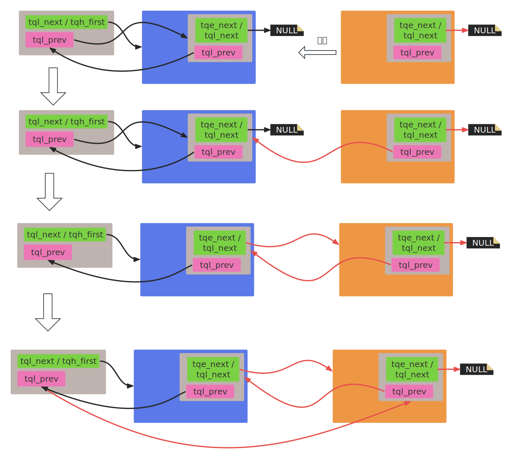

- [1. **队列定义**](#1-队列定义)
- [2. **队列操作宏**](#2-队列操作宏)


QTAILQ 是 QEMU 实现的一种尾队列（Tail Queue）结构，基于双向链表，并且维护了一个指向队列尾部的指针，使得在尾部插入操作更高效。代码位于include/qemu/queue.h。    

# 1. **队列定义**  

**队列连接结构：**  
```c
typedef struct QTailQLink {
    void *tql_next;
    struct QTailQLink *tql_prev;
} QTailQLink;
```

**队列头结构定义：**  
从队列头部的定义可以看出来，这个队列设计了两种模式： `正向链表模式`、`双向链表模式`，用户可以根据需求进行实例化。    

```c
/*
 * 队列头，根据用户类型type创建一个表示队列头的类型，
 * 由于是联合体，初始化时使用tqh_first成员，就表示正向链表模式。
 * 在循环双向链表模式下tqh_circ.tql_next和tqh_first指的是一个东西（类型为用户节点），
 * 所以循环双向链表模式下会使用tqh_first读取到的数据就是tqe_circ.tql_next。
 */
#define QTAILQ_HEAD(name, type)                                         \
union name {                                                            \
        struct type *tqh_first;                                         \
        QTailQLink tqh_circ;                                            \
}

/* 
 * 链表头初始化，
 * 默认作为循环双向链表模式来初始化的，
 * prev指向自己，得到一个空的循环双向链表。
 */
#define QTAILQ_HEAD_INITIALIZER(head)                                   \
        { .tqh_circ = { NULL, &(head).tqh_circ } }

/* 
 * 节点的连接域，根据用户类型type创建一个表示节点连接域的类型。
 * 初始化时使用的是tqe_circ成员，就是循环双向链表模式。
 * 在循环双向链表模式下tqe_circ.tql_next和tqe_next指的是一个东西，
 * 所以循环双向链表模式下会使用tqe_next读取到的数据就是tqe_circ.tql_next。
 */
#define QTAILQ_ENTRY(type)                                              \
union {                                                                 \
        struct type *tqe_next;                                          \
        QTailQLink tqe_circ;                                            \
}
```

工程中，用户在自定义节点结构中包含一个`QTAILQ_ENTRY（UUSER_TYPE）`类型的成员，创建一个队列的代码如下：  
```c
// 用户节点结构
typedef struct Qcow2DiscardRegion {
    BlockDriverState *bs;
    uint64_t offset;
    uint64_t bytes;
    QTAILQ_ENTRY(Qcow2DiscardRegion) next;   // 节点连接域
} Qcow2DiscardRegion;

// 队列头部
QTAILQ_HEAD (, Qcow2DiscardRegion) discards;  // discards就代表一个队列了
```


# 2. **队列操作宏**   

```c
#define QTAILQ_INIT(head) do {                                          \
        (head)->tqh_first = NULL;                                       \
        (head)->tqh_circ.tql_prev = &(head)->tqh_circ;                  \
} while (/*CONSTCOND*/0)
```
这个没有什么好说的，和QTAILQ_HEAD_INITIALIZER宏的功能是一样的，队列初始化。   

---

**插入节点：**  
```c
#define QTAILQ_INSERT_HEAD(head, elm, field) do {                       \
        if (((elm)->field.tqe_next = (head)->tqh_first) != NULL)        \
            (head)->tqh_first->field.tqe_circ.tql_prev =                \
                &(elm)->field.tqe_circ;                                 \
        else                                                            \
            (head)->tqh_circ.tql_prev = &(elm)->field.tqe_circ;         \
        (head)->tqh_first = (elm);                                      \
        (elm)->field.tqe_circ.tql_prev = &(head)->tqh_circ;             \
} while (/*CONSTCOND*/0)
```
- head： 队列头。   
- elm： 用户节点对象的指针。   
- field： 用户节点中的节点连接域。    

将给定节点（elm）插入到头部，if处理非空队列，else处理空队列。   
  

---

```c
#define QTAILQ_INSERT_TAIL(head, elm, field) do {                       \
        (elm)->field.tqe_next = NULL;                                   \
        (elm)->field.tqe_circ.tql_prev = (head)->tqh_circ.tql_prev;     \
        (head)->tqh_circ.tql_prev->tql_next = (elm);                    \
        (head)->tqh_circ.tql_prev = &(elm)->field.tqe_circ;             \
} while (/*CONSTCOND*/0)
```
将给定节点插入到尾部，头部维护了一个指向尾部的指针。   
   

---
```c
QTAILQ_INSERT_AFTER(head, listelm, elm, field)    // 在指定节点（listelm）后面插入
QTAILQ_INSERT_BEFORE(listelm, elm, field)         // 在指定节点（listelm）前面插入
```

---
**移除节点：**  
```c
QTAILQ_REMOVE(head, elm, field)                   // 移除指定节点，会判断该节点是否为尾节点
QTAILQ_REMOVE_SEVERAL(head, left, right, field)   // 从尾队列中移除[left, right]范围内的所有节点，包含left和right节点本身，会判断right是否为尾节点。
```

---
**正序遍历队列：**  
```c
QTAILQ_FOREACH(var, head, field)                 // 遍历尾队列（TAILQ）中的所有节点，只读场景，var用来保存当前节点以便于循环体中使用   
QTAILQ_FOREACH_SAFE(var, head, field, next_var)  // 安全遍历尾队列（TAILQ）中的所有节点，提前保存下一个节点（next_var），允许在遍历过程中删除当前节点后循环可以继续。
```

---
**逆序遍历队列：**
```c
QTAILQ_FOREACH_REVERSE(var, head, field)                   // 逆序遍历队列，只读
QTAILQ_FOREACH_REVERSE_SAFE(var, head, field, prev_var)    // 逆序遍历队列，支持安全删除
```

---
**访问队列：**
```c
QTAILQ_EMPTY(head)         // 判断队列是否为空
QTAILQ_IN_USE(elm, field)  // 指定节点是否在队列中

QTAILQ_FIRST(head)         // 获取队列的第一个节点
QTAILQ_LAST(head)          // 获取队列的最后一个节点

QTAILQ_NEXT(elm, field)    // 获取指定节点的下一个节点
QTAILQ_PREV(elm, field)    // 获取前一个节点
```


