- [1. **整体设计**](#1-整体设计)
- [2. **抽象基类实现**](#2-抽象基类实现)
- [3. **核心抽象类型实现**](#3-核心抽象类型实现)


# 1. **整体设计**
开源项目 — [DeskFlow](https://github.com/deskflow/deskflow)，该项目用于输入设备模拟，键盘鼠标多设备共享，现在将跨平台层的代码框架提取提出来学习学习。   
  

**第1层  —  接口类的公共基类**  
所有类均继承自 IInterface 接口类，可以看做是跨平台的框架的根类型。  

**第2层  —  核心抽象类型** 
|功能|核心抽象类型|
|-------------|-----------------|
|网络功能抽象|IArchNetwork|   
|多线程功能抽象|IArchMultithread|   
|守护进程功能抽象|IArchDaemon|  
|日志功能抽象|IArchLog|  
|休眠功能抽象|IArchSleep|  
|时间功能抽象|IArchTime|  
|字符编码转换|ArchString|  

抽象接口类（IArch*）定义平台无关的行为规范，它们每一个都是单例类型。  

**第3层 —  不同功能的实现类**  
|功能模块|Unix平台实现类|Windows平台实现类|抽象基类|
|---------|---------|-----------|-------------|
|网络|ArchNetworkBSD|ArchNetworkWinsock|IArchNetwork|
|多线程|ArchMultithreadPosix|ArchMultithreadWindows|IArchMultithread|
|守护进程|ArchDaemonNone|ArchDaemonWindows|IArchDaemon|
|日志| ArchLogUnix|ArchLogWindows|IArchLog|
|休眠|ArchSleepUnix|ArchSleepWindows|IArchSleep|
|时间|ArchTimeUnix|ArchTimeWindows|IArchTime|
|字符编码|ArchString|ArchString|ArchString|     

具体实现类（Arch*）提供不同平台的实现，每一个功能模块都有Unix平台和Win平台两套实现。  

**第4层  —  跨平台整合类**  
Arch 单例类通过多继承整合所有模块的功能。   
```cpp
class Arch : public ARCH_DAEMON,
             public ARCH_LOG,
             public ARCH_MULTITHREAD,
             public ARCH_NETWORK,
             public ARCH_SLEEP,
             public ArchString,
             public ARCH_TIME
```
ARCH_DAEMON、ARCH_LOG等宏会在编译时，根据平台的不同来包含不同的头文件，并进行宏替换，替换为对应平台的实现。   


# 2. **公共接口类代码**
```cpp
class IInterface
{
public:
    virtual ~IInterface() = default;
};
```

# 3. **核心抽象类型实现**
对于每个模块，后面会有单独的篇章讲解。  