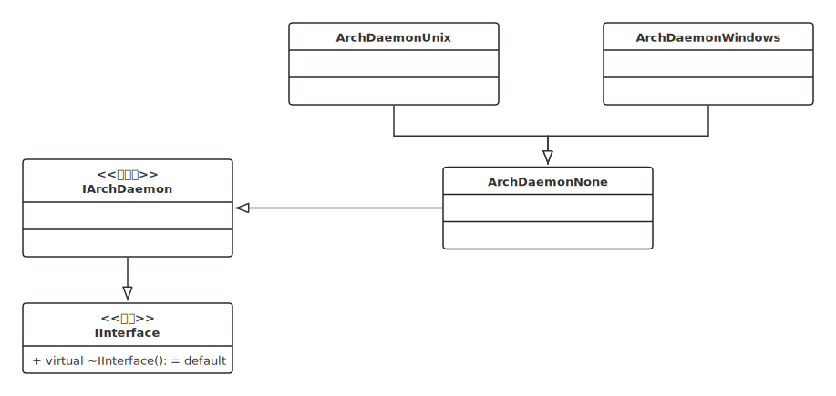

- [1. **抽象类型**](#1-抽象类型)
- [2. **实现类型**](#2-实现类型)


# 1. **抽象类型** 
   
IArchDaemon跨平台的守护进程管理接口，用于处理守护进程的安装、卸载、状态检查及进程守护化操作。
```cpp
class IArchDaemon : public IInterface
{
public:
    // 守护进程的主逻辑函数类型
    using DaemonFunc = std::function<int(int, const char **)>;

    // 安装指定名称的守护进程
    virtual void installDaemon(
        const char *name, const char *description, const char *pathname, const char *commandLine, const char *dependencies
    ) = 0;

    // 卸载指定名称的守护进程
    virtual void uninstallDaemon(const char *name) = 0;
    
    // 安装默认守护进程
    virtual void installDaemon() = 0;

    virtual void uninstallDaemon() = 0;

    // 将当前进程转化为守护进程。
    virtual int daemonize(const char *name, DaemonFunc const &func) = 0;

    // 检查当前用户是否有权限安装/卸载守护进程。
    virtual bool canInstallDaemon(const char *name) = 0;

    // 检查指定守护进程是否已安装。
    virtual bool isDaemonInstalled(const char *name) = 0;

    // 获取当前进程的启动命令行。
    virtual std::string commandLine() const = 0;
};
```

# 2. **实现类型**
**没有守护进程的平台**  
```cpp
#define ARCH_DAEMON ArchDaemonNone

class ArchDaemonNone : public IArchDaemon
{
    /*
     * 这是一个无守护进程实现的空操作类，用于不支持守护进程概念的平台（如某些嵌入式系统或特殊环境）。该类实现了 IArchDaemon 接口，但所有方法都是空操作或返回默认值。
     */

    // override 纯虚函数，封装空实现接口
};
```

**Windows** 
```cpp
#define ARCH_DAEMON ArchDaemonWindows

class ArchDaemonWindows : public ArchDaemonNone
{
    // override 纯虚函数，封装Win32系统接口
};
```

**Unix**
```cpp
#define ARCH_DAEMON ArchDaemonUnix

class ArchDaemonUnix : public ArchDaemonNone
{
    // override 纯虚函数，封装Unix系统接口
};
```

