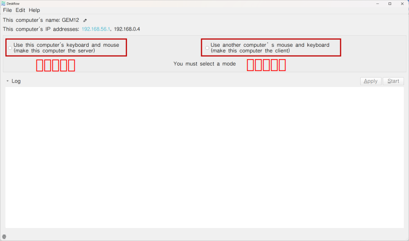
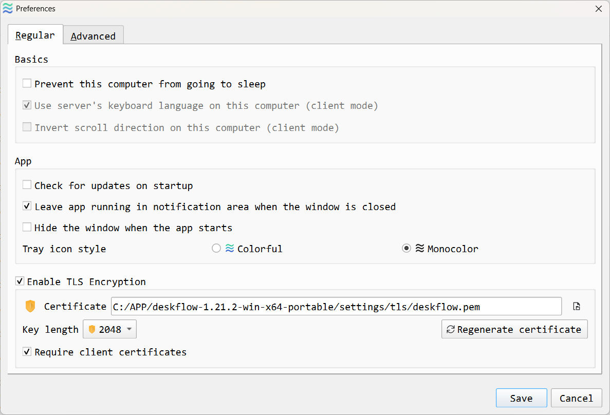
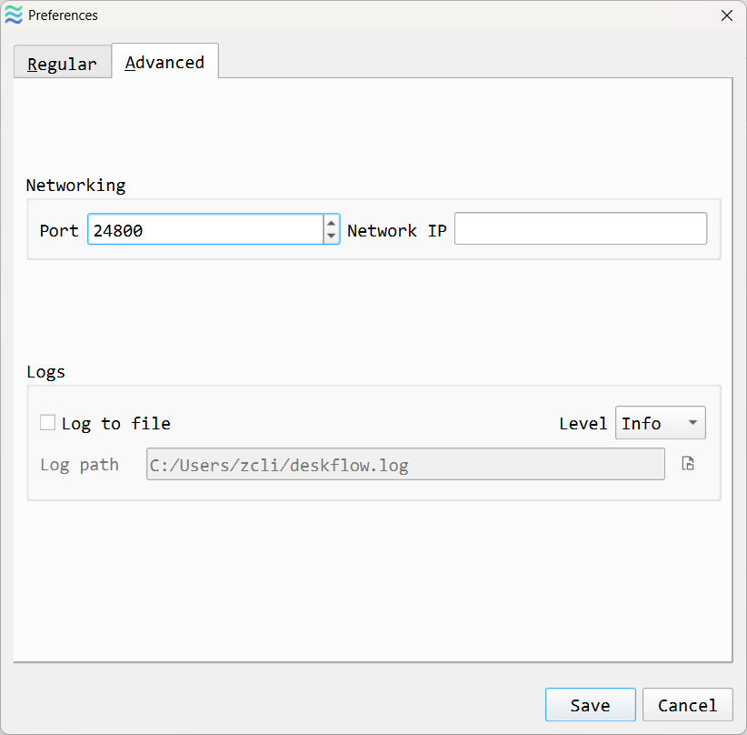
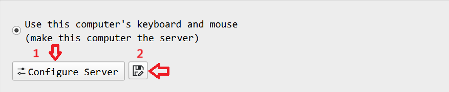
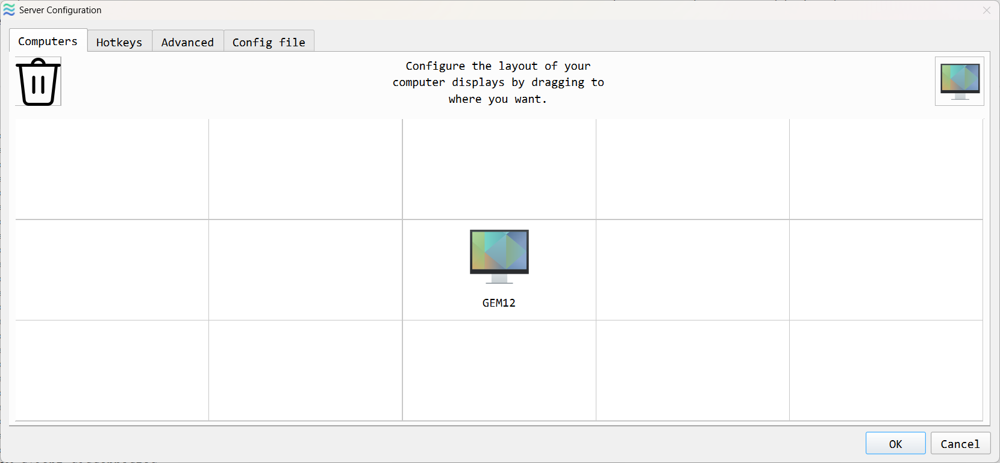
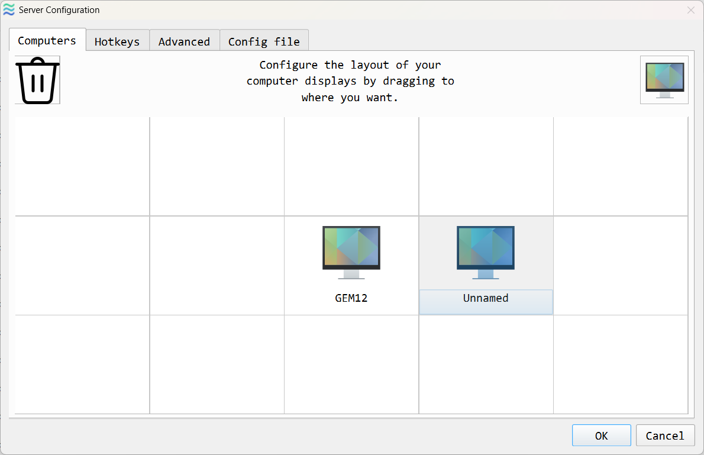
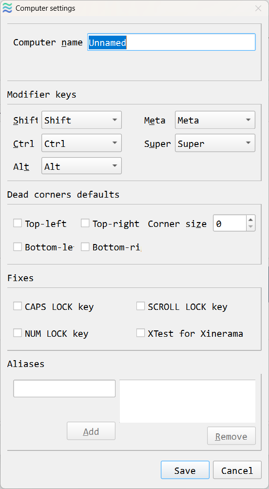
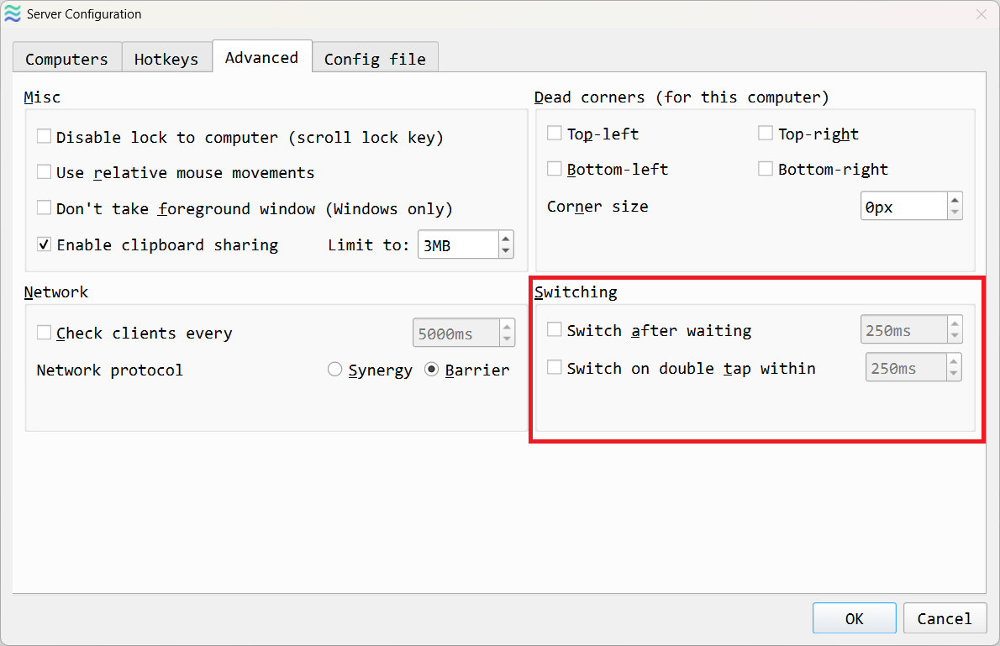
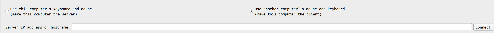

# 1. Deskflow介绍
在多台电脑上共享一套键鼠，支持Windows、Linux、MacOS，功能类似于一个基于软件的KVM切换器，在不同机器之间无缝切换。 本专题中，我们以1.21.2版本为例，介绍一下软件的功能，项目地址[Deskflow](https://github.com/deskflow/deskflow)。

# 2. 功能
首次启动软件时，需要选择当前的电脑模式，是作为服务端还是客户端，界面如下：     
    
接入物理键盘鼠标的就是服务端，其他电脑就是客户端。

# 3. 软件配置
【Edit】-->【Preferences】         
      
有三项配置：Basics、APP、Enable TSL Encryption。  
`1. Basics`：
- 阻止计算机休眠。
- 使用服务器键盘语言（该配置在客户端上使用），因为客户端和服务端键盘语言可能不一致，统一使用服务器键盘语言，这样就一致了。
- 反转鼠标滚轮滚动时页面滚动方向（该配置在客户端上使用），这算是一个个性化配置。

`2. APP`：
- 应用启动时检查更新。
- 关闭应用窗口时，后台运行。
- 后台启动。
- Tray Icon style，系统托盘图标样式。

`3. Enable TSL Encryption`：     
- 启用TSL加密，这是一个安全配置。

        
- Network Address，配置网络地址，默认即可。
- Logs，配置日志文件保存路径、日志级别。

`服务端和客户端在这一层面的配置界面是一样的。`

# 4. 服务端
   
(1) 加载已有的配置文件，如果没有现成的配置文件，就点击【Configure Server】。   
(2) 配置服务器信息，界面如下：        
    

`【Computers】`   
该项设置配置客户端与服务端的布局，中间的`GEM12`是服务器，服务器周围的格子用于放置客户端，通过拖动右上角的电脑图标来创建客户端PC，如下图所示：            
         
双击创建的客户端PC，就可以配置客户端的信息了，如下图所示：       
         
该页面中需要注意的是Fixes，部分按键在一些平台上不可用，可以通过Fixes来修复，例如在Linux系统上Scroll Lock键不可用。        

# 5. 键鼠在PC之间的切换逻辑
   
红框区域提供了两种切换方式：    
- 在两台PC之间的边界超过指定时间切换到对应的PC。    
- 在指定的时间内，两次tap切换到对应的PC，这个没有好像有BUG，不起作用。

# 6. 客户端
客户端配置： 【3. 软件配置】  
客户端使用：    

输入服务器IP或者服务器名称，然后点击连接。
