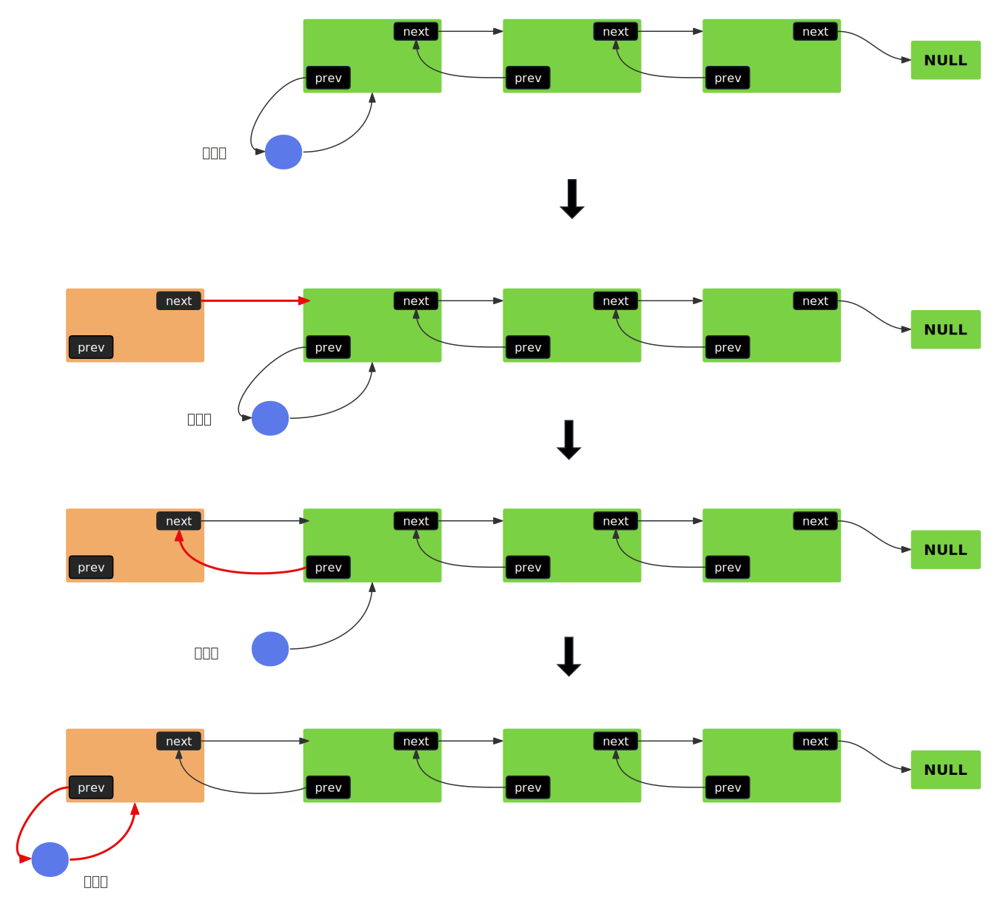
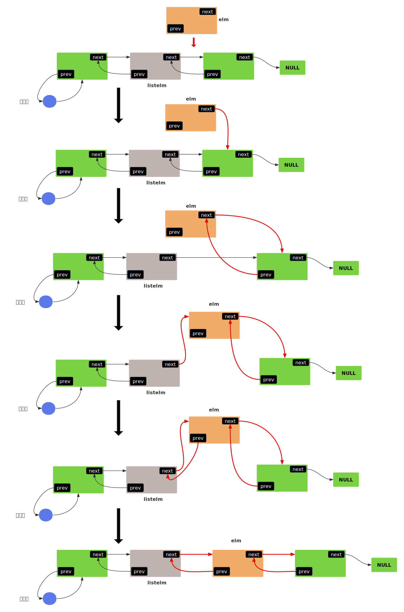
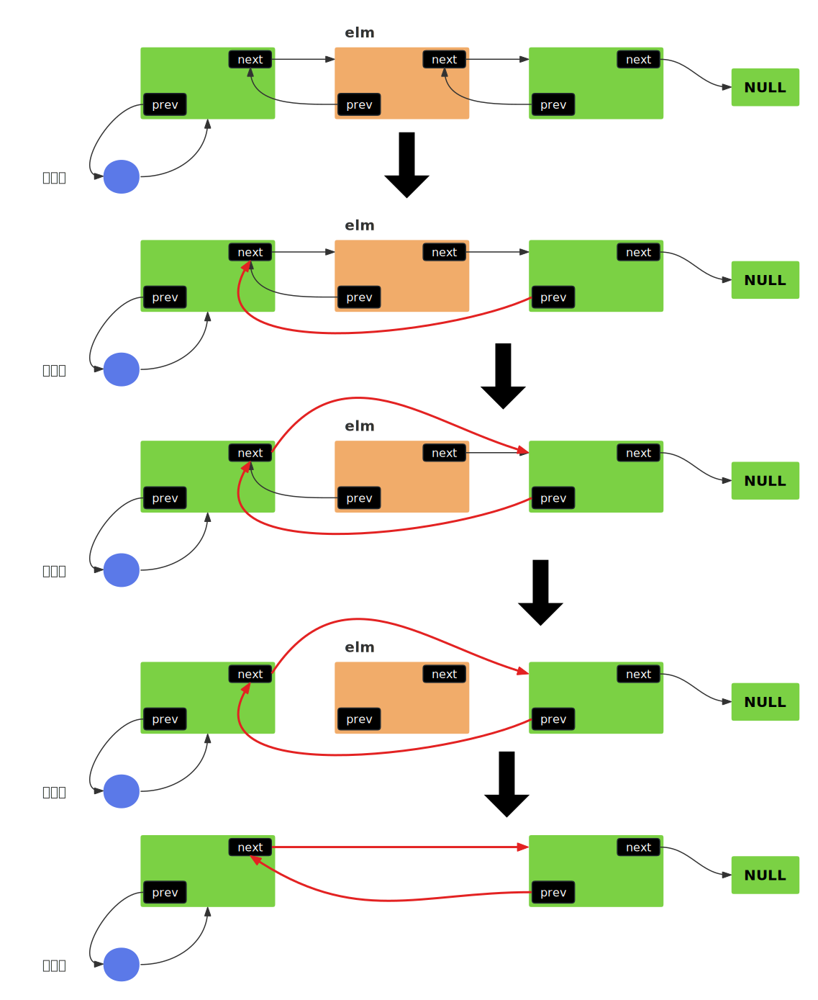
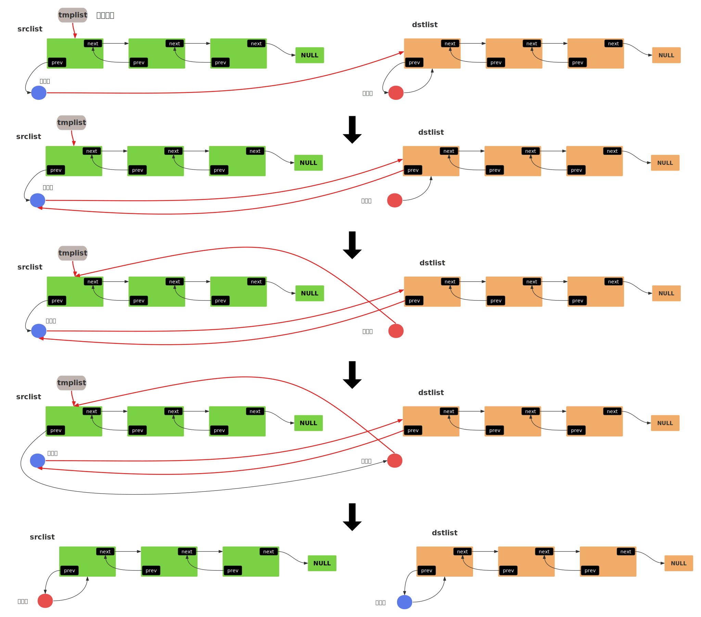

- [1. 链表定义](#1-链表定义)
  - [1.1. 优化](#11-优化)
- [2. 链表操作](#2-链表操作)
  - [2.1. 访问链表](#21-访问链表)
  - [2.2. 链表初始化](#22-链表初始化)
  - [2.3. 插入操作](#23-插入操作)
    - [2.3.1. 链表头部插入新节点](#231-链表头部插入新节点)
    - [2.3.2. 指定节点后插入节点](#232-指定节点后插入节点)
    - [2.3.3. 指定节点前插入节点](#233-指定节点前插入节点)
  - [2.4. 判断节点是否在链表中](#24-判断节点是否在链表中)
  - [2.5. 移除节点](#25-移除节点)
    - [2.5.1. 移除指定节点](#251-移除指定节点)
    - [2.5.2. 移除指定节点（安全版本）](#252-移除指定节点安全版本)
  - [2.6. 遍历链表](#26-遍历链表)
  - [交换两个链表的全部节点](#交换两个链表的全部节点)
- [3. 使用示例](#3-使用示例)
  - [3.1. 节点结构](#31-节点结构)
  - [3.2. 链表头结构](#32-链表头结构)


qemu-8.2.2/include/qemu/queue.h是QEMU中实现的通用数据结构库，源自FreeBSD的queue.h。   

# 1. 链表定义

```c
/*
 * 链表头： 包含一个指向首元节点的指针
 */
#define QLIST_HEAD(name, type)                                          \
struct name {                                                           \
        struct type *lh_first;  /* first element */                     \
}

/*
 * 链表初始化。
 * 首元节点指针初始化为NULL。
 */
#define QLIST_HEAD_INITIALIZER(head)                                    \
        { NULL }

/*
 * 链表节点的连接域。
 * 节点类型的结构体中包含此结构体，用于连接链表。
 */
#define QLIST_ENTRY(type)                                                    \
struct {                                                                     \
        struct type *le_next;   /* 指向下一个节点 */                           \
        struct type **le_prev;  /* 指向前驱节点的le_next字段，这是一个效率设计 */  \
}
```
## 1.1. 优化
&emsp;&emsp;Qemu-List带来的优化就是`**le_prev`，一般情况下，单链表是没有prev相关的字段，而双链表的prev字段是指向前驱节点的，但是Qemu-List不属于这两种情况。假如现在有一个这样的链表：A->B->C，C的le_prev指向B的le_next，而B的le_next又指向C，所以C的le_prev实际指向C自己，相对于一般的链表设计，这样设计的好处是，删除节点的效率高一点。对于非操作系统级别的程序可能少见这种设计，但是对于内核或者驱动来说，性能是非常敏感的，能优化一点是一点。那么，这种设计是如何优化删除效率的：    
- 一般但链表设计中，要删除节点B，需要访问节点A，以便在移除B后建立A和C的连接：A->C。  
- Qemu-List中，B的le_prev指向B自己，这样删除B时，不需要访问A，基于节点B就可以实现：A->C，基本思路如下所示:   
```c
QLIST_REMOVE(B, entry) {
    // 步骤1：更新后继节点C的前驱指针
    if (B.le_next != NULL)               // C存在
        C.le_prev = B.le_prev;           // 即 C.le_prev = &A.le_next，也就是让C的le_prev指向A的le_next(原本指向B的le_prev)
    
    // 步骤2：通过前驱指针修改A的le_next
    *B.le_prev = B.le_next;              // 相当于 A.le_next = C的地址
}
```
&emsp;&emsp;从上面代码可以看到，删除节点B时，整个过程不需要访问A。    
&emsp;&emsp;下面再看一点代码，以便对于该链表的使用有一个初步了解：     
```c
/* qemu-8.2.2/block.c */
static QLIST_HEAD(, BlockDriver) bdrv_drivers =
    QLIST_HEAD_INITIALIZER(bdrv_drivers);
```
&emsp;&emsp;上面是一个块设备驱动相关的链表，使用QLIST_HEAD宏函数创建，宏替换后如下：  
```c
static struct { 
        struct BlockDriver *lh_first;
} bdrv_drivers = { NULL };
```


# 2. 链表操作

## 2.1. 访问链表
```c
#define QLIST_EMPTY(head)                ((head)->lh_first == NULL)
#define QLIST_FIRST(head)                ((head)->lh_first)
#define QLIST_NEXT(elm, field)           ((elm)->field.le_next)
```

## 2.2. 链表初始化
```c
#define QLIST_INIT(head) do {                                           \
        (head)->lh_first = NULL;                                        \
} while (/*CONSTCOND*/0)
```

## 2.3. 插入操作
### 2.3.1. 链表头部插入新节点
```c
#define QLIST_INSERT_HEAD(head, elm, field) do {                        \
        if (((elm)->field.le_next = (head)->lh_first) != NULL)          \
                (head)->lh_first->field.le_prev = &(elm)->field.le_next;\
        (head)->lh_first = (elm);                                       \
        (elm)->field.le_prev = &(head)->lh_first;                       \
} while (/*CONSTCOND*/0)
```
**解释：**  
- field:&emsp; 就是使用宏`QLIST_ENTRY(type)`创建的链表节点连接结构，是节点中的连接域字段，通过该字段访问后继节点。      
- elm:&emsp;要插入的节点。    

**代码逐行解释：**   
`if (((elm)->field.le_next = (head)->lh_first) != NULL)`   
1. 使elm的le_next字段指向原首元节点。   
2. 判断链表是否为空。

`(head)->lh_first->field.le_prev = &(elm)->field.le_next;`   
1. 如果链表非空，使原首元节点的le_prev字段指向新节点的le_next字段。  

`(head)->lh_first = (elm);`   
1. 使链表头指向新节点。   

`(elm)->field.le_prev = &(head)->lh_first;`
1. 使新节点的le_prev字段指向链表头的lh_first字段，也就是指向自己，这就是首元节点。  

  


### 2.3.2. 指定节点后插入节点
```c
#define QLIST_INSERT_AFTER(listelm, elm, field) do {                    \
        if (((elm)->field.le_next = (listelm)->field.le_next) != NULL)  \
                (listelm)->field.le_next->field.le_prev =               \
                    &(elm)->field.le_next;                              \
        (listelm)->field.le_next = (elm);                               \
        (elm)->field.le_prev = &(listelm)->field.le_next;               \
} while (/*CONSTCOND*/0)
```
- elm： 要插入的节点   
- listelm： 插入到该节点后。   



### 2.3.3. 指定节点前插入节点
```c
#define QLIST_INSERT_BEFORE(listelm, elm, field) do {                   \
        (elm)->field.le_prev = (listelm)->field.le_prev;                \
        (elm)->field.le_next = (listelm);                               \
        *(listelm)->field.le_prev = (elm);                              \
        (listelm)->field.le_prev = &(elm)->field.le_next;               \
} while (/*CONSTCOND*/0)
```
&emsp;&emsp;和QLIST_INSERT_AFTER差不多。   

## 2.4. 判断节点是否在链表中
```c
#define QLIST_IS_INSERTED(elm, field) ((elm)->field.le_prev != NULL)
```

## 2.5. 移除节点
### 2.5.1. 移除指定节点
```c
#define QLIST_REMOVE(elm, field) do {                                   \
        if ((elm)->field.le_next != NULL)                               \
                (elm)->field.le_next->field.le_prev =                   \
                    (elm)->field.le_prev;                               \
        *(elm)->field.le_prev = (elm)->field.le_next;                   \
        (elm)->field.le_next = NULL;                                    \
        (elm)->field.le_prev = NULL;                                    \
} while (/*CONSTCOND*/0)
```
- elm: 要移除的节点。  
- field: 节点连接域。  
    

### 2.5.2. 移除指定节点（安全版本）
```c
#define QLIST_SAFE_REMOVE(elm, field) do {                              \
        if ((elm)->field.le_prev != NULL) {                             \
                if ((elm)->field.le_next != NULL)                       \
                        (elm)->field.le_next->field.le_prev =           \
                            (elm)->field.le_prev;                       \
                *(elm)->field.le_prev = (elm)->field.le_next;           \
                (elm)->field.le_next = NULL;                            \
                (elm)->field.le_prev = NULL;                            \
        }                                                               \
} while (/*CONSTCOND*/0)
```
- 安全性考虑： 先判断elm节点是否存在，再进行删除。   
- 删除节点： 和QLIST_REMOVE() 一样。


## 2.6. 遍历链表

**1. 一般遍历**
```c
#define QLIST_FOREACH(var, head, field)                                 \
        for ((var) = ((head)->lh_first);                                \
                (var);                                                  \
                (var) = ((var)->field.le_next))
```
- 不需要删除节点时使用。
**2. 安全遍历**
```c
#define QLIST_FOREACH_SAFE(var, head, field, next_var)                  \
        for ((var) = ((head)->lh_first);                                \
                (var) && ((next_var) = ((var)->field.le_next), 1);      \
                (var) = (next_var))
```
- 安全性改进: &emsp;它支持在遍历过程中安全删除当前节点，在进入循环体之前，next_var 已保存下一个节点的指针，即使循环体内删除或修改了当前节点 var，next_var 仍指向下一个有效节点（不受 var 操作的影响），步进时直接使用 next_var，避免访问已释放的内存。

**3. 使用宏遍历**  
遍历宏只是实现了for循环的for(;;;)部分：   
QLIST_FOREACH：    
```c
// 遍历所有注册的块设备驱动程序，找出最适合处理指定设备文件（如 /dev/cdrom）的驱动程序。   
static BlockDriver *find_hdev_driver(const char *filename)
{
    int score_max = 0, score;
    BlockDriver *drv = NULL, *d;
    GLOBAL_STATE_CODE();

    QLIST_FOREACH(d, &bdrv_drivers, list) {
        if (d->bdrv_probe_device) {
            score = d->bdrv_probe_device(filename);
            if (score > score_max) {
                score_max = score;
                drv = d;
            }
        }
    }

    return drv;
}
```
QLIST_FOREACH_SAFE：        
```c
// 从指定块设备状态（BlockDriverState）的操作阻塞列表中移除特定原因的阻塞项。
void bdrv_op_unblock(BlockDriverState *bs, BlockOpType op, Error *reason)
{
    BdrvOpBlocker *blocker, *next;
    GLOBAL_STATE_CODE();
    assert((int) op >= 0 && op < BLOCK_OP_TYPE_MAX);
    QLIST_FOREACH_SAFE(blocker, &bs->op_blockers[op], list, next) {
        if (blocker->reason == reason) {
            QLIST_REMOVE(blocker, list);
            g_free(blocker);
        }
    }
}
```

## 交换两个链表的全部节点
```c
#define QLIST_SWAP(dstlist, srclist, field) do {                        \
        void *tmplist;                                                  \
        tmplist = (srclist)->lh_first;                                  \
        (srclist)->lh_first = (dstlist)->lh_first;                      \
        if ((srclist)->lh_first != NULL) {                              \
            (srclist)->lh_first->field.le_prev = &(srclist)->lh_first;  \
        }                                                               \
        (dstlist)->lh_first = tmplist;                                  \
        if ((dstlist)->lh_first != NULL) {                              \
            (dstlist)->lh_first->field.le_prev = &(dstlist)->lh_first;  \
        }                                                               \
} while (/*CONSTCOND*/0)
```
我们以为两个非空链表为例：    
    


# 3. 使用示例

## 3.1. 节点结构
```c
// thread-pool.h
typedef struct ThreadPoolElement ThreadPoolElement;

// thread-pool.c
struct ThreadPoolElement {
    BlockAIOCB common;
    ThreadPool *pool;
    ThreadPoolFunc *func;
    void *arg;

    enum ThreadState state;
    int ret;

    QTAILQ_ENTRY(ThreadPoolElement) reqs;

    /* 
     * 节点的连接区域，每个节点通过该域连接前后相邻节点。
     */
    QLIST_ENTRY(ThreadPoolElement) all;
};
```

## 3.2. 链表头结构

```c
BlockAIOCB *thread_pool_submit_aio(ThreadPoolFunc *func, void *arg,
                                   BlockCompletionFunc *cb, void *opaque)
{
    ThreadPoolElement *req;
    // ......
    // 省略一堆代码

    /*
     * 链表头部保存在pool实例中。 
     */
    ThreadPool *pool = aio_get_thread_pool(ctx);
    // .....
    QLIST_INSERT_HEAD(&pool->head, req, all);
    // ......
}
```
下面我们来看这个`ThreadPool *pool`是如何保存头部的：  
```c
// thread-pool.h
typedef struct ThreadPool ThreadPool;

// thread-pool.c
struct ThreadPool {
    AioContext *ctx;
    QEMUBH *completion_bh;
    QemuMutex lock;
    QemuCond worker_stopped;
    QemuCond request_cond;
    QEMUBH *new_thread_bh;

    /*
     * 使用QLIST_HEAD宏创建一个链表，链表节点中所保存的元素类型为ThreadPoolElement。
     */
    QLIST_HEAD(, ThreadPoolElement) head;

    QTAILQ_HEAD(, ThreadPoolElement) request_list;
    int cur_threads;
    int idle_threads;
    int new_threads;
    int pending_threads; 
    int min_threads;
    int max_threads;
};
```
