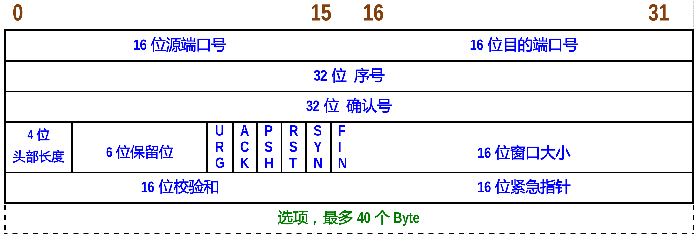

- [1. TCP报文结构](#1-tcp报文结构)
  - [1.1. 固定头部](#11-固定头部)
  - [1.2. 头部选项](#12-头部选项)
- [2. 协议特性](#2-协议特性)

# 1. TCP报文结构
TCP头部由`固定头部`（20字节）、`头部选项`（最长40字节）组成。  

## 1.1. 固定头部
  
|字段|功能|
|---------|---------|
|32位序列号|一次TCP传输活动中，一个传输方向上，字节流中的每一个字节的编号。|
|32位确认号|用于响应对方，告诉对方收到了数据，等于序列号+1|
|4位头部长度|记录了TCP头部的长度有几个`32Bit`|
|6个标志位||
|16位窗口大小|接收通告窗口（RWND），于流量控制，拥塞控制中会用到|
|16位校验和|发送端填充，接收端进行校验|
|16位紧急指针||

**16位标志位**  
  
|标志位|功能|
|---------|---------|
|URG|紧急指针是否有效|
|ACK|确认号是否有效|
|PSH|接收方应该尽快将这个报文交给应用层，这是一个数据报文|
|RST|连接复位请求|
|SYN|同步序号，用于建立连接，这是一个连接请求报文|
|FIN|这是一个close报文|

## 1.2. 头部选项
头部选项长度可变，最长40个字节，主要是用于在建立连接时，协商一些参数，确定开启那些功能。头部选项结构如下（3部分）：
|      一个Byte    |            一个Byte          |        n个Byte      |
|-----------------|------------------------------|--------------------|
|       kind      |         length               |        info        |
|     选项类型     |头部选项的长度（包括kind和length）|    选项的具体信息     |

`kind=2, length=4, info占用2个Byte`    
&emsp;&emsp;用于指定最大报文段长度，此时，TCP连接初始化时，双方以此协商最大报文段长度（MSS），一般这个MSS=MTU-40，这个“40”包含20字节的tcp头部和20字节的ip头部。这样一来，报文就不超过MTU的长度，也就是减少了ip分片。   

`kind=3, length=3，info占用1个Byte`   
&emsp;&emsp;窗口扩大因子，info记录移位数，用于设置RWND，例如，固定头部中的16位窗口大小是S，头部选项给的窗口扩大因子是T，那么这一次TCP连接的实际RWND大小就是: &emsp;$S \times 2^T，T \in [0,14]$，也就是S左移T位。但是有一个问题，人家RWND最大才16bBit(65536)，这样一搞，不就超了吗？实际上内核是允许的，并可以通过修改 **/proc/sys/net/ipv4/tcp_window_scaling** 的值来启用或者关闭窗口扩大因子选项。      

`kind=4, length=2, 无info`   
&emsp;&emsp;启用SACK选项，用于支持selective ACK 功能，TCP协议有丢包重传的功能，假如现在发送方发送了A、B、C、D、E、F，6个报文，结果B丢了，此时TCP模块会重传A之后的所有报文，开启SACK功能后，TCP模块只重传丢失的报文。

`kind=5, ..., ...`   
&emsp;&emsp;这个是SACK实际工作选项，也就是丢包时会用到，这个选项会发送丢包信息（info），发送方通过这些信息查找丢失的报文。

`kind=8, length=10, info占用8个Byte`   
&emsp;&emsp;这个是时间戳选项，计算RTT时间，主要服务于流控。   

# 2. 协议特性
&emsp;&emsp;传输层协议有两个，TCP和UDP，我们都知道UDP是数据报协议，用于广播/多播场景， 而TCP协议`面向连接`、`字节流`、`可靠传输`、`流量控制`，这三个特性理解如下：      
- **面向连接**： 每一次的通讯都需要建立`一对一`的连接，然后才能进行数据传输，数据传输完成后结束连接。   
- **字节流**：  在发送端，应用层通过N次写操作，将数据放到TCP发送缓存区后，TCP模块会将发送缓存区中的数据封装成M个TCP报文发送出去，但是这个N和M没有联系，再说接收端接收到数据后，TCP模块会按照报文的序号将数据依次放入TCP的接收缓存区中，并通知应用程序读取数据，应用程序是一次性读取完成还是分为K次读取，完全是应用程序的设计需求，和N、M没有关系。也就是说，发送端写的次数和接收端读取的次数没有瓜葛，可以理解为TCP协议在传输数据时是没有边界的，这就是“字节流”的概念。   
- **可靠传输**： 为了保证可靠性，TCP做了3件事，采用`发送应答机制`、`报文重传`、`报文重排`。后面会有专门的篇章讲解这些特性。      
- **流量控制**： 高效使用网络带宽也是TCP模块的重要职责之一，也就是`TCP拥塞控制`设计，这个特性后面也会使用单独的篇章来介绍。    
