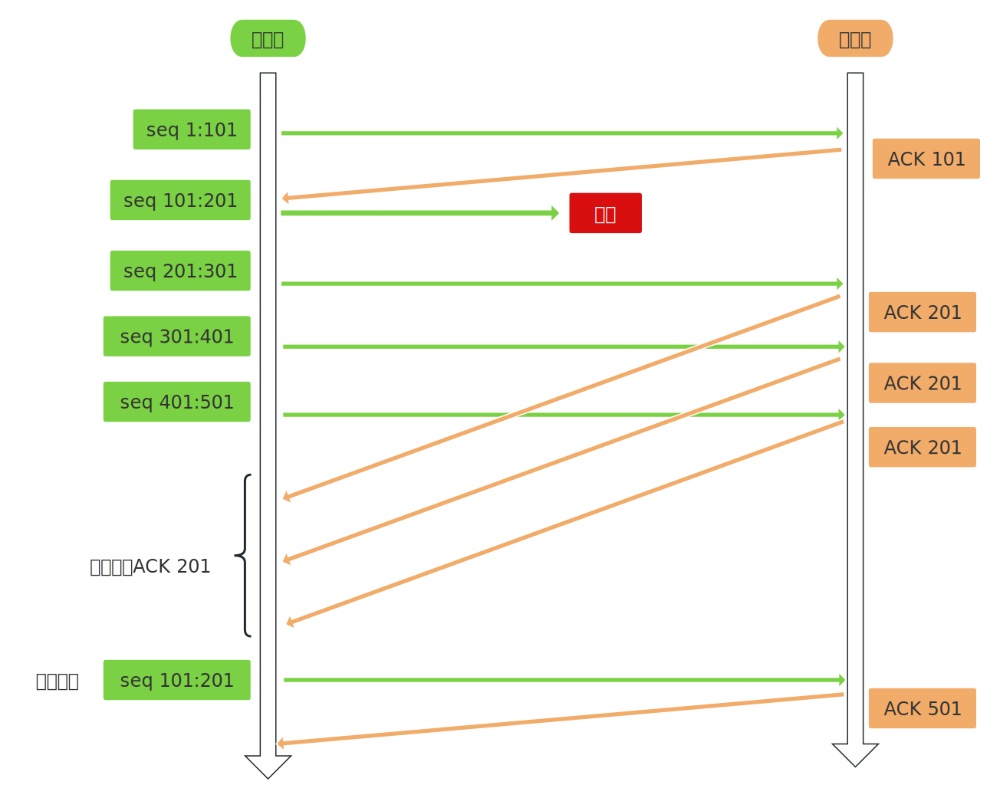
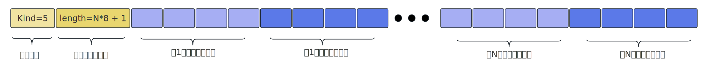

- [1. 什么时候重传报文](#1-什么时候重传报文)
- [2. 超时重传策略](#2-超时重传策略)
- [3. 快速重传策略](#3-快速重传策略)
  - [3.1. SACK](#31-sack)
- [4. 其他](#4-其他)


# 1. 什么时候重传报文
&emsp;&emsp;重传报文有两种情况：`超时重传`、`快速重传`：  
-  **超时重传**: &emsp;发送端的TCP模块每发送一个报文后都会启用定时器，如果在定时时间内没有收到应答报文，就会重传该报文，这就是超时重传，至于没有收到应答报文，可能是报文丢失，也可能是应答报文丢失。  
-  **快速重传**： &emsp;发送端连续收到3个重复报文段，就认为丢包了，触发快速重传，重传丢失的报文段。


# 2. 超时重传策略
&emsp;&emsp;TCP模块会为每一个发送出去但没有收到ACK的报文维护一个定时器，报文发送出去就会启用超时定时器，超时时间（RTO）的设置当然是依据RTT的，但不是简单的RTO=RTT，毕竟RTT也是动态变化的，具体的计算方法我也没有细究。当前只需要知道，当到达超时时间但没有收到ACK，就会重传报文并重置定时器，以Linux为例，有两个重要的内核参数： 
```bash
root@GEM:/proc/sys/net/ipv4# pwd
/proc/sys/net/ipv4
root@GEM:/proc/sys/net/ipv4# 
root@GEM:/proc/sys/net/ipv4# ls tcp_retries
tcp_retries1  tcp_retries2                       # 两个文件决定了重传的次数
root@GEM:/proc/sys/net/ipv4# 
```
 **tcp_retries1**  最少重传次数，默认为3，在IP层接管之前的最少重传次数。  
 **tcp_retries2**  最多重传次数，默认为15，连接放弃前的最多重传次数。  

&emsp;&emsp;至于多次重传时RTO的设置，Linux采用的是`加倍`的方式，即每次重传都将RTO增大一倍，当然在算法层面，这个“加倍”不是“x2”，只是最终的结果表现为倍增。不管底层算法是如何设计的，这个超时重传的时间跨度还是比较长的，这肯定不行啊，所以就有了`快速重传`。


# 3. 快速重传策略
&emsp;&emsp;从发送端角度看，连续收到3个重复的ACK，就认为这个报文丢了，例如一个报文的编号为10～101，发送端连续收到3个101-ACK，就认为“seq 10:101”这个报文丢失了，此时就会触发快速重传，这玩意儿也是拥塞控制的一部分。   


`缺点`:   
&emsp;&emsp;当发生丢包事件时就说明网络可能是拥塞了，这种情况下可能就不是丢一个包这么简单了，如果丢了好几个包呢，那此时的重传工作就复杂了，那几个包需要重传呢？这时就需要`SACK`（Selective Acknowledgment）机制了，在TCP协议头的头部选项中开启此功能。   

## 3.1. SACK
&emsp;&emsp;在《TCP协议与报文结构》篇章中我们提到了SACK，也就是kind=5的头部选项，接收端通过该选项来携带丢失的数据信息，告诉发送端哪些数据丢失了，这样发送端只需要重传丢失的数据即可。但是这个“丢失信息”的格式是什么样的呢，这时候就要注意了，TCP是流式协议，我们不能应该从报文的角度来看，它是`数据流`，“丢包”就是数据流中的一段或者多段缺失了，此时我只需要标识出那几段缺失了，也就是缺失数据段的起始位置和结束位置，SACK类型的头部选项格式如下：     
    
从图中可以看出，SACK选项的info部分，包含了一段或者多段记录，每段记录包含8个字节，这8个字节又分为两部分：    
- **缺失段左边缘**： 左边4个字节记录了起始序号，就是缺失数据段的第一个字节的序号。    
- **缺失段右边缘**： 右边4个字节记录了结束序号，就是缺失数据段的最后一个字节的序号的下一个序号。    


# 4. 其他
&emsp;&emsp;`RTT`，它表示包的`往返时间`，就是`数据发送时刻`到`接收到ACK时刻`的差值。
