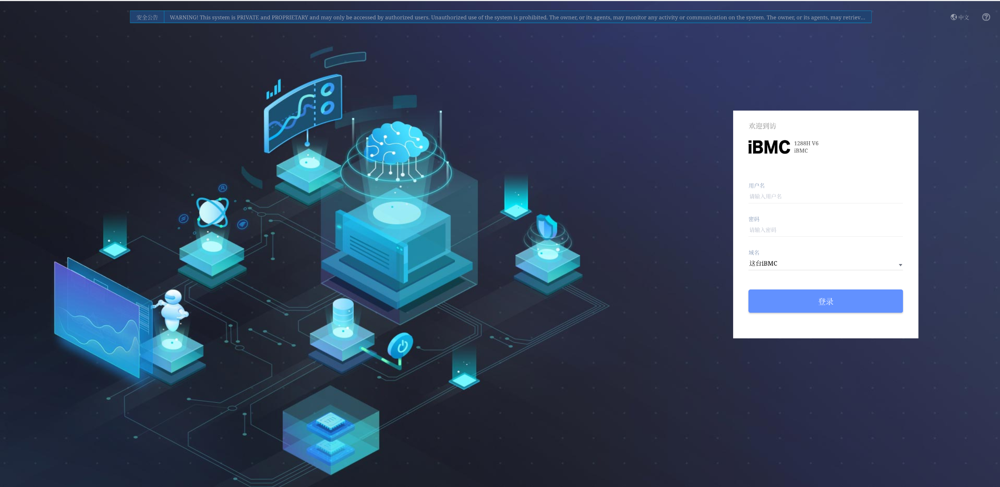
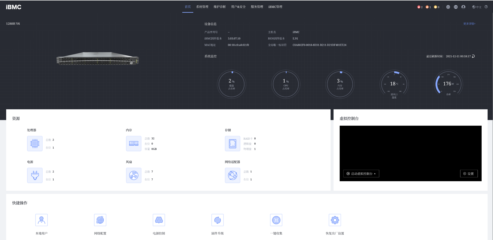

# iBMC服务器管理软件
iBMC智能管理系统（Intelligent Baseboard Management Controller，以下简称iBMC）是面向服务器全生命周期的服务器嵌入式管理系统。提供硬件状态监控、部署、节能、安全等系列管理工具，标准化接口构建服务器管理更加完善的生态系统。  
## iBMC登陆界面 
  

## iBMC管理界面  
  

# 监控与故障管理 (FDM)
故障诊断与管理（FDM）是iBMC一系列诊断技术和工具的总称，FDM对服务器各类部件进行全面的监控，实现服务器关键部件的深度故障诊断和故障预测机制。

# 智慧能耗管理 (DEMT)
动态能耗管理技术（DEMT）是一组根据CPU负载、环境温度等多种输入参数，动态实时智能调节各部件的功耗的技术集合，通过动态能耗管理技术和休眠技术，使设备节能管理更加高效。

# “零”接触运维
iBMC提供KVM，SOL虚拟媒体，Web接入等多种远程管理方式，支持配置、升级、部署能力，实现“零”接触运维，方便运维人员随时随地接入服务器实施运维管理。