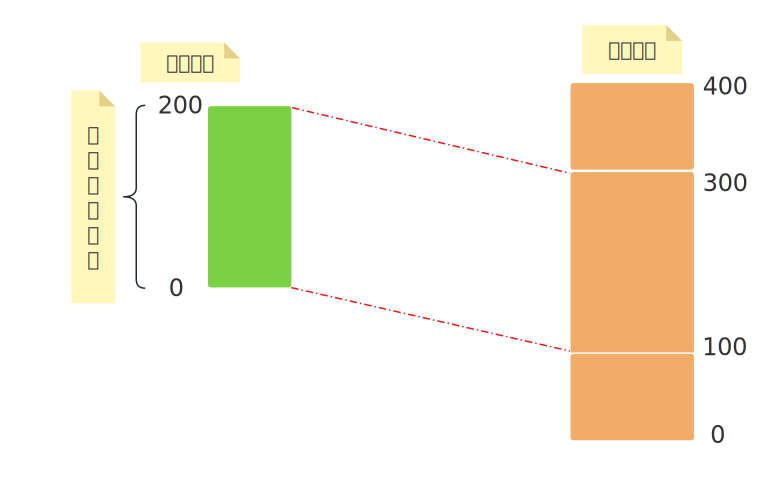

1. [1. 虚拟内存](#1-虚拟内存)
2. [2. 页](#2-页)
    1. [2.1. 页表](#21-页表)
    2. [2.2. 多级页表](#22-多级页表)
    3. [2.3. 页表项](#23-页表项)
3. [3. 映射关系](#3-映射关系)
4. [4. TLB](#4-tlb)

# 1. 虚拟内存
&emsp;&emsp;进程不会直接访问物理内存，进程能够看到的地址空间是`虚拟地址空间`，虚拟地址通过一定的规则关联到物理地址，简单理解为下图：   
   

# 2. 页
&emsp;&emsp;在虚拟内存中，内存以`页`为单位进行划分，以便于管理，地址转换也是以页为单位进行的，对于X86_64系统，页的大小为4KB。计算机物理内存也被划分为同样大小的块，称为`物理页帧`。   

## 2.1. 页表
&emsp;&emsp;操作系统以及MMU使用`页表`管理页，页表中存储着`页表项`，页表项记录着虚拟地址到物理地址的映射关系。每个进程都有自己独立的页表，这确保了进程地址空间的隔离性。当 CPU 切换到某个进程执行时，CR3 寄存器（在 x86 架构下）会被加载指向该进程的顶级页表的物理地址。    
## 2.2. 多级页表   
&emsp;&emsp;现代系统地址空间巨大（如 64 位系统），不会使用一个巨大的单级页表来存储所有映射。因此，页表通常是多级的，实际工作中，MMU会根据当前进程的顶级页表基址，一层一层得遍历，在最后一级页表中找到目标虚拟页对应的页表项。    

## 2.3. 页表项
**页表的内容：**     
- **物理页帧号：** 指示该虚拟页当前映射到的物理页帧的起始地址。    
- **存在位：** 表示该虚拟页当前是否在物理内存中。如果为 0，访问该页会触发**缺页中断**，进而终止程序。     
- **读/写权限位：** 控制该页是可读、可写还是只读。   
- **用户/超级用户权限位：** 控制用户态进程是否可以访问该页（内核页通常只能在内核态访问）。   
- **访问位：** 被硬件置位，表示该页最近被访问过（用于页面置换算法如 LRU）。   
- **修改位：** 被硬件置位，表示该页的内容被修改过（需要写回磁盘后才能释放其物理页帧）。   
- **其他标志位：** 如全局页、禁用缓存、NX（不可执行）位等。   

&emsp;&emsp;当 CPU 执行指令访问一个虚拟地址时，MMU 自动查阅当前进程的页表，将该虚拟地址翻译成对应的物理地址。而且不同进程的页表项可以指向同一个物理页帧，用于共享，例如动态链接库。  

# 3. 映射关系
&emsp;&emsp; 虚拟页不一定时刻都有物理页帧与之对应，也不一定连续地映射到物理内存上。一个虚拟页可以映射到一个物理页帧，也可以映射到磁盘上的交换空间，或者暂时没有映射（未分配）。  

# 4. TLB
&emsp;&emsp; 现代系统使用多级页表（如 x86_64 的 4 级页表）。每次地址转换需多次访问内存（遍历每一级页表），可能需 **4~5 次内存访问**才能完成一次转换。内存访问速度远低于 CPU 速度，直接导致性能严重下降。考虑到程序的局部性原理，程序在短时间内倾向于集中访问少量内存页（如循环代码、连续数据），这些页的地址转换结果（映射关系）可被缓存复用。   
&emsp;&emsp; `TLB` 是一个**硬件缓存**（通常由 SRAM 实现），存储最近使用过的**虚拟页号 → 物理页帧号**的映射关系。每个条目相当于一个**页表项的副本**（含物理页号 + 权限位）。现代 CPU 通常包含多级 TLB（如 L1 TLB、L2 TLB），容量逐级增大但速度略慢。
&emsp;&emsp; 如果我们把页表看作一本厚重的“电话簿”，TLB 就是手机“常用联系人列表”——你不需要每次都翻电话簿查号码，最近联系过的人名和号码会被快速缓存。

