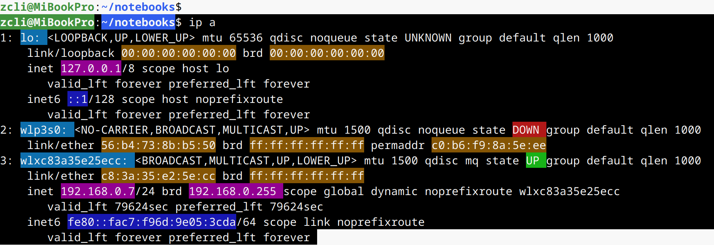
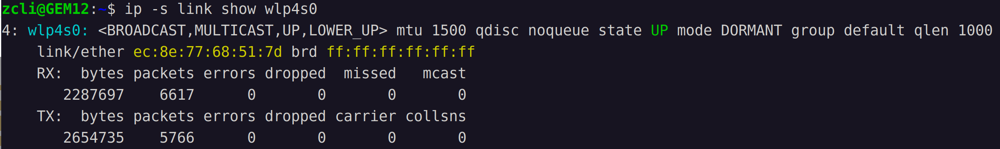
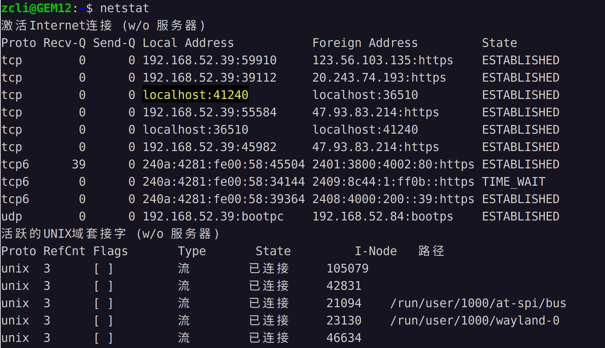
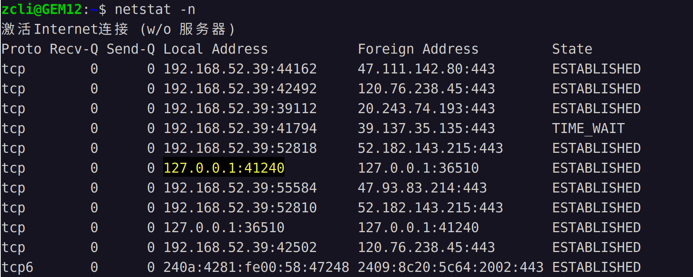
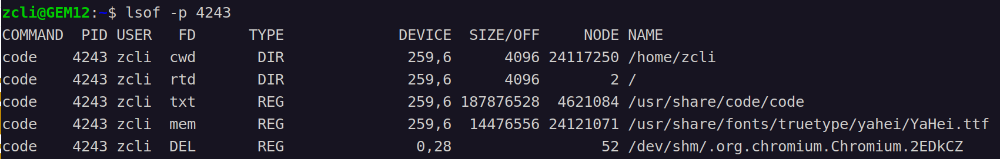
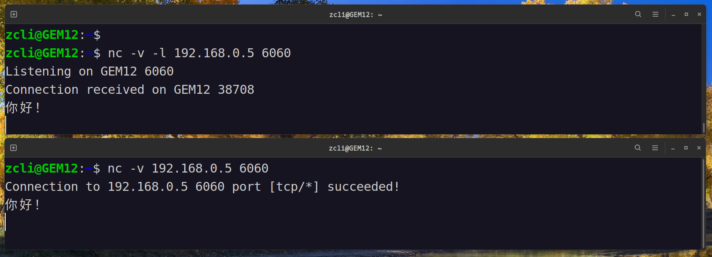

# 1. iproute2
ip命令全称iproute2，

**1.** `查看所有网卡的状态`   
```bash
ip a  # ip addr show 的简写
```
命令输出：   
  
- 图中有三张网卡： lo（本地回环）、wlp3s0（无线网卡）、wlxc83a35e25ecc（usb有线网卡）。  
- state UP: 表示网卡已启用。   
- link/ether: 网卡的MAC地址。   
- inet 192.168.0.7/24: 网卡的ipv4-IP地址和子网掩码。  
- brd 192.168.0.255: 网卡的广播地址。
- inet6 fe80::fac7::f96d::9e05::3cda/64: 网卡的ipv6-IP地址和子网掩码。    


**2.**`显示指定接口的信息`   
```bash
ip addr show eth0    # ip a s eht0
```


**3.**`显示接口的统计信息`  
```bash
ip -s link show eth0
```
  


**4.**`启用网卡`    
```bash
sudo ip link set eth0 up    # 启用接口， 将 "eth0" 替换为实际的网络接口名称
sudo ip link set eth0 down  # 禁用接口
```


**5.**`添加/删除 IP 地址`   
```bash
sudo ip addr add 192.168.1.100/24 dev eth0  # 为 eth0 接口添加 IPv4 地址， 重启后失效
sudo ip addr del 192.168.1.100/24 dev eth0  # 删除 eth0 接口的指定 IP 地址
```

**6.**`还是路由表、ARP表、VLAN相关功能`
略......   


# 2. netstat
查看网络连接状态, 先看一下命令的默认输出：   
    
默认情况下，对于一些有别名的 ip 地址和端口号 netstat 会显示别名，例如127.0.0.1显示localhost，80端口会显示成http，如果我们想要的是原始IP地址，可以使用-n参数。  
    

**其他选项**   
```
-a (all)显示所有选项，netstat 默认不显示 LISTEN 相关。
-t (tcp)仅显示 tcp 相关选项
-u (udp)仅显示 udp 相关选项
-n 不显示别名，能显示数字的全部转化成数字
-l 仅列出有在 Listen (监听) 的服務状态
-p 显示建立相关链接的程序名
-r 显示路由信息，路由表
-e 显示扩展信息，例如uid等
-s 按各个协议进行统计 (重要)
-c 每隔一个固定时间，执行该 netstat 命令。
```

# 3. lsof
list opened filedesciptor，在Linux系统中，所有的与资源句柄相关的东西都可以统一抽象成文件描述符。   
    
- -p : 指定进程ID。   
- lsof 命令第一栏进程名在显示的时候，默认显示前 n 个字符, 可以使用 `+c 20`来指定显示的字符数。    
- 如果需要仅显示系统的网络连接信息，可以`-Pni`。   


# 4. nc
netcat命令，常见的用法是模拟一个服务器程序被其他客户端连接，或者模拟一个客户端连接其他服务器，连接之后就可以进行数据收发。

**1.**`模拟一个服务器程序`   
```bash
nc -v -l 192.168.0.5 6060
```
这样就在 6060 端口开启了一个服务器，我们可以通过192.168.0.5:6060来连接这个服务器。   


**2.**`模拟一个客户端程序`    
```bash
nc -v www.baidu.com 80    
nc -v -p 6050 www.baidu.com 80  # 指定客户端使用6050端口连接服务器
```

**3.**`发送数据`   
`服务端： `   
    
`客户端： `   
    
`发送数据: `
    


# curl
curl用于发送http请求。  

**1.**`保存网页`   
```bash
curl http://www.baidu.com > index.html
```

**2.**`下载文件`   
```bash
curl --fail --show-error --location --progress-bar "https://ollama.com/download/ollama-linux-${ARCH}.tgz${VER_PARAM}"
```

**3.**`GET和POST请求`   
没用过。


