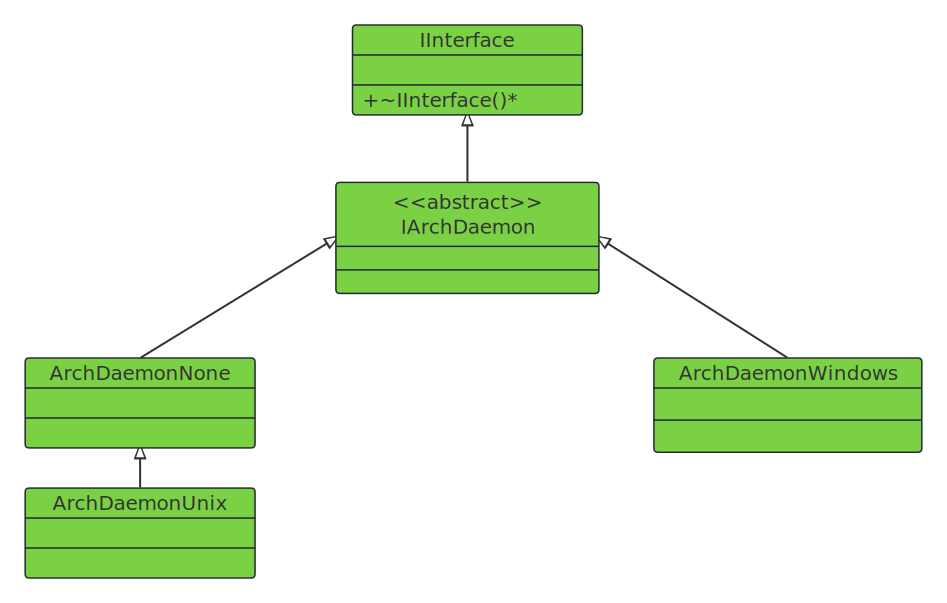

- [1. **守护进程设计**](#1-守护进程设计)
- [2. **接口主要功能**](#2-接口主要功能)
    - [2.1. **守护进程安装与卸载**](#21-守护进程安装与卸载)
    - [2.2. **守护进程化操作**](#22-守护进程化操作)
    - [2.3. **状态查询功能**](#23-状态查询功能)
- [3. **IArchDaemon代码解释**](#3-iarchdaemon代码解释)
- [4. **平台特定功能**](#4-平台特定功能)
    - [4.1. **Windows平台特性**](#41-windows平台特性)
    - [4.2. **Unix平台特性**](#42-unix平台特性)
    - [4.3. **不支持守护进程的平台**](#43-不支持守护进程的平台)


# 1. **守护进程设计** 
   
&emsp;&emsp;IArchDaemon是Deskflow中平台抽象层的核心接口之一，专门负责提供跨平台的守护进程功能，为不同操作系统平台的守护进程操作提供统一的编程接口。IArchDaemon接口继承自IInterface，该接口使用函数类型别名`DaemonFunc`来定义守护进程的主函数签名。  

---


# 2. **接口主要功能**
## 2.1. **守护进程安装与卸载**
```cpp
    // 安装与卸载
    virtual void installDaemon(const char *name, const char *description, const char *pathname, const char *commandLine, const char *dependencies) = 0;
    virtual void uninstallDaemon(const char *name) = 0;
    
    // 默认安装与卸载
    virtual void installDaemon() = 0;
    virtual void uninstallDaemon() = 0;
```

## 2.2. **守护进程化操作**
```cpp
    // 将当前进程转换为守护进程
    virtual int daemonize(const char *name, DaemonFunc const &func) = 0;
```

## 2.3. **状态查询功能**
```cpp
    // 检查用户是否有权限安装守护进程
    virtual bool canInstallDaemon(const char *name) = 0;
    // 检查守护进程是否已安装 
    virtual bool isDaemonInstalled(const char *name) = 0;
```

---

# 3. **IArchDaemon代码解释**
```cpp
class IArchDaemon : public IInterface
{
public:
    // 守护进程的主逻辑函数类型
    using DaemonFunc = std::function<int(int, const char **)>;

    // 安装指定名称的守护进程
    virtual void installDaemon(
        const char *name, const char *description, const char *pathname, const char *commandLine, const char *dependencies
    ) = 0;

    // 卸载指定名称的守护进程
    virtual void uninstallDaemon(const char *name) = 0;
    
    // 安装默认守护进程
    virtual void installDaemon() = 0;

    virtual void uninstallDaemon() = 0;

    // 将当前进程转化为守护进程。
    virtual int daemonize(const char *name, DaemonFunc const &func) = 0;

    // 检查当前用户是否有权限安装/卸载守护进程。
    virtual bool canInstallDaemon(const char *name) = 0;

    // 检查指定守护进程是否已安装。
    virtual bool isDaemonInstalled(const char *name) = 0;

    // 获取当前进程的启动命令行。
    virtual std::string commandLine() const = 0;
};
```

---

# 4. **平台特定功能**
## 4.1. **Windows平台特性** 
Win平台的守护进程实现比较复杂。   
- 静态方法 runDaemon() 用于运行守护进程主循环。    
- daemonRunning() 和 daemonFailed() 方法用于状态管理。  
- getDaemonQuitMessage() 处理Windows服务控制消息。   


## 4.2. **Unix平台特性**
Unix实现相对简单，主要专注于进程的守护进程化操作。  
```cpp
#define ARCH_DAEMON ArchDaemonUnix

class ArchDaemonUnix : public ArchDaemonNone
{
public:
  ArchDaemonUnix() = default;
  ~ArchDaemonUnix() override = default;

  // IArchDaemon overrides
  int daemonize(const char *name, DaemonFunc const &func) override; // 进程守护进程化
};
```

## 4.3. **不支持守护进程的平台**  
ArchDaemonNone提供了一个"空"实现，适用于不支持守护进程概念的平台，其中安装和卸载函数什么都不做，查询函数返回false。   

