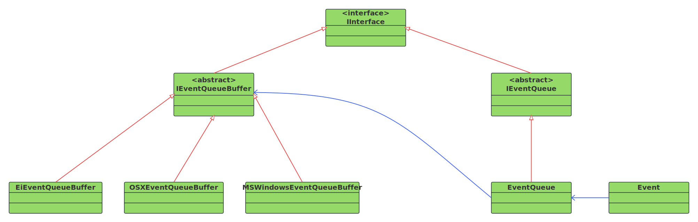

- [1. **设计思路**](#1-设计思路)
- [2. **核心类型**](#2-核心类型)
    - [2.1. **顶层接口**](#21-顶层接口)
    - [2.2. **平台层实现**](#22-平台层实现)
- [3. **定时器**](#3-定时器)
- [4. **线程安全**](#4-线程安全)
- [5. **事件处理器**](#5-事件处理器)
- [6. **事件订阅**](#6-事件订阅)
- [7. **事件发布**](#7-事件发布)
- [8. **事件循环**](#8-事件循环)


# 1. **设计思路**   
&emsp;&emsp;DeskFlow的事件框架实现了一个基于`发布-订阅`模式的异步事件系统。事件队列使用了三层设计： 接口层（IEventQueue）、平台缓冲层（IEventQueueBuffer）、平台实现层（各 OS 特定实现）。发布者和订阅者类型通过关联一个IEventQueue类型的成员与事件框架来发布或者订阅事件。  

- IEventQueue，事件队列的顶层接口，供发布者和订阅者使用。  
- IEventQueueBuffer，队列的底层实现，封装实际的平台操作，这是一个抽象类，所以需要每种操作系统提供对应的派生类实现。   


# 2. **核心类型**    


## 2.1. **顶层接口**
|类型|职能|
|---------|---------|
|Event|描述了`事件`的基本结构，包含事件类型、目标对象、数据和标志位。<br> 事件支持两种数据类型：POD（简单数据）和非POD对象（复杂C++对象）|  
|IEventQueue|接口类定义了`事件队列`的核心接口，包括事件的注册和移除、循环、分发等等，由派生类`EventQueue`提供具体实现|  

## 2.2. **平台层实现**  
IEventQueueBuffer为IEventQueue提供平台层的支持，它定义了事件的三种类型：无事件、系统事件和用户事件，并提供了等待事件、获取事件和添加事件的基本方法供EventQueue使用。  
|类型|功能||
|------|------|------|
|IEventQueueBuffer|事件队列缓冲区抽象基类||  
|EiEventQueueBuffer|Linux-WayLand平台|继承自IEventQueueBuffer|
|XWindowsEventQueueBuffer|Linux-X11平台|继承自IEventQueueBuffer| 
|MSWindowsEventQueueBuffer|Win平台|继承自IEventQueueBuffer|
|OSXEventQueueBuffer|Mac平台|继承自IEventQueueBuffer|


# 5. **事件处理器**  
使用通用函数包装器封装可调用对象。  
```cpp
class IEventQueue : public IInterface
{
public:
    using EventHandler = std::function<void(const Event &)>;
};
```


# 6. **事件订阅**
通过 adoptHandler 方法将特定的事件类型与处理器进行绑定，建立事件到处理逻辑的映射关系，并添加到`m_handler`中。  
```cpp
virtual void addHandler(EventTypes type, void *target, const EventHandler &handler) = 0;
```


# 7. **事件发布**

1. **发布事件**
通过 addEvent 方法发布事件。该方法会根据事件标志决定是立即分发还是加入队列。 
```cpp
// 如果立即分发，就调用dispatchEvent(event);
// 如果缓冲处理，就调用addEventToBuffer(event);
virtual void addEvent(const Event &event) = 0;
```

2. **事件分发**
dispatchEvent 方法负责将事件路由到相应的处理器。它首先查找特定事件类型的处理器，如果找不到就使用未知事件类型的处理器。   
```cpp
  virtual bool dispatchEvent(const Event &event) = 0;  // 就是去执行event关联的事件处理器
```

# 8. **事件循环**  
主事件循环，持续处理队列中的事件直到接收到退出事件。  
```cpp
virtual void loop() = 0;  // 通过dispatchEvent分发事件
```
也是业务层的业务循环主要逻辑，我们以客户端为例：
```cpp
int ClientApp::mainLoop()
{
    // ...

    m_events->loop();  // 处理事件

    // ...
}
```

# 4. **线程安全**   
使用互斥锁和条件变量来确保多线程环境下的安全性。  
```cpp
class EventQueue : public IEventQueue
{
    // ...

private:
    Mutex *m_readyMutex = nullptr;             // 队列是否就绪
    CondVar<bool> *m_readyCondVar = nullptr;   // 等待队列就绪
};
```


# 3. **定时器**  
定时器类型的定义内嵌到了EventQueue中，支持一次性和重复定时器。   
```cpp
class EventQueue : public IEventQueue
{
    // ...
private:
    class Timer
    {
        // EventQueueTimer功能的实际实现
    };

    // ...
};
```
支持创建周期性或一次性的定时事件。
```cpp
class IEventQueue : public IInterface
{
    // ...
public:
    // 定时器事件
    class TimerEvent
    {
    public:
            EventQueueTimer *m_timer;  //!< The timer
            uint32_t m_count;          //!< Number of repeats
    }; 

    // ...
};
```


