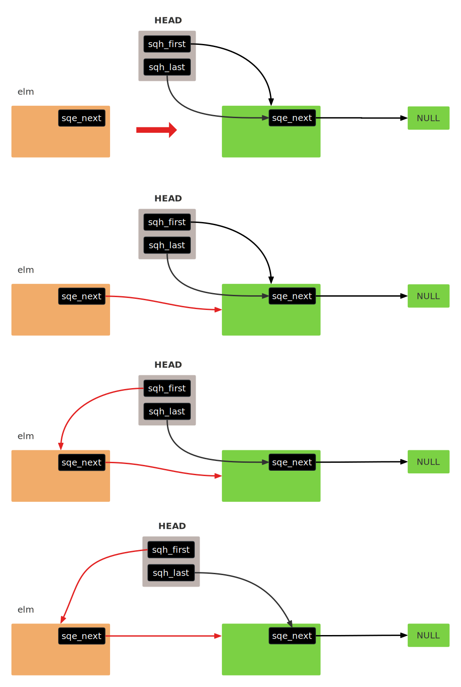
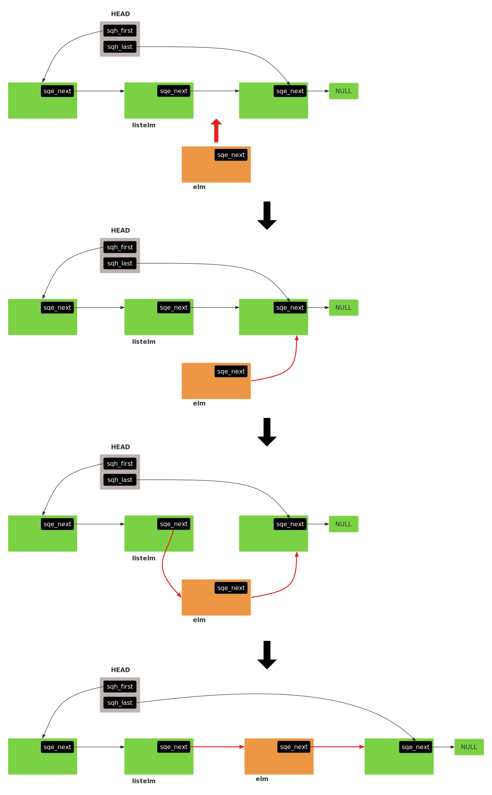
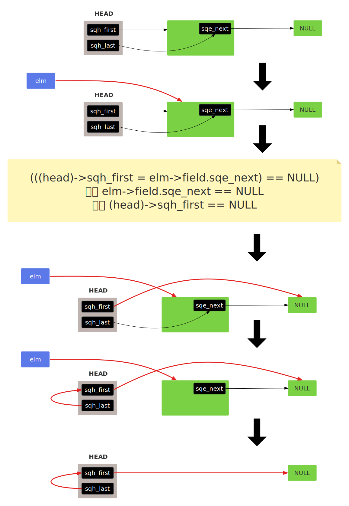
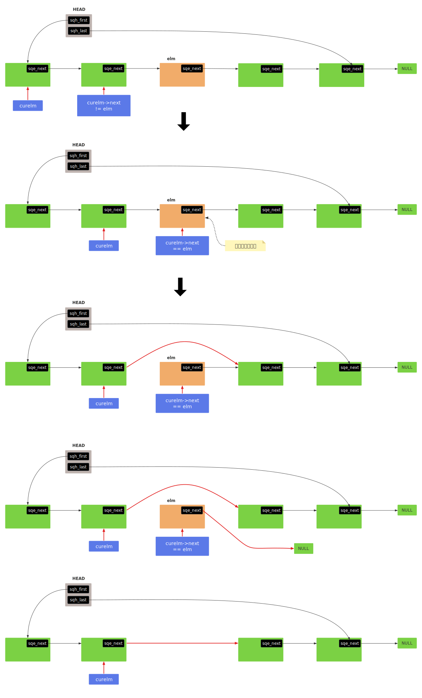
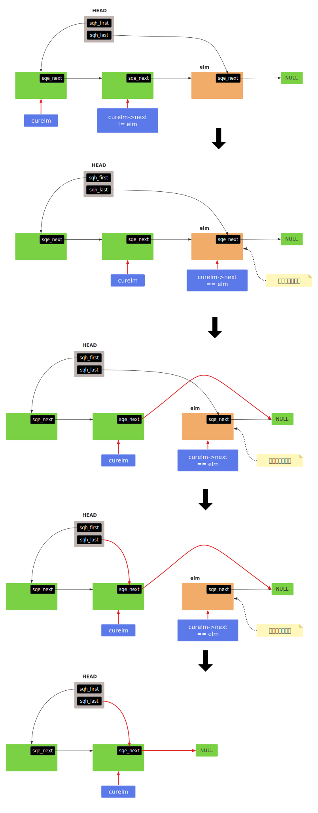
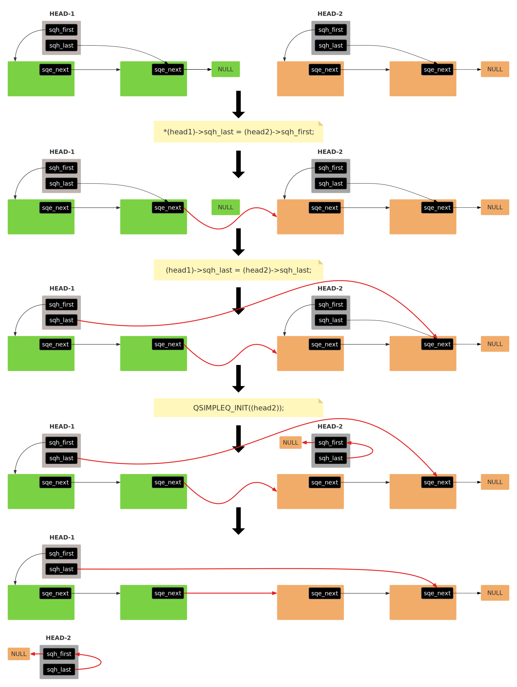
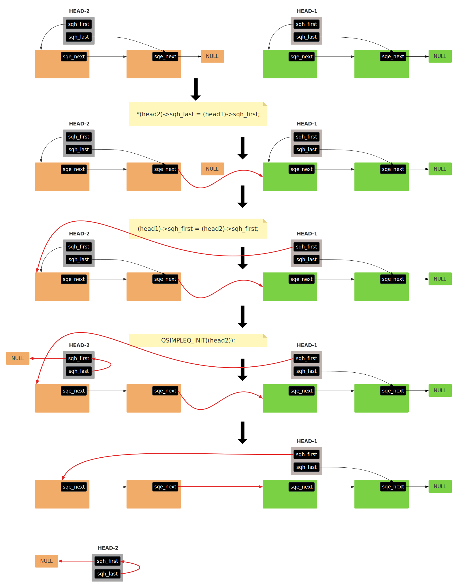
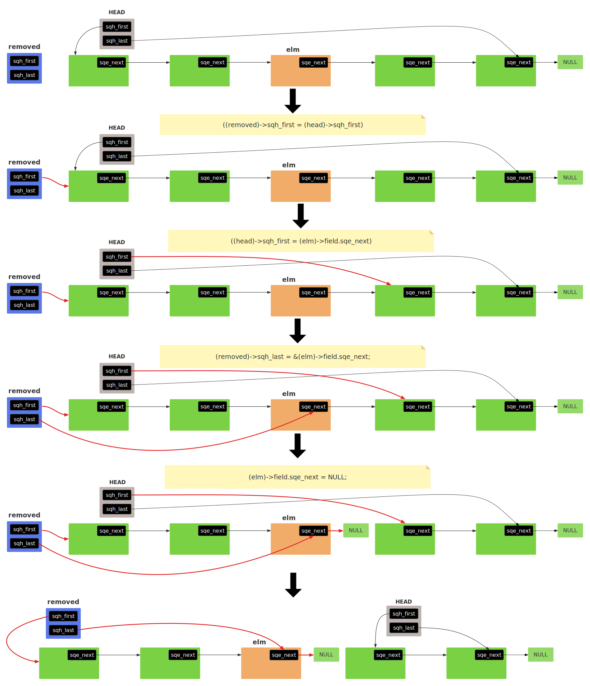

- [1. 队列定义](#1-队列定义)
  - [1.1. 使用案例](#11-使用案例)
- [2. 队列操做](#2-队列操做)
  - [2.1. 基本访问方法](#21-基本访问方法)
  - [2.2. 队列初始化](#22-队列初始化)
  - [2.3. 插入节点](#23-插入节点)
    - [2.3.1. 插入到头部](#231-插入到头部)
    - [2.3.2. 插入到尾部](#232-插入到尾部)
    - [2.3.3. 插入到中间](#233-插入到中间)
- [3. 移除节点](#3-移除节点)
  - [3.1. 移除头部节点](#31-移除头部节点)
  - [3.2. 移除指定节点](#32-移除指定节点)
  - [3.3. 遍历](#33-遍历)
    - [3.3.1. 遍历队列](#331-遍历队列)
    - [3.3.2. 遍历队列（安全）](#332-遍历队列安全)
  - [3.4. 尾节点快速定位](#34-尾节点快速定位)
  - [3.5. 队列合并](#35-队列合并)
    - [3.5.1. 合并到尾部](#351-合并到尾部)
    - [3.5.2. 合并到头部](#352-合并到头部)
  - [3.6. 分割队列](#36-分割队列)
- [4. 完整代码](#4-完整代码)


# 1. 队列定义
```c
// 队列头
#define QSIMPLEQ_HEAD(name, type)                                       \
struct name {                                                           \
    struct type *sqh_first;    /* first element */                      \
    struct type **sqh_last;    /* addr of last next element */          \
}

// 初始化一个队列
#define QSIMPLEQ_HEAD_INITIALIZER(head)                                 \
    { NULL, &(head).sqh_first }

// 节点中的连接域，指向下一个节点
#define QSIMPLEQ_ENTRY(type)                                            \
struct {                                                                \
    struct type *sqe_next;    /* next element */                        \
}
```


## 1.1. 使用案例
&emsp;&emsp;qemu-8.2.2/qemu-img.c     
```c
// 节点类型
typedef struct ImgBitmapAction {
    enum ImgBitmapAct act;
    const char *src; /* only used for merge */
    QSIMPLEQ_ENTRY(ImgBitmapAction) next;
} ImgBitmapAction;

// 磁盘持久化位图操作。  
static int img_bitmap(int argc, char **argv)
{
    // ......
    // 省略一堆代码
    // ......
    
    
    // 队列头
    QSIMPLEQ_HEAD(, ImgBitmapAction) actions;
    ImgBitmapAction *act, *act_next;
    const char *op;
    int inactivate_ret;

    // 初始化队列
    QSIMPLEQ_INIT(&actions);  

    for (;;) {

        // ......

        switch (c) {

        // ......

        case OPTION_ADD:
            act = g_new0(ImgBitmapAction, 1);
            act->act = BITMAP_ADD;
            
            // 添加节点
            QSIMPLEQ_INSERT_TAIL(&actions, act, next);  
            add = true;
            break;
  
        // ......

        }
    }

    // 判断队列是否为空
    if (QSIMPLEQ_EMPTY(&actions)) {
        error_report("Need at least one of --add, --remove, --clear, "
                     "--enable, --disable, or --merge");
        goto out;
    }
    
    // ......


    // 遍历队列
    QSIMPLEQ_FOREACH_SAFE(act, &actions, next, act_next) {   
        switch (act->act) {
        // ......
        }

        if (err) {
            // ......
        }
        g_free(act);
    }

    // ......
 out:
    // ......
    return ret;
}
```

# 2. 队列操做

## 2.1. 基本访问方法
```c
// 常规判空：  单线程环境、受锁保护的多线程临界区、性能敏感但线程安全已保障的场景。
#define QSIMPLEQ_EMPTY(head)        ((head)->sqh_first == NULL)


// 原子判空：  无锁编程（Lock-free）场景，多线程环境无显式锁保护时，需检测队列状态变化的异步场景。
#define QSIMPLEQ_EMPTY_ATOMIC(head) \
    (qatomic_read(&((head)->sqh_first)) == NULL)

// 获取队列的首节点。
#define QSIMPLEQ_FIRST(head)        ((head)->sqh_first)

// 获取elm的下一个节点
#define QSIMPLEQ_NEXT(elm, field)   ((elm)->field.sqe_next)
```

## 2.2. 队列初始化
```c
#define QSIMPLEQ_INIT(head) do {                                        \
    (head)->sqh_first = NULL;                                           \
    (head)->sqh_last = &(head)->sqh_first;                              \
} while (/*CONSTCOND*/0)
```
  

## 2.3. 插入节点

### 2.3.1. 插入到头部
```c
#define QSIMPLEQ_INSERT_HEAD(head, elm, field) do {                     \
    if (((elm)->field.sqe_next = (head)->sqh_first) == NULL)            \
        (head)->sqh_last = &(elm)->field.sqe_next;                      \
    (head)->sqh_first = (elm);                                          \
} while (/*CONSTCOND*/0)
```
- elm: 待插入的节点。
- field: 节点的连接域。
- head: 队列的头。    

**1. 空队列插入节点**     
   

**2. 非空队列插入节点**     
  


### 2.3.2. 插入到尾部
```c
#define QSIMPLEQ_INSERT_TAIL(head, elm, field) do {                     \
    (elm)->field.sqe_next = NULL;                                       \
    *(head)->sqh_last = (elm);                                          \
    (head)->sqh_last = &(elm)->field.sqe_next;                          \
} while (/*CONSTCOND*/0)
```


### 2.3.3. 插入到中间
```c
#define QSIMPLEQ_INSERT_AFTER(head, listelm, elm, field) do {           \
    if (((elm)->field.sqe_next = (listelm)->field.sqe_next) == NULL)    \
        (head)->sqh_last = &(elm)->field.sqe_next;                      \
    (listelm)->field.sqe_next = (elm);                                  \
} while (/*CONSTCOND*/0)
```
- elm: 等待插入的节点。   
- listelm: 插入该节点后。      
- 中间插入的节点分为两种情况：
1. listelm是尾节点，和QSIMPLEQ_INSERT_TAIL差不多。         
1. listelm不是尾节点，插入过程如下：   
   


# 3. 移除节点

## 3.1. 移除头部节点  
```c
#define QSIMPLEQ_REMOVE_HEAD(head, field) do {                          \
    typeof((head)->sqh_first) elm = (head)->sqh_first;                  \
    if (((head)->sqh_first = elm->field.sqe_next) == NULL)              \
        (head)->sqh_last = &(head)->sqh_first;                          \
    elm->field.sqe_next = NULL;                                         \
} while (/*CONSTCOND*/0)
```    

1. 队列中的有两个及以上节点：     
       

2. 队列中只有一个节点：      
   


## 3.2. 移除指定节点    
```c
#define QSIMPLEQ_REMOVE(head, elm, type, field) do {                    \
    if ((head)->sqh_first == (elm)) {                                   \
        QSIMPLEQ_REMOVE_HEAD((head), field);                            \
    } else {                                                            \
        struct type *curelm = (head)->sqh_first;                        \
        while (curelm->field.sqe_next != (elm))                         \
            curelm = curelm->field.sqe_next;                            \
        if ((curelm->field.sqe_next =                                   \
            curelm->field.sqe_next->field.sqe_next) == NULL)            \
                (head)->sqh_last = &(curelm)->field.sqe_next;           \
        (elm)->field.sqe_next = NULL;                                   \
    }                                                                   \
} while (/*CONSTCOND*/0)
```
- elm: 要删除的节点。
1. 如果elm是第一个节点，则使用QSIMPLEQ_REMOVE_HEAD进行删除。   

2. 如果elm是中间节点：        
   

3. 如果elm是最后一个节点：   
  


## 3.3. 遍历

### 3.3.1. 遍历队列
不删除节点时使用。   
```c
#define QSIMPLEQ_FOREACH(var, head, field)                              \
    for ((var) = ((head)->sqh_first);                                   \
        (var);                                                          \
        (var) = ((var)->field.sqe_next))
```
使用案例：  
```c
// qemu-8.2.2/audio/audio.c。   
// 遍历全局音频设备链表，逐个初始化每个音频设备。     
void audio_init_audiodevs(void)
{
    AudiodevListEntry *e;

    QSIMPLEQ_FOREACH(e, &audiodevs, next) {
        audio_init(e->dev, &error_fatal);
    }
}
```

### 3.3.2. 遍历队列（安全）
遍历队列时可以安全删除节点。   
```c
#define QSIMPLEQ_FOREACH_SAFE(var, head, field, next)                   \
    for ((var) = ((head)->sqh_first);                                   \
        (var) && ((next = ((var)->field.sqe_next)), 1);                 \
        (var) = (next))
```
使用案例：   
```c
// qemu-8.2.2/migration/ram.c   
// 在虚拟机迁移结束或发生错误时调用，清理未处理完的页面请求队列，防止资源泄露。
// 释放 RAMState 结构体中的 src_page_requests 队列中所有剩余的页面请求。
static void migration_page_queue_free(RAMState *rs)
{
    struct RAMSrcPageRequest *mspr, *next_mspr;
    /* This queue generally should be empty - but in the case of a failed
     * migration might have some droppings in.
     */
    RCU_READ_LOCK_GUARD();
    // 遍历队列
    QSIMPLEQ_FOREACH_SAFE(mspr, &rs->src_page_requests, next_req, next_mspr) {
        memory_region_unref(mspr->rb->mr);
        // 删除节点
        QSIMPLEQ_REMOVE_HEAD(&rs->src_page_requests, next_req);
        g_free(mspr);
    }
}
```

## 3.4. 尾节点快速定位
```c
#define QSIMPLEQ_LAST(head, type, field)                                \
    (QSIMPLEQ_EMPTY((head)) ?                                           \
        NULL :                                                          \
            ((struct type *)(void *)                                    \
        ((char *)((head)->sqh_last) - offsetof(struct type, field))))
```
- 如果队列为空，则返回NULL。如果队列不为空，则返回队尾节点。
- ofensetof()，获取结构体成员相对于结构体的偏移量。   
- `offsetof(struct type, field)`，获取field在type中的偏移量。    
- `(char *)((head)->sqh_last)`，转换为 char* 类型以便进行字节级的指针运算。   
- `(char *)((head)->sqh_last) - offsetof(struct type, field)`，从尾元素的 next 指针地址回退到包含它的结构体起始地址。   
- `(struct type *)(void *)`，双重类型转换，先将计算出的地址转为 void*（通用指针类型），再转为目标类型 struct type *（具体结构体指针）。   


## 3.5. 队列合并 

### 3.5.1. 合并到尾部
```C
#define QSIMPLEQ_CONCAT(head1, head2) do {                              \
    if (!QSIMPLEQ_EMPTY((head2))) {                                     \
        *(head1)->sqh_last = (head2)->sqh_first;                        \
        (head1)->sqh_last = (head2)->sqh_last;                          \
        QSIMPLEQ_INIT((head2));                                         \
    }                                                                   \
} while (/*CONSTCOND*/0)
```
- 将 head2 队列的所有元素插入到 head1 队列的尾部。   
- 只有当 head2 队列非空时才执行操作，空队列合并是无效操作，直接跳过。 
    


### 3.5.2. 合并到头部
```c
#define QSIMPLEQ_PREPEND(head1, head2) do {                             \
    if (!QSIMPLEQ_EMPTY((head2))) {                                     \
        *(head2)->sqh_last = (head1)->sqh_first;                        \
        (head1)->sqh_first = (head2)->sqh_first;                          \
        QSIMPLEQ_INIT((head2));                                         \
    }                                                                   \
} while (/*CONSTCOND*/0)
```
- 将 head2 队列的所有元素插入到 head1 队列的头部。   
- 只有当 head2 队列非空时才执行操作，空队列合并是无效操作，直接跳过。   
    


## 3.6. 分割队列
将原队列从指定节点之后分割为两个独立队列。
```c
#define QSIMPLEQ_SPLIT_AFTER(head, elm, field, removed) do {            \
    QSIMPLEQ_INIT(removed);                                             \
    if (((removed)->sqh_first = (head)->sqh_first) != NULL) {           \
        if (((head)->sqh_first = (elm)->field.sqe_next) == NULL) {      \
            (head)->sqh_last = &(head)->sqh_first;                      \
        }                                                               \
        (removed)->sqh_last = &(elm)->field.sqe_next;                   \
        (elm)->field.sqe_next = NULL;                                   \
    }                                                                   \
} while (/*CONSTCOND*/0)
```
- head: &emsp;队列头，为空时直接返回。   
- elm: &emsp;从elm开始分割队列，将eml（包括）之前的节点划分给removed。
- removed: &emsp;指向移除的队列。   
- 以elm为非末尾节为例：    
   


# 4. 完整代码
```c
/*
 * Simple queue definitions.
 */
#define QSIMPLEQ_HEAD(name, type)                                       \
struct name {                                                           \
    struct type *sqh_first;    /* first element */                      \
    struct type **sqh_last;    /* addr of last next element */          \
}

#define QSIMPLEQ_HEAD_INITIALIZER(head)                                 \
    { NULL, &(head).sqh_first }

#define QSIMPLEQ_ENTRY(type)                                            \
struct {                                                                \
    struct type *sqe_next;    /* next element */                        \
}

/*
 * Simple queue functions.
 */
#define QSIMPLEQ_INIT(head) do {                                        \
    (head)->sqh_first = NULL;                                           \
    (head)->sqh_last = &(head)->sqh_first;                              \
} while (/*CONSTCOND*/0)

#define QSIMPLEQ_INSERT_HEAD(head, elm, field) do {                     \
    if (((elm)->field.sqe_next = (head)->sqh_first) == NULL)            \
        (head)->sqh_last = &(elm)->field.sqe_next;                      \
    (head)->sqh_first = (elm);                                          \
} while (/*CONSTCOND*/0)

#define QSIMPLEQ_INSERT_TAIL(head, elm, field) do {                     \
    (elm)->field.sqe_next = NULL;                                       \
    *(head)->sqh_last = (elm);                                          \
    (head)->sqh_last = &(elm)->field.sqe_next;                          \
} while (/*CONSTCOND*/0)

#define QSIMPLEQ_INSERT_AFTER(head, listelm, elm, field) do {           \
    if (((elm)->field.sqe_next = (listelm)->field.sqe_next) == NULL)    \
        (head)->sqh_last = &(elm)->field.sqe_next;                      \
    (listelm)->field.sqe_next = (elm);                                  \
} while (/*CONSTCOND*/0)

#define QSIMPLEQ_REMOVE_HEAD(head, field) do {                          \
    typeof((head)->sqh_first) elm = (head)->sqh_first;                  \
    if (((head)->sqh_first = elm->field.sqe_next) == NULL)              \
        (head)->sqh_last = &(head)->sqh_first;                          \
    elm->field.sqe_next = NULL;                                         \
} while (/*CONSTCOND*/0)

#define QSIMPLEQ_SPLIT_AFTER(head, elm, field, removed) do {            \
    QSIMPLEQ_INIT(removed);                                             \
    if (((removed)->sqh_first = (head)->sqh_first) != NULL) {           \
        if (((head)->sqh_first = (elm)->field.sqe_next) == NULL) {      \
            (head)->sqh_last = &(head)->sqh_first;                      \
        }                                                               \
        (removed)->sqh_last = &(elm)->field.sqe_next;                   \
        (elm)->field.sqe_next = NULL;                                   \
    }                                                                   \
} while (/*CONSTCOND*/0)

#define QSIMPLEQ_REMOVE(head, elm, type, field) do {                    \
    if ((head)->sqh_first == (elm)) {                                   \
        QSIMPLEQ_REMOVE_HEAD((head), field);                            \
    } else {                                                            \
        struct type *curelm = (head)->sqh_first;                        \
        while (curelm->field.sqe_next != (elm))                         \
            curelm = curelm->field.sqe_next;                            \
        if ((curelm->field.sqe_next =                                   \
            curelm->field.sqe_next->field.sqe_next) == NULL)            \
                (head)->sqh_last = &(curelm)->field.sqe_next;           \
        (elm)->field.sqe_next = NULL;                                   \
    }                                                                   \
} while (/*CONSTCOND*/0)

#define QSIMPLEQ_FOREACH(var, head, field)                              \
    for ((var) = ((head)->sqh_first);                                   \
        (var);                                                          \
        (var) = ((var)->field.sqe_next))

#define QSIMPLEQ_FOREACH_SAFE(var, head, field, next)                   \
    for ((var) = ((head)->sqh_first);                                   \
        (var) && ((next = ((var)->field.sqe_next)), 1);                 \
        (var) = (next))

#define QSIMPLEQ_CONCAT(head1, head2) do {                              \
    if (!QSIMPLEQ_EMPTY((head2))) {                                     \
        *(head1)->sqh_last = (head2)->sqh_first;                        \
        (head1)->sqh_last = (head2)->sqh_last;                          \
        QSIMPLEQ_INIT((head2));                                         \
    }                                                                   \
} while (/*CONSTCOND*/0)

#define QSIMPLEQ_PREPEND(head1, head2) do {                             \
    if (!QSIMPLEQ_EMPTY((head2))) {                                     \
        *(head2)->sqh_last = (head1)->sqh_first;                        \
        (head1)->sqh_first = (head2)->sqh_first;                          \
        QSIMPLEQ_INIT((head2));                                         \
    }                                                                   \
} while (/*CONSTCOND*/0)

#define QSIMPLEQ_LAST(head, type, field)                                \
    (QSIMPLEQ_EMPTY((head)) ?                                           \
        NULL :                                                          \
            ((struct type *)(void *)                                    \
        ((char *)((head)->sqh_last) - offsetof(struct type, field))))

/*
 * Simple queue access methods.
 */
#define QSIMPLEQ_EMPTY_ATOMIC(head) \
    (qatomic_read(&((head)->sqh_first)) == NULL)
#define QSIMPLEQ_EMPTY(head)        ((head)->sqh_first == NULL)
#define QSIMPLEQ_FIRST(head)        ((head)->sqh_first)
#define QSIMPLEQ_NEXT(elm, field)   ((elm)->field.sqe_next)
```
