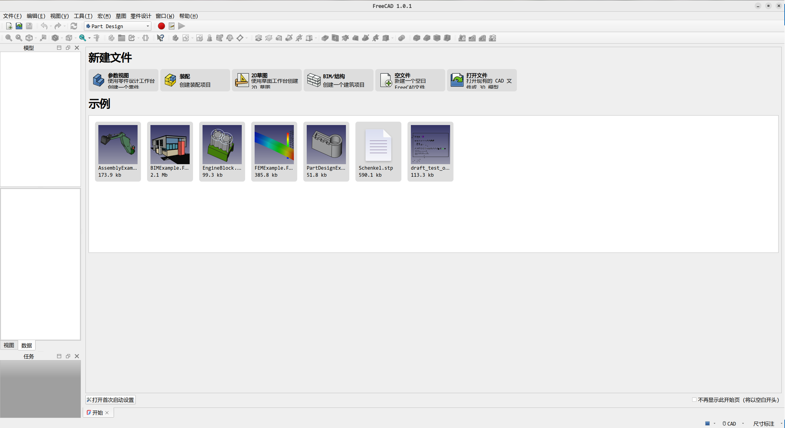

- [1. 简单介绍](#1-简单介绍)
- [2. Windows](#2-windows)
  - [2.1. 安装MSVC编译环境](#21-安装msvc编译环境)
  - [2.2. 下载源码](#22-下载源码)
  - [2.3. 安装依赖包 Freecad-libpack](#23-安装依赖包-freecad-libpack)
  - [2.4. 编译](#24-编译)
- [3. Linux](#3-linux)
  - [3.1. 安装依赖](#31-安装依赖)
  - [3.2. 编译](#32-编译)


# 1. 简单介绍
FreeCAD的架构是基于工作台系统（Workbench）的，工作台是针对特定的设计任务而组建的，每个工作台都包含一系列专门的工具这是一种模块化设计，例如CAD、CAM、CAE。看起来和solidworks差不多。  

**关键依赖库**：  
- 几何内核： OpenCASCADE(OOC)。  
- 3D渲染： OpenInventor、Coin3D、Pivy。 
- Python脚本工具： PyCXX、Swig、Boost.python。脚本引擎和模块扩展支持，在命令模式支持Python脚本驱动，GUI模式下支持Python脚本宏录制。。  
- UI： Qt、PySide。  

**主要工作台**:  
- Part工作台：基础几何建模。   
- PartDesign工作台：参数化特征建模。   
- Sketcher工作台：2D草图绘制。   
- TechDraw工作台：技术制图。   
- FEM工作台：有限元分析。   

# 2. Windows
## 2.1. 安装MSVC编译环境
不安装visual studio，我们只需要MSVC编译套件，直接下载`Visual Studio 2022 生成工具`：   
1. 在 “工作负载” 选项卡中，勾选 “使用 C++ 的桌面开发”。  
2. 勾选 “MSVC v143 - VS 2022 C++ x64/x86 生成工具”（最新版本）。  
3. 勾选 Windows 10/11 SDK（根据系统版本选择）。

例如我安装到： C:\app\Microsoft Visual Studio\Build Tools\VC\Tools\MSVC\14.44.35207\bin\Hostx64\x64，然后将该目录添加到环境变量中。    


## 2.2. 下载源码
```bash
git clone --recurse-submodules https://github.com/FreeCAD/FreeCAD.git
```
这样会下载整个仓库的所有版本，体积较大，也可以到freecad的github仓库下载指定的版本，但是freecad源码不包含子模块，需要单独下载子模块，具体见文件“.gitmodules”。  


## 2.3. 安装依赖包 Freecad-libpack
到[Freecad-libpack Github仓库](https://github.com/FreeCAD/FreeCAD-LibPack)下载并解压到指定目录，例如： C:\Users\zci\Desktop\Code\FreeCAD\LibPack-1.1.0-v3.1.1.3-Release，然后在FreeCAD源码的cmake文件中设置环境变量，如此下：  
```cmake
# == Win32 is default behaviour use the LibPack copied in Source tree ==========
if(MSVC)
    option(FREECAD_RELEASE_PDB "Create PDB files for Release version." ON)
    option(FREECAD_RELEASE_SEH "Enable Structured Exception Handling for Release version." ON)
    option(FREECAD_LIBPACK_USE "Use the LibPack to Build FreeCAD (only Win32 so far)." ON)
    option(FREECAD_USE_PCH "Activate precompiled headers where it's used." ON)
    
    # libpack的环境变量
    set(ENV{FREECAD_LIBPACK_DIR},"C:/Users/zci/Desktop/Code/FreeCAD/LibPack-1.1.0-v3.1.1.3-Release") 

    if (DEFINED ENV{FREECAD_LIBPACK_DIR})
        set(FREECAD_LIBPACK_DIR $ENV{FREECAD_LIBPACK_DIR} CACHE PATH  "Directory of the FreeCAD LibPack")
        message(STATUS "Found libpack env variable: ${FREECAD_LIBPACK_DIR}")
    else()
        set(FREECAD_LIBPACK_DIR ${CMAKE_SOURCE_DIR} CACHE PATH  "Directory of the FreeCAD LibPack")
    endif()
```

## 2.4. 编译
```bash
mkdir __BUILD
cd __BUILD

cmake ..
cmake --build C:/Users/zci/Desktop/Code/FreeCAD/FreeCAD-1.0.1/__BUILD  --parallel -j16   --config Release
```
编译完成后还不能直接运行，因为一堆动态库不在环境变量中，可以添加环境变量，也可以将动态库都拷贝到freecad.exe目录下。


# 3. Linux
## 3.1. 安装依赖
所以这里采取一种投机取巧的方式：   
1. 安装freecad-daily源（Ubuntu）。  
```bash
sudo add-apt-repository ppa:freecad-maintainers/freecad-daily
sudo apt update
```
1. 安装FreeCAD   
```bash
sudo apt install freecad-daily
```
如此，需要的依赖就全部安装好了。

## 3.2. 编译
1. **获取源码**      

同Windows。

2. **编译**    

```bash
mkdir build
cd build  
cmake ..
make -j16
```
3. **运行**    

   


