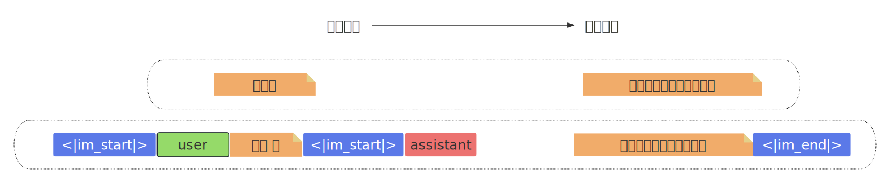
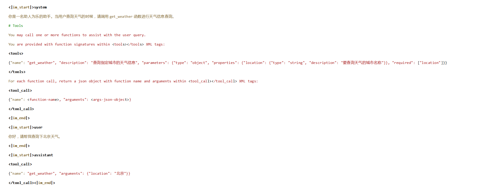

1. [1. 认识模型的输入输出](#1-认识模型的输入输出)
2. [2. 微调数据集](#2-微调数据集)
    1. [2.1. 一般数据集](#21-一般数据集)
3. [3. 训练Function calling能力的数据集](#3-训练function-calling能力的数据集)
    1. [3.1. Tool Schema 数据集的核心作用](#31-tool-schema-数据集的核心作用)
    2. [3.2. Tool Schema 数据集格式](#32-tool-schema-数据集格式)
4. [4. 带有思考过程的数据集](#4-带有思考过程的数据集)
5. [5. 带有思考过程、Function calling的数据集](#5-带有思考过程function-calling的数据集)


# 1. 认识模型的输入输出   

&emsp;&emsp;从模型底层原理看，大模型会使用一些特殊字符来标记用户的不同类型输入、系统提示词、以及工具调用或者多模态输入等。以Qwen3为例，在一次实际的对话过程中，模型的真实输入和输出如下所示：
  
&emsp;&emsp;上图中 <|im_start|> 代表文本开始，而 user 则代表消息身份，用于构建多轮对话，而 <|im_end|> 则代表文本结束，即用户输入结束，而 <|im_start|> 代表新一段文本开始， assistant 代表接下来由模型创建消息，而 <|im_end|> 同样代表模型创建消息的结束。模型就是通过这样一组特殊字符标记来规范自己的行为，判断当前消息类型，以及通过输出特殊标记来确定停止时间。对于绝大多数模型，我们可以在模型的 tokenizer_config.json 中看到完整的特殊标记符（以及系统提示词模板）：
```json
{
  "add_bos_token": false,
  "add_prefix_space": false,
  "added_tokens_decoder": {
    "151643": {
      "content": "<|endoftext|>",
      "lstrip": false,
      "normalized": false,
      "rstrip": false,
      "single_word": false,
      "special": true
    },
    "151644": {
      "content": "<|im_start|>",
      "lstrip": false,
      "normalized": false,
      "rstrip": false,
      "single_word": false,
      "special": true
    },
    "151645": {
      "content": "<|im_end|>",
      "lstrip": false,
      "normalized": false,
      "rstrip": false,
      "single_word": false,
      "special": true
    },
    "151646": {
      "content": "<|object_ref_start|>",
      "lstrip": false,
      "normalized": false,
      "rstrip": false,
      "single_word": false,
      "special": true
    },
    # ...
    # ...
```

# 2. 微调数据集
&emsp;&emsp;微调属于有监督的训练，所以需要**输入输出对**形式的数据集。  

## 2.1. 一般数据集
以[huggingface](https://www.modelscope.cn/datasets/xiaofengalg/Chinese-medical-dialogue)上提供的一个医疗数据集为例：  
```json
[
    {
        "instruction": "小儿肥胖超重该如何治疗",
        "input": "女宝宝，刚7岁，这一年，察觉到，我家孩子身上肉很多，而且，食量非常的大，平时都不喜欢吃去玩，请问：小儿肥胖超重该如何治疗。",
        "output": "孩子出现肥胖症的情况。家长要通过孩子运功和健康的饮食来缓解他的症状，可以先让他做一些有氧运动，比如慢跑，爬坡，游泳等，并且饮食上孩子多吃黄瓜，胡萝卜，菠菜等，禁止孩子吃一些油炸食品和干果类食物，这些都是干热量高脂肪的食物，而且不要让孩子总是吃完就躺在床上不动，家长在治疗小儿肥胖期间如果孩子情况严重就要及时去医院在医生的指导下给孩子治疗。",
        "history": null
    },
    {
        "instruction": "小儿肥胖超重该怎样医治",
        "input": "男孩子，刚4岁，最近，发现，我家孩子体重要比别的孩子重很多，而且，最近越来越能吃了，还特别的懒，请问：小儿肥胖超重该怎样医治。",
        "output": "孩子一旦患上肥胖症家长要先通过运动和饮食来改变孩子的情况，要让孩子做一些他这个年龄段能做的运动，如游泳，慢跑等，要给孩子多吃一些像苹果，猕猴桃，胡萝卜等食物，禁止孩子吃高热量，高脂肪的食物，像蛋糕，干果，曲奇饼干等，严格的控制孩子的饮食，不要让他暴饮暴食，多运动对改变孩子肥胖都是有好处的，在治疗小儿肥胖期间如果情况严重，建议家长先带孩子去医院检查一下孩子肥胖症的原因在针对性的治疗。",
        "history": null
    },
    {
        "instruction": "小儿肥胖能吃该如何治疗",
        "input": "男宝，已经5岁，今年，察觉到，孩子身上越来越肉乎了，同时，吃的饭也比一般孩子多，平时都不喜欢吃去玩，请问：小儿肥胖能吃该如何治疗。",
        "output": "当孩子患上肥胖症的时候家长可以增加孩子的运动量和控制他的饮食来改变症状，像游泳，爬坡这类游泳运动对肥胖的症状都很好的效果，像冬瓜，西红柿这样高纤维的蔬菜要多吃一些，孩子不可以吃像蛋糕，夏威夷果这些高热量的食物，而且不要让孩子总是吃完就躺在床上不动，家长在治疗小儿肥胖期间如果孩子情况严重就要及时去医院在医生的指导下给孩子治疗。",
        "history": null
    },
```

每一个”{}“中都有input和output，微调程序需要将数据集转化为如下格式， 才能训练模型：   
```bash
<|im_start|>system
小儿肥胖超重该怎样医治<|im_end|>\n<|im_start|>user\n男孩子，刚4岁，最近，发现，我家孩子体重要比别的孩子重很多，而且，最近越来越能吃了，还特别的懒，请问：小儿肥胖超重该怎样医治。<|im_end|>\n<|im_start|>assistant\n孩子一旦患上肥胖症家长要先通过运动和饮食来改变孩子的情况，要让孩子做一些他这个年龄段能做的运动，如游泳，慢跑等，要给孩子多吃一些像苹果，猕猴桃，胡萝卜等食物，禁止孩子吃高热量，高脂肪的食物，像蛋糕，干果，曲奇饼干等，严格的控制孩子的饮食，不要让他暴饮暴食，多运动对改变孩子肥胖都是有好处的，在治疗小儿肥胖期间如果情况严重，建议家长先带孩子去医院检查一下孩子肥胖症的原因在针对性的治疗。
<|im_end|>
```
上面的数据是给程序看的，我们整理一下，如下：   
```bash
<|im_start|>system
小儿肥胖超重该怎样医治
<|im_end|>
<|im_start|>user
男孩子，刚4岁，最近，发现，我家孩子体重要比别的孩子重很多，而且，最近越来越能吃了，还特别的懒，请问：小儿肥胖超重该怎样医治。
<|im_end|>
<|im_start|>assistant
孩子一旦患上肥胖症家长要先通过运动和饮食来改变孩子的情况，要让孩子做一些他这个年龄段能做的运动，如游泳，慢跑等，要给孩子多吃一些像苹果，猕猴桃，胡萝卜等食物，禁止孩子吃高热量，高脂肪的食物，像蛋糕，干果，曲奇饼干等，严格的控制孩子的饮食，不要让他暴饮暴食，多运动对改变孩子肥胖都是有好处的，在治疗小儿肥胖期间如果情况严重，建议家长先带孩子去医院检查一下孩子肥胖症的原因在针对性的治疗。
<|im_end|>
```
在训练过程中，通过`<|im_start|>system...<|im_end|>` 来标记系统提示词。实际进行微调时，模型会根据`assistant`为界，学习assistant之前的文本输入情况下应该如何输出。上面展示的是带有`系统提示词`的微调数据集格式，也有些微调数据集是没有系统提示词的。 

# 3. 训练Function calling能力的数据集
&emsp;&emsp;微调只能优化模型的Function calling能力，并不能从无到有让模型学会Function calling，所以微调只反对本身具备外部工具调用能力的模型。而且数据集中需要包含`tool schema·信息，如果对话过程中带入了Function calling，此时模型会读取tool schema，这个tool schema又是啥子？在对话系统中引入 Function Calling（函数调用）时，模型需要依赖 Tool Schema（工具架构）来理解可用的工具及其参数。Tool Schema 是对工具（如 API、数据库操作、外部服务等）的结构化定义，它明确告诉模型：   
- 工具的功能是什么？  
- 工具的输入参数有哪些？  
- 参数的类型和约束条件是什么？  
- 工具的输出格式是什么？  

## 3.1. Tool Schema 数据集的核心作用
1. **定义工具的接口：**      
Tool Schema 是模型与外部工具之间的“契约”，确保模型生成的调用符合工具的实际需求。例如，调用天气查询 API 时，必须指定 location 参数，且类型为字符串。   
2. **参数验证：**    
模型生成的调用参数需符合 Tool Schema 的格式要求（如字段名、类型、必填项），避免无效调用。   
3. **生成结构化输出：**  
模型会根据 Tool Schema 的描述，生成符合要求的 JSON 或其他结构化数据作为调用参数。    

## 3.2. Tool Schema 数据集格式
Tool Schema有多种定义方式，`Python 函数 + 类型注解`、`Pydantic 模型`、`JSON Schema`，MCP会自动创建tool schema。  
Tool Schema Json 的大概形式如下:   
```json
tool_schema = [
 {
    "name": "get_weather",
    "description": "查询指定城市的天气信息",
    "parameters": {
       "type": "object",
       "properties": {
          "location": {
             "type": "string",
             "description": "要查询天气的城市名称"
          }
       },
       "required": ["location"]
    }
 }
]
```
此时，如果我们进行如下对话：   
**系统提示词（instruction）**  ：你是一名助人为乐的助手。当用户查询天气的时候，请调用get_weather函数进行天气信息查询。   
**用户输入（input）**          ： 你好，请帮我查询下北京天气。    
**助手回复（output）**        ：{"name": "get_weather", "arguments": {"location": "北京"}}   
这个”**助手回复（output）**“就是一条`Function call message`， 根据这条信息来进行外部工具调用。此时模型真实的输入和输出内容如下：   
   
&emsp;&emsp;接下来在进行训练时，模型同样是根据assistant前的内容，学习assistant后面的输出内容。


# 4. 带有思考过程的数据集
如果是带有思考链，则数据集大概形式如下：   
```json
{
    "system": "你是一名助人为乐的助手。当用户查询天气的时候，请调用get_weather函数进行天气信息查询。",
    "conversations": [
        {
            "role":    "user", 
            "content": "你好，好久不见！"
        }
        {
            "role": "assistant", 
            "contant": "是的呀，好久不见，最近有什么事情要分享给我吗？", 
            "reasoning_content": "好的, 用户发来“你好，好久不见！”,我需要回应。首先，用户可能希望得到亲切的回应，所以应该用友好的语气。",    
        }
    ]
}
```
此时对应的模型真实的内部输入和输出结果如下：   
```bash
<|im_start|>system
你是一名助人为乐的助手。<|im_end|>
<|im_start|>user
你好，好久不见。<|im_end|>
<|im_start|>assistant
<think>
好的，用户发来“你好，好久不见！”，我需要回应。首先，用户可能希望得到亲切的回应，所以应该用友好的语气。
</think>
是的呀，好久不见，最近有什么有趣的事情要和我分享么？<|im_end|>
```
`<think>`与`</think>`之间的就是思考过程，后面紧跟着就是模型回答。  


# 5. 带有思考过程、Function calling的数据集
```json
{
    "system": "你是一名助人为乐的助手。",
    "conversations": [
        {
            "role": "user", 
            "content": "你好，好久不见！"
        }
        {
            "role": "assistant", 
            "contant": " <tool_call>/n{\"name\": \"get_weather\", \"arguments\": \"location\": \"北京\"}/n</tool_call>",    
            "reasoning_content": "好的，用户问北京今天的天气，我应该尝试调用工具 get_weather，并将参数设置为北京。",      
        }
    ]
}
```
训练模型时读取到的格式：   
```bash
<|im_start|>system
你是一名助人为乐的助手。当用户查询天气的时候，请调用get_weather函数进行天气信息查询。
# Tools
You may call one or more functions to assist with the user query.
You are provided with function signatures within <tools></tools> XML tags:
<tools>
{"name": "get_weather", "description": "查询指定城市的天气信息", "parameters": {"type": "object", "properties": {"location": {"type": "string", "description": "要查询天气的城市名称"}}, "required": ["location"]}}
</tools>
For each function call, return a json object with function name and arguments 
within <tool_call></tool_call> XML tags:
<tool_call>
{"name": <function-name>, "arguments": <args-json-object>}
</tool_call>
<|im_end|>
<|im_start|>user
你好，请帮我查询下北京天气。
<|im_end|>
<|im_start|>assistant
<think>
好的，用户问北京今天的天气，我应该尝试调用工具 get_weather，并将参数设置为北京。
</think>
<tool_call>
{"name": "get_weather", "arguments": {"location": "北京"}}
</tool_call><|im_end|>
```
同时拥有Function calling、混合推理等功能，属于功能非常复杂的模型了。在实际微调过程中，稍有不慎就会令其丧失原有能力。  


