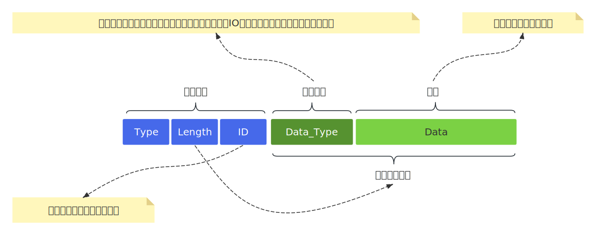

- [1. **流式协议**](#1-流式协议)
- [2. **流的边界**](#2-流的边界)
- [3. **应用层协议设计**](#3-应用层协议设计)
  - [3.1. **报文设计**](#31-报文设计)
  - [3.2. **解析器设计**](#32-解析器设计)
    - [3.2.1. **解析器的核心组成**](#321-解析器的核心组成)
    - [3.2.2. **异步通信**](#322-异步通信)

# 1. **流式协议**
&emsp;&emsp;TCP提供一种可靠传输方式，通过序列号和包重传确认机制保证数据包的有序，不会丢包或包乱序，并且数据一定被正确发到目的地。如果我们使用UDP协议，但又不能接受丢包，那就要在UDP的基础去现类似TCP的有序和可靠传输机制了（例如 RTP、RUDP）。TCP作为`流式协议`，它保证数据有序送达，但是数据流中，那个字节是开始，那个字节是结束，这就不关人家的事情了，也就是说，我们从传输层拿到数据后，要自行处理数据的`边界`。

# 2. **流的边界**       
关于边界问题，有两种情况：`粘包`、`半包`。   
- 粘包： 多个包裹连接在一起，也可能不是整数个包。   
- 半包： 只收到一个包的一部分。     

&emsp;&emsp;无论是半包还是粘包问题，问题都出在`流的边界`上，常用的解决办法有3种：`固定包长度`、`指定包结束标志`、`封装一套协议（协议头+数据）`。对于数据包固定大小，当数据长度小于包长度时，需要使用特定字符填充，例如“\0”，必须和正常数据区分开。当数据报长度大于包长度时，需要分包，发送端需要分包，接收端需要组包。对于指定包的结束标志，就是使用特定的符号或者符号组合作为包结束标志，例如FTP、SMTP协议，使用“\r\n”表示结束，接受端处理包时，遇到“\r\n”就认为获取到了一个包。

# 3. **应用层协议设计**
&emsp;&emsp;应用层协议设计要和网络传输层解耦，协议层提供读写报文的回调函数的声明，但是函数实现交给由业务层完成，业务层需要将设计好的读写函数注册给协议层。协议层需要读写数据时直接调用读写函数即可。但是要注意，协议的读写回调需要使用非阻塞方式实现。一般情况下，网络部分也是独立的模块，业务层通过网络模块接收网络数据并将数据保存到缓存区中，然后将缓存区的使用权移交给协议层，同样协议层需要发送数据时，也要将报文的缓存区使用权移交给网络模块。  

## 3.1. **报文设计**
报文一般会分为`控制报文`和`数据报文`。控制报文用于处理设备连接/断开、配置管理、流控制等，数据报文用于传输各种数据，报文大概的结构如下：   
   

最基本的控制报文有：
|控制报文|功能|
|------------|------------|
|Hello报文| 双方建立连接（TCP）后发送的第一个包是Hello报文，  用于同步双方的信息，包括协议版本，软件版本等等，保证新版协议对于旧版本的兼容性|
|connect报文|客户端发送，建立用户协议的连接|
|disconnect报文|断开连接，双发都可以发送|  
|其他| ... |
|||

## 3.2. **解析器设计**
通常我们使用基于回调的状态机架构来设计解析器。协议解析器定义了一个完整的回调接口系统来处理协议的数据包解析和序列化。   
1. **解析器的核心组成**    

|||  
|---------------------|------------|   
|**数据收发器**           | 一对儿回调函数，由用户提供，用于从网络接收数据，以及发送数据到网络|  
|**数据处理器**          | 一套数据处理回调程序，由于用户提供。  解析器收到完整报文并解析后将数据分发给对应的处理程序|  
|**报文构造器**         | 由用户调用，用于构造报文并将数据添加到报文中，最后将报文添加到发送队列中|   
|**capabilities缓存**  | 记录通讯双方的功能特性，用于兼容旧版协议|  
|**头部缓存**          | 保存正在接收的头部（报文头部、类型头部），以及接收进度。  头部决定了数据接收完成后，分发给那个处理程序|   
|**接收缓冲区**        | 缓存接收到的数据，以及接收进度。  数据接收完成后，解析器会将数据地址传递给对应的处理函数|  
|**发送队列**          | 缓存等待发送的报文|  
|**锁**               | 保存用户传入的互斥量，维护发送队列的线程安全|  

2. **协议层的任务循环**   

- 协议层任务循环以读回调为入口，一旦读取到数据，解析器就进入解析流程，依次读取报文头部、类型头部、数据，直到读回调返回0。在读取报文头部后会检查头部字段是否合法，并获取报文长度，以便于确定当前报文的结束边界。   
- 如果读回调返回0时，读取到的数据小于报文长度，此时会从解析流程返回，但是数据不会丢失，因为解析器已经缓存数据，等到新数据达到可以继续读取，直到读取到整个报文。读取一个完整报文后就将数据移交给处理器程序。   
- 处理器需要在处理数据后发送响应报文，也就是将处理结果打包成对应的报文并添加到发送队列中。而解析器发送回调的任务就是将发送队列中报文缓存区移交给网络模块。也可以基于事件机制，网络模块收到数据后通知协议层读取数据，而协议层这边在发送队列有数据时通知网络模块。    

