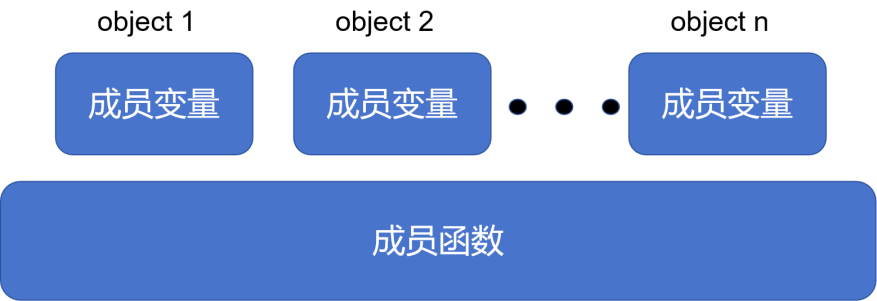
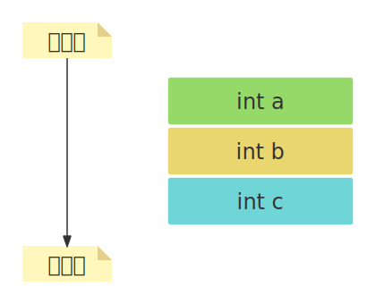
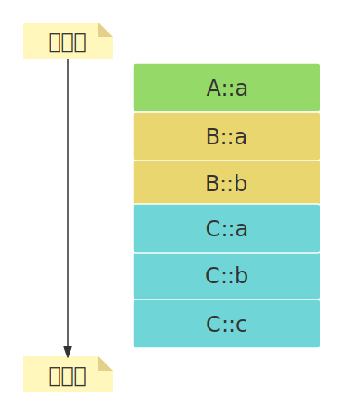
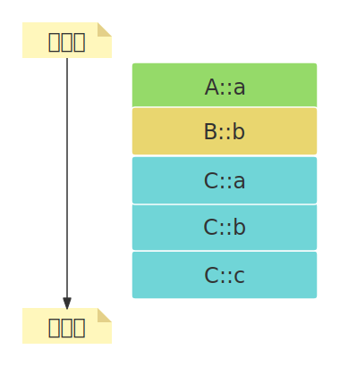

1. [1. 数据成员和函数成员](#1-数据成员和函数成员)
2. [2. 数据成员的内存布局](#2-数据成员的内存布局)
3. [3. 有成员变量遮蔽](#3-有成员变量遮蔽)
4. [4. 多继承时的内存模型](#4-多继承时的内存模型)


# 1. 数据成员和函数成员
&emsp;&emsp;类是创建对象的模板，不存在于编译后的可执行文件中；而对象是实实在在的数据，需要内存来存储。对象被创建时会在栈区/堆区分配内存。创建对象时要为对象分配内存，不同对象的成员变量不同，需要单独分配内存，但成员函数的代码时相同的，所有对象共享同一段函数代码。成员变量在堆区或栈区分配内存，成员函数在代码区分配内存。  
  
很显然，对象的大小只受成员变量的影响，和成员函数没有关系。和结构体非常类似，对象的成员变量也会有内存对齐的问题。  

# 2. 数据成员的内存布局
```cpp
class A {
public:
    int a;
}

class B : public A {
public:
    int b;
}

class C : public B {
public:
    int c;
}
```
类C对象的内存布局如下：  



# 3. 有成员变量遮蔽
```cpp
class A {
public:
    int a;
}

class B : public A {
public:
    int a;
    int b;
}

class C : public B {
public:
    int a;
    int b;
    int c;
}
```
   
被遮蔽的变量依然存在，但是不能访问了。    

# 4. 多继承时的内存模型
```cpp
class A {
public:
    int a;
}

class B {
public:
    int b;
}

class C : public A, public B {
public:
    int c;
}
```  
   

属于基类的成员，排列顺序和继承时声明的顺序相同。  


