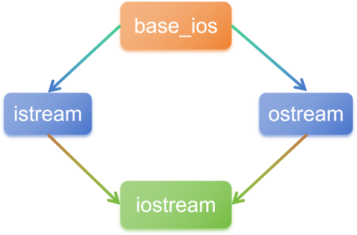

1. [1. 单继承，多继承](#1-单继承多继承)
2. [2. 继承时的权限](#2-继承时的权限)
3. [3. using提权](#3-using提权)
4. [4. 继承中的构造与析构](#4-继承中的构造与析构)
    1. [4.1. 构造](#41-构造)
    2. [4.2. 析构](#42-析构)
5. [5. 虚继承](#5-虚继承)


# 1. 单继承，多继承
     
`单继承`：一个派生类从一个基类继承。   
`多继承`：一个派生类从多个基类继承（需注意菱形继承问题）。   

# 2. 继承时的权限     
- `public`：   基类的 public 成员在派生类中仍为 public，protected 成员变为 protected。
- `protected`：基类的 public 和 protected 成员在派生类中变为 protected。   
- `private`：  默认继承方式，基类的 public 和 protected 成员在派生类中变为 private。   
- `using`:     提升继承时的权限。
- `虚继承`：    用于解决多继承中的 菱形继承问题，确保公共基类在继承链中只存在一份实例

```cpp
class UsbDevice {

};

class UsbHub : public UsbDevice {

}

int main() {

    UsbHub hub;
    UsbDevice& device = hub;   // 基类引用指向派生类对象
    UsbDevice* device = &hub;  // 基类指针指向派生类对象
}
```

# 3. using提权
```cpp
class Base {
protected:
    void internal() {}
};

class Derived : public Base {
public:
    using Base::internal;  // 提升为public访问
};

// 使用
Derived d;
d.internal();  // 合法（原为protected）
```


# 4. 继承中的构造与析构
构造与析构不会被继承。  
## 4.1. 构造
- 构造函数调用顺序&emsp;：&emsp;基类 --> 派生类。   
- 如果有多继承，基类的构造是从左到右调用。   
- 默认调用基类的默认构造函数。   
- 可以手动指定调用基类的哪个构造函数。   
- 派生类只能调用`直接基类`的构造函数，但是虚继承中与此不同。   
```cpp
class Derived : public Base {
public:
    Derived(参数列表) : Base(基类构造函数参数) {
        // 派生类构造函数体
    }
};
```
单继承：   
```cpp
#include <iostream>
using namespace std;

class Base {
public:
    Base(int x) {
        cout << "Base constructor with x = " << x << endl;
    }
};

class Derived : public Base {
public:
    Derived(int x, int y) : Base(x) {  // 显式调用 Base(int)
        cout << "Derived constructor with y = " << y << endl;
    }
};

int main() {
    Derived d(10, 20);
    return 0;
}
```
多继承：   
```cpp
#include <iostream>
using namespace std;

class A {
public:
    A(int x) { cout << "A constructor with x = " << x << endl; }
};

class B {
public:
    B(double y) { cout << "B constructor with y = " << y << endl; }
};

class Derived : public A, public B {
public:
    Derived(int x, double y) : A(x), B(y) {  // 按继承顺序调用 A 和 B
        cout << "Derived constructor" << endl;
    }
};

int main() {
    Derived d(10, 3.14);
    return 0;
}
```
结合初始化列表：  
```cpp
#include <iostream>
using namespace std;

class A {
public:
    A(int x) { cout << "A constructor with x = " << x << endl; }
};

class B {
public:
    B(double y) { cout << "B constructor with y = " << y << endl; }
};

// 派生类
class Derived : public A, public B {
private:
    int z;
public:
    Derived(int x, double y, int z) : A(x), B(y), z(z) {            // 按继承顺序调用 A 和 B，然后是初始化列表
        cout << "Derived constructor with z = " << z << endl;
    }
};

int main() {
    Derived d(10, 3.14, 42);
}
```

## 4.2. 析构
- 调用顺序： 派生类 --> 基类， 与构造函数相反。   
- 无需显式调用基类析构函数， C++ 编译器会自动调用基类的析构函数。 
- 基类的析构函数必须声明为`虚函数`， 这样才能通过基类的指针或引用调用派生类的析构函数，以安全销毁对象。  
- 将基类的析构函数声明为虚函数后，派生类的析构函数也会自动成为虚函数。这个时候编译器会忽略指针的类型，而根据指针的指向的对象来选择函数，指针指向哪个类的对象就调用哪个类的函数。
```cpp
class Base {
public:
    virtual ~Base() = default; // C++11 及之后支持默认虚析构函数
};

class Derived : public Base {
public:
    ~Derived() override { /* 释放派生类资源 */ }
};
```

# 5. 虚继承
菱形继承问题：     
```cpp
/*虚基类*/
class A
{
protected:
int m_x;
};
/*虚继承*/
class B: virtual public A
{
protected:
int m_y;
};
```
C++标准库中的iostream类就是一个虚继承的实际应用案例。iostream从istream和ostream直接继承而来，而istream和ostream又都继承自一个共同的名为base_ios的类，是典型的菱形继承。此时istream和ostream必须采用虚继承，否则将导致iostream类中保留两份base_ios类的成员。  


iostream是最终派生类，istream、ostream是直接基类，base_ios是间接基类（虚基类）。istream和ostream的公共成员声明在虚基类中。  