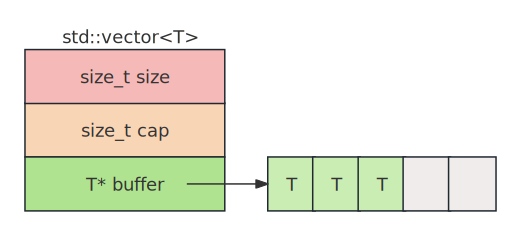

- [1. vector](#1-vector)
- [2. 使用](#2-使用)
    - [2.1. 容量](#21-容量)
    - [2.2. 访问](#22-访问)
    - [2.3. 构造vector对象](#23-构造vector对象)
    - [2.4. 插入元素](#24-插入元素)
        - [2.4.1. 尾部插入](#241-尾部插入)
        - [2.4.2. 指定位置插入](#242-指定位置插入)
    - [2.5. 移除元素](#25-移除元素)
- [3. 内存释放](#3-内存释放)
- [4. 迭代器](#4-迭代器)
- [5. 其他](#5-其他)


# 1. vector
[std::vector](https://en.cppreference.com/w/cpp/container/vector.html)，动态数组，维护一块连续的存储空间，容量可动态改变。       
      
**size**&emsp;:&emsp;     当前元素个数。      
**cap**&emsp;:&emsp;      当前容量，会动态扩容。       
**buffer**&emsp;:&emsp;   指向一块连续的存储空间。    


# 2. 使用
## 2.1. 容量
1. empty、size，capacity方法。
2. shrink_to_fit()，如果不再需要再填充元素了，那就可以调用shrink_to_fit()方法，将cap缩减到size大小。本质就是在申请一块size大小的内存，然后将原来的元素拷贝到新的内存中，然后释放原来的内存。   


## 2.2. 访问
1. 下标访问，和array一样，可以使用[]访问元素。     
2. 支持front、back、data方法。   
3. swap方法，交换两个vector对象，实际是交换指针，所以比array要快（注意是交换两个vector对象，而不是一个vector对象中的元素）。     
4. 关于swap方法，有一个常用的技巧是结合它来“清空”一个向量并释放其内存:   
```cpp
std::vector<int>().swap(vec1);
```
`std::vector<int>()` 创建了一个临时的、空的 vector<int> 对象，`.swap(vec1)` 调用了这个临时对象的 swap 方法，将它与 vec1 的内容交换。交换后，vec1 变成一个空的 vector（和临时对象交换后的结果），临时对象现在持有原来 vec1 的所有内存资源，当这行语句结束后，在临时对象超出作用域时被销毁，它所持有的内存也被一并释放。如果使用clear()，则vec1会被清空，但是容量没有重置，内存不会被释放。

## 2.3. 构造vector对象

```cpp
// 构造一个初始容量为1024的vector对象。
std::vector<int> v;
v.reserve(1024);     
```

```cpp
// vecitor对象的初始容量为6，每个元素的值都被初始化为1024。
std::vector<int> v(6, 1024);
```


## 2.4. 插入元素    

### 2.4.1. 尾部插入   
两者都是向容器末尾添加元素，但是工作原理不同：    

**`push_back`**     

将一个已经构造好的对象添加到容器的末尾，若传递右值会调用移动构造函数（若存在）；若传递左值，则调用拷贝构造函数。    
```cpp
std::vector<Person> vec;
Person alice("Alice", 30);
vec.push_back(alice);             // 拷贝构造
vec.push_back(Person("Bob", 25)); // 移动构造
```   

**`emplace_back`**      

直接传递构造对象所需的参数列表，在容器末尾直接构造一个对象，避免临时对象的创建，也就是在容器末尾原地构造一个对象出来。   
```cpp
vec.emplace_back("Charlie", 40); // 直接构造，无拷贝或移动
```

### 2.4.2. 指定位置插入
两者都是向容器中指定位置插入元素，返回指向新插入元素的迭代器，区别参考push_back和emplace_back。两者的第一个参数都是一个迭代器，新元素会插入到迭代器指向的元素之前。  

**`insert`**   
```cpp
iterator insert( const_iterator pos, const T& value );  
iterator insert( const_iterator pos, T&& value );  

iterator insert( const_iterator pos, size_type count, const T& value );  // 快速填充多个相同元素。   

template< class InputIt >
iterator insert( const_iterator pos, InputIt first, InputIt last );      // 在迭代器 pos 指向的位置前插入范围 [first, last) 中的所有元素。   
iterator insert( const_iterator pos, std::initializer_list<T> ilist );   // 在迭代器 pos 指向的位置前插入初始化列表 ilist 中的所有元素。   
```


**`emplace`**    
```cpp
template< class... Args >
iterator emplace( const_iterator pos, Args&&... args );  // 根据给定参数在指定位置前，原地构造一个元素。
```

## 2.5. 移除元素   

**`pop_back`**，移除最后一个元素。    
```cpp
void pop_back();  
```

**`erase`**，移除指定位置/区间的元素。移除指定位置的元素，后边的元素要前移，因为vector是连续存储的。  
   
```cpp

iterator erase( const_iterator pos );
iterator erase( const_iterator first, const_iterator last );
```

**`clear`**，移除 vector 中所有元素，使其size()变为0，但是容量（capacity()）不变。clear() 会遍历容器中的每个元素，并调用元素的析构函数，但vector对象本身不会被释放。     
```cpp
void clear(); 
```


# 3. 内存释放
clear() 不释放内存，若需释放内存，需手动调用 shrink_to_fit()：     
```cpp
vec.clear();
vec.shrink_to_fit(); // capacity 变为 0
```

# 4. 迭代器
支持随机访问的迭代器。   

# 5. 其他
- 本身不提供push_front和pop_front方法。   
- 写操作可能会导致迭代器失效，就是发生变化了，这个迭代器指向的已经不是原来的那个元素了。   
- 进行比较时，和array不同，vector的大小可以动态改变，即使是大小不同的两个vector对象也可以比较，但是元素类型还是要相同的。    


