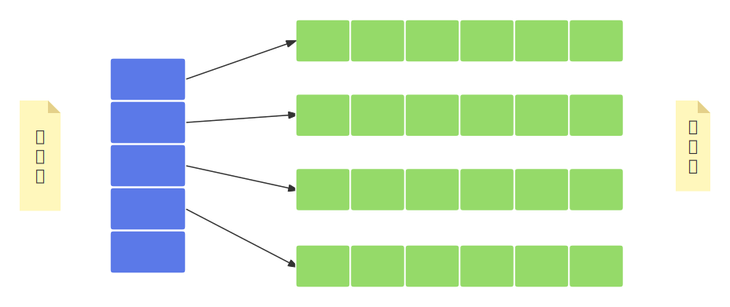
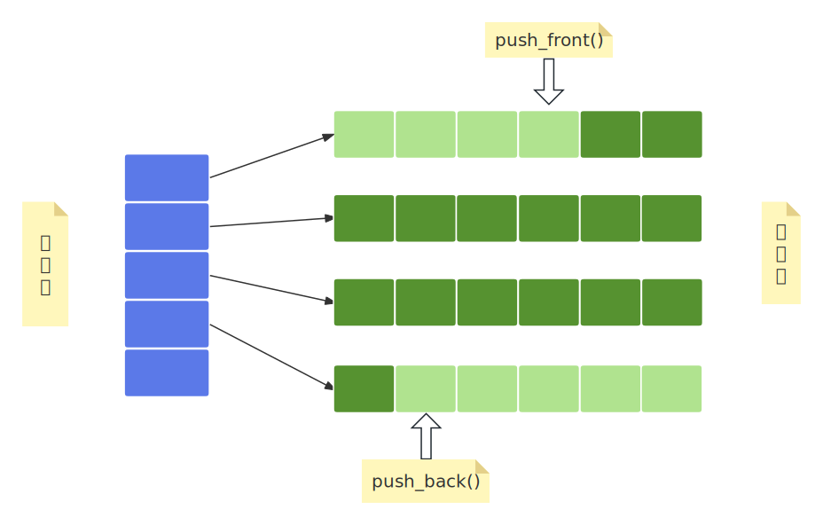

- [1. deque](#1-deque)
- [2. 迭代器](#2-迭代器)
- [3. 常用成员函数](#3-常用成员函数)
- [4. 创建 deque 容器对象](#4-创建-deque-容器对象)
- [5. 访问方法](#5-访问方法)


# 1. deque

[std::deque](https://en.cppreference.com/w/cpp/container/deque.html)，双端队列，支持在头部和尾部高效插入/删除元素，同时提供随机访问能力，不擅长在序列中间添加或删除元素，从功能上看起来，像是对于 std::vector 的增强。  
```cpp
// Defined in header <deque>
template<
    class T,
    class Allocator = std::allocator<T>
class deque{
    // ...
protected:
    iterator start;   // 指向第一个块
    iterator finish;  // 指向最后一个块
    map_pointer map;  // 映射表
    // ...
}
```
可以看到，deque容器底层使用分块存储，由多个相等大小的内存块组成，单是内存块之间不一定是连续的，可以位于在内存的不同区域。使用一个映射表（可能是vector）来保存各个块的起始地址。  
   
通过映射表就可以将分散的内存块连接起来，从而实现一个“连续的内存块”，当需要在头部或尾部增加块时，只需要申请内存后更新映射表即可。   


# 2. 迭代器
支持随机访问迭代器，用起来和vector一样，但是底层是不一样的，deque底层是分块的，所以deque对于随机访问进行了封装，重载了随机访问迭代器的各种运算符，使得迭代器需要能够识别块的边界，从而在不连续的分段块之间无缝遍历。   


# 3. 常用成员函数
相比vector增加了如下成员函数：   

|成员函数|函数功能|
|--------|----------|
|push_back()|在序列的尾部添加一个元素。|
|push_front()|在序列的头部添加一个元素。|
|pop_back()|移除容器尾部的元素。|
|pop_front()|移除容器头部的元素。|

例如插入元素：  
   


# 4. 创建 deque 容器对象
```cpp
std::deque<int> d;  // 空的 deque 容器对象

std::deque<int> d(10);  // 创建一个具有 10 个元素的 deque 容器，默认初始值为 0

std::deque<int> d(10, 42);  // 创建一个具有 10 个元素的 deque 容器，每个元素的值都为 42

std::deque<int> d1(5);
std::deque<int> d2(d1);  // 通过拷贝d1创建一个deque对象d2，需要d2与d1的元素类型相同
```

```cpp
// 通过拷贝其他类型容器中指定区域内的元素创建一个新容器
int a[] = { 1,2,3,4,5 };
std::deque<int>d(a, a + 5);


std::array<int, 5>arr{ 11,12,13,14,15 };
std::deque<int>d(arr.begin()+2, arr.end()); 
```

# 5. 访问方法
使用迭代器、[]、at()。


