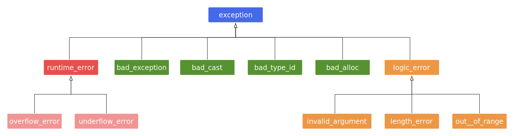

1. [1. 异常语法格式](#1-异常语法格式)
2. [2. 栈展开](#2-栈展开)
3. [3. 异常对象](#3-异常对象)
4. [4. 捕获异常](#4-捕获异常)
    1. [4.1. 隐式类型转换](#41-隐式类型转换)
    2. [4.2. 捕获任意类型异常](#42-捕获任意类型异常)
    3. [4.3. 抛出已经捕获的异常](#43-抛出已经捕获的异常)
5. [5. 函数try块](#5-函数try块)
6. [6. 标准库中的异常](#6-标准库中的异常)
7. [7. 注意事项](#7-注意事项)


# 1. 异常语法格式
```cpp
try 
{
    // 可能抛出异常的代码段（使用 throw 抛出一个异常对象）。
}
catch (ExceptionType &e) 
{
    // 处理异常。
}
// 可以有多个catch块，来捕获不同类型的异常。
```

# 2. 栈展开
触发异常时，系统会进行“栈展开”：   
1. 抛出异常后续的代码不会被执行。    
2. 局部对象会按照构造相反的顺序销毁。  
3. 系统会尝试匹配相应的catch块，如果匹配就执行catch块中的代码，然后执行后续代码。
4. 如果没有匹配的catch块，就会一直栈展开，如果到了main函数还是匹配不到catch块，就触发terminate结束程序。    


# 3. 异常对象
1. 系统会使用抛出的异常拷贝初始化一个临时对象，称为异常对象。  
2. 异常对象会在栈展开过程中被保留，并且最终传递给匹配的catch块。   


# 4. 捕获异常
## 4.1. 隐式类型转换

看如下代码：  
```cpp
class Base {};
class Derived : public Base {};
```
```cpp
int main()
{
    try 
    {
         // ...
         throw Derived();
    }
    catch (Derived& e)
    {
      // ...
    }
    catch (Base& e)
    {
       // ...
    }
}
```
上面代码的catch(Derived& e)块不会被匹配，因为Drived引用可以隐式转换为Base引用，这个转换是安全的。无论try{}块抛出Base还是Derived，catch(Base& e)都会被匹配。正确的写法是：  
```cpp
    catch (Derived& e)
    {
      // ...
    }
    catch (Base& e)
    {
       // ...
    }
```
类似的情形还有非const引用转为const引用、函数转为函数指针。   


## 4.2. 捕获任意类型异常
```cpp
catch (...)
{

}
```
## 4.3. 抛出已经捕获的异常
在catch块中，可以抛出当前捕获的异常。   
```cpp
catch (exception& e)
{
    // ...
    throw;
}
```
实际上是在catch块中，即使没有显式`throw;`，编译器也会在catch块的最后添加`throw;`，这样一来，其他地方依然能够感知到这个异常，例如在上一小节所讲述的情形中，如果对象创建失败，处理异常后没有退出程序，那么程序会继续往下执行，后面的程序就要通过异常来判断这个对象是否创建成功。
```cpp
int main()
{
    B obj;
    obj.m_y;  // 对象创建失败时，行为未定义
}
```
正确：  
```cpp
int main()
{
    try
    {
        B obj;
        obj.m_y;
    }
    catch(int)
    {
        // 处理异常
    }
}
```

# 5. 函数try块

**1. 在对象初始化时**   
捕获初始化列表中抛出的异常。   
```cpp
class A 
{
public:
    A() { throw 1;}
} 

class B
{
public:
    B() 
    try : m_x()
    {
    }
    catch (int)
    {
        // ...
    }

private:
    A   m_x;
    int m_y;

public:
    void f();
} 
```
这种情况下，栈展开时会销毁对应代码段在抛出异常时已经申请的资源， 但是不会调用B类型的析构函数。     


**2. 一般的函数try块**
```cpp
void f(A a)
try
{
    // ...
    throw 666;
}
catch(...)
{

}
```
```cpp
int main()
{
    try
    {
        f(A {}); // 注意了，A{}抛出的异常，需要在当前代码块中处理
    }
    catch(...)
    {
        // 处理异常
    }
}
```


# 6. 标准库中的异常
```cpp
#incliude <stdexcept>
```

```cpp
// 使用形式
void func()
{
    throw std::runtime_error("Invalid Inuput!");
}

int main()
{
    try
    {
        func();
    }
    catch(std::runtime_error &e)
    {
        // 处理异常
        std::cout << e.what() << std::endl;
    }

    // ...
}
```
实际开发中，应该抛出标准异常，或者派生自标准异常的异常。   


# 7. 注意事项
1. 在一个异常未被捕获时，又抛出一个新的异常，程序会崩溃。   
2. 不要在析构函数，或者operator delete重载函数中抛出异常。   
3. 使用noexcept声明函数不会抛出异常，否则编译器默认会抛出异常。  
```cpp
void func() noexcept
{
    // 1. 声明为noexcept的函数抛出异常，程序会终止。
    // 2. 
}
```
```cpp
void func() noexcept(/* <表达式> */)
{
    // 1. noexcept(true)声明的函数不会抛出异常。   
    // 2. noexcept(false)声明的函数会抛出异常。
}
```
4. 注意重定义，有noecept和没有noexcept其实声明的是同一个函数。   
5. 函数指针要注意形式兼容，函数指针要兼容它指向的那个函数。     
```cpp
void func(int)
{

}

int main()
{
    void (*fo)(int) noexcept = func;  // 错误，func是有可能抛出异常的。

    void (*foo)(int) = func;          // 正确，foo 兼容 func
}
```

6. 虚函数override要注意形式兼容，就说基类的虚函数要兼容派生类重写的那个。  
    - 如果基类有可能抛出异常，则子类可以重写为可能抛出异常，也可以重写为不抛异常。  
    - 如果基类明确不抛异常，则子类必须重写为不抛异常。   
7. 注意异常安全，在抛出异常后进行栈展开，要释放当前代码块的资源，所以要保证这些资源的析构函数能够正常执行。   
8. 不要瞎用异常，异常的运行成本较高。    
