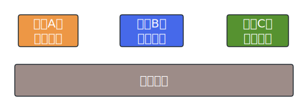
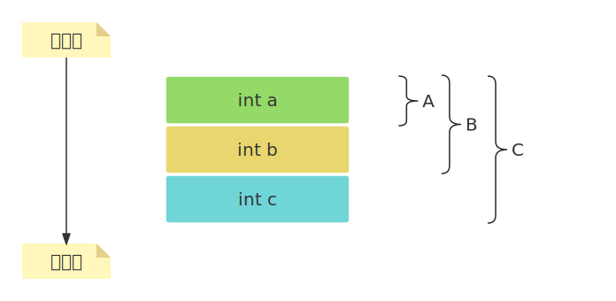
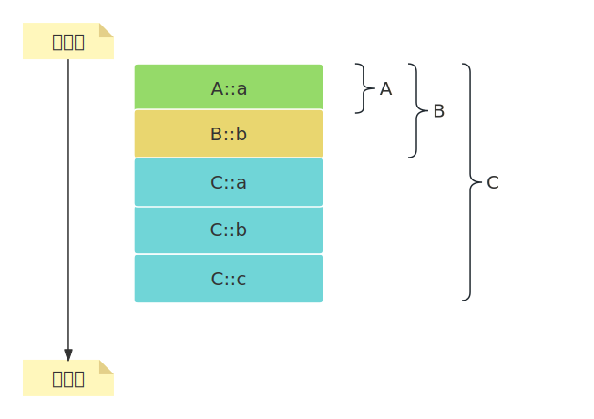
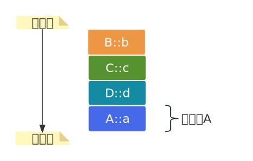

- [1. **数据成员和函数成员**](#1-数据成员和函数成员)
- [2. **数据成员的内存布局**](#2-数据成员的内存布局)
- [3. **有成员变量遮蔽时的内存分布**](#3-有成员变量遮蔽时的内存分布)
- [4. **多继承时的内存模型**](#4-多继承时的内存模型)
- [5. **虚继承时的内存分布**](#5-虚继承时的内存分布)


# 1. **数据成员和函数成员**
&emsp;&emsp;类是创建对象的模板，不存在于编译后的可执行文件中，而对象是实实在在的数据，需要内存来存储。在创建对象时要为对象分配内存，不同对象的成员变量值不同，所以需要单独分配内存，但成员函数的代码是相同的，所有对象共享同一段函数代码。成员变量在堆区或栈区分配内存，成员函数放在代码区。  
  
很显然，对象的大小只受成员变量的影响，和成员函数没有关系。和结构体非常类似，对象的成员变量也会有内存对齐的问题。  

# 2. **数据成员的内存布局**
```cpp
class A {
public:
    int a;
}

class B : public A {
public:
    int b;
}

class C : public B {
public:
    int c;
}
```
类C对象的内存布局如下：  



# 3. **有成员变量遮蔽时的内存分布**
```cpp
class A {
public:
    int a;
}

class B : public A {
public:
    int a;
    int b;
}

class C : public B {
public:
    int a;
    int b;
    int c;
}
```
   
C::a，C::b遮蔽了A::a，B::b，但是A::a、B::b依然在内存中。    

# 4. **多继承时的内存模型**
```cpp
class A {
public:
    int a;
}

class B {
public:
    int b;
}

class C : public A, public B {
public:
    int c;
}
```  
   

两个基类的成员按继承时声明的顺序排列。  

# 5. **虚继承时的内存分布**
```cpp
class A{
public:
    int a;
};

class B : virtual public A{
public:
    int b;
};

class C : virtual public A{
public:
    int c;
};

class D : public B ,public C{
public:
    int d;
};
```
   
虚基类子对象（共享部分）位于派生类最后面，所以在编译期共享部分的地址会变化，需要编译器使用特定的方法计算地址，不同的编译器方法可能也不同。


