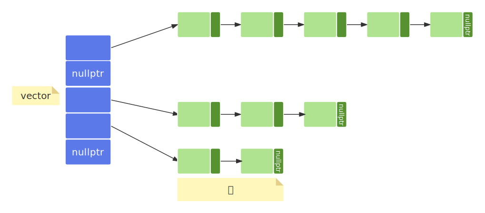

- [1. 哈希容器](#1-哈希容器)
- [2. 底层实现](#2-底层实现)
- [3. 哈希容器的负载因子](#3-哈希容器的负载因子)
- [4. 成员函数](#4-成员函数)

# 1. 哈希容器
无序关联容器基于哈希实现，并使用链地址法处理哈希冲突。和有序关联容器不同，哈希容器中的元素/key是未排序的，元素的位置由哈希函数确定。  
  - **`unordered_set`**：哈希集合  
  - **`unordered_map`**：哈希映射  
  - **`unordered_multiset`**：允许重复键的哈希集合  
  - **`unordered_multimap`**：允许重复键的哈希映射  

和关联式容器相比，无序容器擅长通过指定键查找对应的值（平均时间复杂度为 O(1)）；但是当使用迭代器遍历容器中存储的元素时，执行效率就不如关联式容器了。   

# 2. 底层实现
首先，我们要有一个vector数组，但是这个数组不是用来存储元素的，而是用来存储链表头指针的，这些链表被称为“`桶（bucket）`”，哈希值相同的元素/key被放在同一个桶中，这就是所谓的链地址法。   
  
现在，我们要插入一个元素，过程如下：   
1. 将key带入哈希函数，得到哈希值，H。   
2. 计算出来哈希值和桶的数量（n），进行取余操作（H%n），得到桶的索引。
3. 将元素保存到桶中。    
4. 如果桶索引对应的桶不存在，则创建一个链表，将元素插入到链表头部，并将桶的头指针记录在vector数组中。   

# 3. 哈希容器的负载因子
$$ 负载因子 = \frac{存储的键值对总数}{桶数} $$  
负载因子越大，表明一个桶中存储的元素越多，那么哈希表就越慢，太慢了就说明哈希值的计算套路不好使了。stl中的哈希容器会有一个默认负载因子，超过默认值就会增加桶数量，并重新哈希，重新哈希会导致当前容器迭代器失效。   

# 4. 成员函数
|成员方法|	功能  |
|---------------------------|------------------------------------|
| bucket_count()            |   返回当前容器底层存储键值对时，使用桶的数量。|
| max_bucket_count()        |   返回当前系统中，unordered_map 容器底层最多可以使用多少个桶。|
| bucket_size(n)            |	返回第 n 个桶中存储键值对的数量。|
| bucket(key)               |	返回以 key 为键的键值对所在桶的编号。|
| load_factor()             |	返回 unordered_map 容器中当前的负载因子。|
| max_load_factor()       	|   返回或者设置当前 unordered_map 容器的最大负载因子。|
| rehash(n)	                |   尝试重新调整桶的数量为等于或大于 n 的值。如果 n 大于当前容器使用的桶数，则该方法会是容器重新哈希，该容器新的桶数将等于或大于 n。  反之，如果 n 的值小于当前容器使用的桶数，则调用此方法可能没有任何作用。|
| reserve(n)	            |   将容器使用的桶数（bucket_count() 方法的返回值）设置为最适合存储 n 个元素的桶数。|
| hash_function()           | 	返回当前容器使用的哈希函数对象。|

