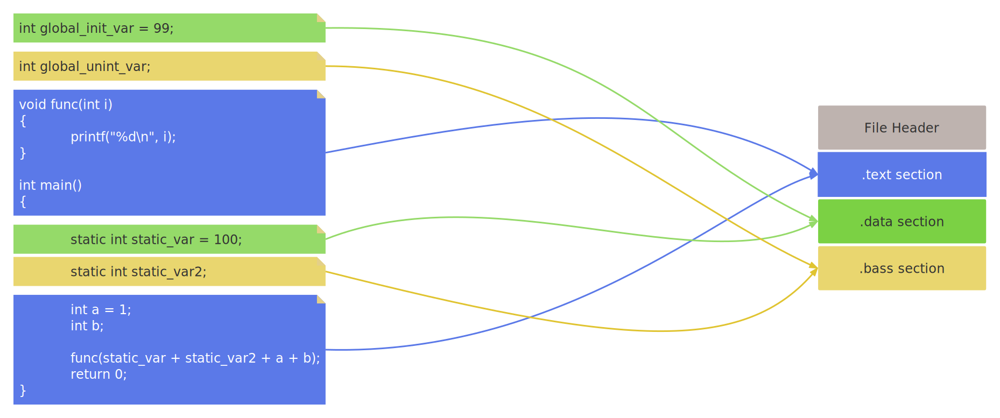

1. [1. 目标文件格式](#1-目标文件格式)
2. [2. 目标文件结构](#2-目标文件结构)

# 1. 目标文件格式
&emsp;&emsp;PC平台的主流可执行文件格式有两种：Linux上的`ELF`和Windows上的`PE`。不仅仅是可执行文件，动态链接库、静态链接库、目标文件也都是以相同的格式保存的。以ELF为例，可以进一步分为4类：    
| ELF文件类型  | 描述    | 例子   |
|------------|---------|-------|
| 可重定位文件 | 可以被用来链接成可执行文件、共享目标文件，例如静态库。 | linux系统的.o   windows系统的.obj       |
| 可执行文件   | 最常见的，没什么好说的 | Windows系统的.exe   Linux系统上没有后缀 |
| 共享目标文件 | 1. 连接器使用该文件和其他可重定位文件、共享目标文件链接，昌盛新的目标文件。          2. 动态链接器将几个共享目标文件与可执行文件结合，作为进程映像的一部分来运行。 | Linux系统的 .so   windows系统的 .dll      |
| 核心转储文件 | 进程意外终止时，系统将该进程地址空间的内容和终止时的一些信息存储到核心存储文件。         | Linux系统的 core dump  |

&emsp;&emsp;实际上这两货都是COFF格式的变种，在Linux系统上可以使用file命令查看文件类型。COFF引入了`段`的概念，不同的目标文件，段的数量，类型不同。  

# 2. 目标文件结构   
&emsp;&emsp;一个目标文件包含了多种信息，例如指令、数据等等，不同类型的数据放在不同的`段`中，具有不同的权限。以ELF文件为例：    
  
&emsp;&emsp;ELF文件的开头是一个`文件头`，它描述了整个文件的文件属性，包括文件是否可执行、是静态链接还是动态链接，以及入口地址（可执行文件）、目标硬件、目标操作系统等等信息。文件头中还包含一个`段表`（Section Table），其实就是个数组，这个表描述了文件中的各个段的属性以及段在文件中的偏移位置等等。  
- 二进制文件中的`机器指令`位于`代码段`（.text或.code）中；  
- 已初始化全局变量以及局部静态的变量位于`数据段`（.data）；  
- 未初始化全局变量以及静态局部变量位于`BSS段`（.bss），这个段只是一个预留位置，内有内容，不占空间；    

