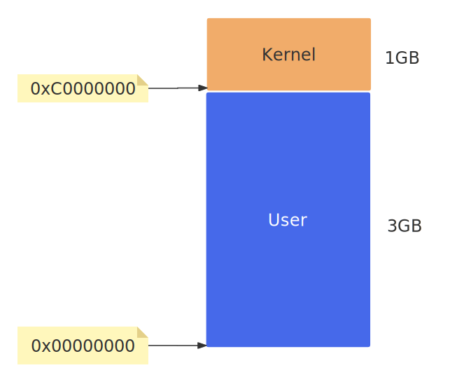

&emsp;&emsp;可执行文件只有装载到内存以后才能被CPU执行。早期的程序装载十分简陋，装载的基本过程就是把程序从外部存储器中读取到内存中的某个位置。随着硬件MMU的诞生，多进程、多用户、虚拟存储的操作系统出现以后，可执行文件的装载过程变得非常复杂。  

# 1. 进程的虚拟地址空间
&emsp;&emsp;每个程序被运行起来以后，它将拥有自己独立的虚拟地址空间（Virtual Address Space），这个虚拟地址空间的大小由计算机的硬件平台决定，具体地说是由CPU的位数决定的。硬件决定了地址空间的最大理论上限，即硬件的寻址空间大小，比如32位的硬件平台决定了虚拟地址空间的地址为0 ~ $2^{32-1}$，即0x00000000~0xFFFFFFFF，也就是我们常说的4GB 虚拟空间大小；而64位的硬件平台具有64位寻址能力，它的虚拟地址空间高达0 ~ $2^{64}$。     

&emsp;&emsp; 我们以32位Linux操作系统为例，32位平台下有4GB的虚拟空间，而进程只能使用那些操作系统分配给进程的地址，如果访问未经允许的空间，那么操作系统就会捕获到这些访问，将进程的这种访问当作非法操作，强制结束进程。Windows系统上的`进程因非法操作需要关闭`以及Linux下的`Segmentation fault`很多时候就是因为进程访问了未经允许的地址。那么到底这4GB的进程虚拟地址空间是怎样的分配状态呢？默认情况下，Linux操作系统将进程的虚拟地址空间做了如下图所示的分配:    
  
4GB内存可能不够用，所以Intel 在1995年在CPU中引入了PAE（物理地址扩展）机制，将32位地址扩展到36位，即4GB到64GB。  

**`对于Windows`**   
在 32 位 [Windows系统](https://learn.microsoft.com/zh-cn/windows-hardware/drivers/gettingstarted/virtual-address-spaces?source=recommendations) 中，可用的虚拟地址空间共计为 2^32 字节（4 GB）。 通常，较低的 2 GB 用于用户空间，而上 2 GB 用于系统空间。不过Windows是可以修改启动参数将操作系统占用的虚拟地址空间减少到1GB，即跟Linux一样。在 64 位 Windows 中，虚拟地址空间的理论大小为 2^64 字节，但实际上仅使用一小部分。

**`对于64位系统`**   
对于64位系统，理论虚拟地址空间是0 ~ $2^{64}$，也就是高达16EB的空间，实际也用不了这么多，所以一般操作系统分配了256TB的地址空间，低128TB分配给用户进程，高128TB给内核空间。  

