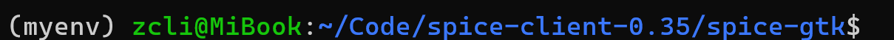

直接使用 pip 在全局环境中安装 Python 包，会干扰系统的包管理器（如 apt）。从Python 3.11 开始引入的一项安全措施 —— 虚拟环境，旨在防止用户意外地破坏系统Python的环境。       
使用方法:  
```bash
apt install python3.11-venv
python3 -m venv myenv  # myenv是虚拟环境的目录
# 激活虚拟环境
source myenv/bin/activate
```
运行source myenv/bin/activate命令后就进入了python虚拟环境中：      
  
在虚拟环境下可以正常使用pip命令，下载的软件包位于虚拟环境中。使用完毕后执行`deactivate`命令推出虚拟环境。  