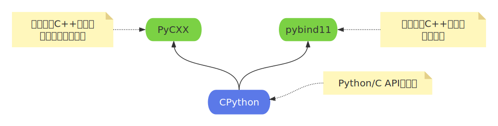

- [1. Python/C API接口](#1-pythonc-api接口)
- [2. 使用 C/C++ 编写 Python 模块](#2-使用-cc-编写-python-模块)
- [3. 在C/C++代码中调用Python代码](#3-在cc代码中调用python代码)
  - [3.1. 导入模块中的函数](#31-导入模块中的函数)
  - [3.2. 导入模块中的类](#32-导入模块中的类)


## 1. Python/C API接口
   
Python/C API 是 Python 官方提供的 C 语言接口，允许 C/C++ 程序与 Python 解释器交互，CPython就是这套接口的实现。     
这套接口有两种用法：     
1. **在Python代码中调用使用C/C++编写扩展模块**： &ensp;把性能关键或系统级代码写成 C/C++ 函数，编译成共享库（.so / .pyd），在 Python 里像普通模块一样 import。    
2. **在C/C++代码中调用Python代码**： &ensp;在 C 代码里启动 Python 虚拟机、执行 Python 脚本、调用 Python 函数、使用 Python 对象，从而直接复用现成的 Python 生态。 

以CPython为例记录一下这两种用法。  

## 2. 使用 C/C++ 编写 Python 模块
将C/C++与Python集成有两种主要开发模式： 
- 将C/C++函数公开为Python模块函数。   
- 从C++类创建新的Python类。  

**这里展示使用CPython将C函数公开为Python模块函数：**      

`1.` **编写C函数**     
mymodule.c  
```cpp
#include <Python.h>

// 定义函数
static PyObject* add(PyObject* self, PyObject* args) {
    int a, b;
    if (!PyArg_ParseTuple(args, "ii", &a, &b))
        return NULL;
    return PyLong_FromLong(a + b);
}


//2. 定义方法表 
static PyMethodDef module_methods[] = {
    {"add", add, METH_VARARGS, "Add two integers"},
    {NULL, NULL, 0, NULL}
};


//3. 定义模块结构
static struct PyModuleDef mymodule = {
    PyModuleDef_HEAD_INIT,
    "mymodule",
    "Example module that adds two numbers",
    -1,
    module_methods
};


// 4. 模块初始化
PyMODINIT_FUNC PyInit_mymodule(void) {
    return PyModule_Create(&mymodule);
}
```

`2. ` **构建脚本**     
setup.py   

```py
from setuptools import setup, Extension

ext = Extension(
    'mymodule',
    sources=['mymodule.c']
)

setup(
    name='mymodule',
    version='1.0',
    description='CPython extension example',
    ext_modules=[ext]
)
```

`3. ` **编译**     
```bash
zci@Gem:~/000$ python3 setup.py build_ext --inplace
zci@Gem:~/000$
zci@Gem:~/000$ tree -L 1
.
├── build
├── mymodule.c
├── mymodule.cpython-312-x86_64-linux-gnu.so   # 编译成的动态库
└── setup.py
```

`4. ` **使用模块**    
test.py  
```py
import mymodule
result = mymodule.add(3, 5)
print(result)  # 输出: 8
```


---

## 3. 在C/C++代码中调用Python代码

**分为三步：**     
```cpp
// 1. 初始化Python解释器
void Py_Initialize();   
int Py_IsInitialized();  // 解析器的是否已经初始化完成，完成返回大于0，否则返回0。


// 2. 执行Python代码


// 3. 释放解释器资源
void Py_Finalize();     
```

### 3.1. 导入模块中的函数

接下来细说第2步： 从Python脚本文件中导入模块，并执行模块中的函数：    
`1.` 添加 Python 脚本路径到 sys.path。
```cpp
PyRun_SimpleString("import sys\nsys.path.append('path/to/_script')");
```


`2.` 导入 Python 模块: &ensp;使用 PyImport_ImportModule 导入模块。
```cpp
PyObject* pModule = PyImport_ImportModule("mymodule"); // mymodule.py
if (!pModule) {
    PyErr_Print(); // 打印错误信息
    return -1;     // 处理错误
}
```


`3.` 获取模块中的函数对象: &ensp;通过 PyObject_GetAttrString 获取模块中的函数对象，PyObject_GetAttrString() 会增加返回对象的引用计数。
```cpp
// 获取模块中的my_function函数。  
PyObject* pFunc = PyObject_GetAttrString(pModule, "my_function");  

// 检查 pFunc 是否为可调用对象（函数、方法、类等）
if (!pFunc || !PyCallable_Check(pFunc)) {
    PyErr_Print();
    Py_XDECREF(pFunc);   // 释放 pFunc 的引用计数
    Py_DECREF(pModule);  // 释放模块对象 pModule 的引用计数
    return -1;
}
```


`4.` 准备参数并调用函数：&ensp;根据函数的参数类型，使用 Py_BuildValue 构造参数，并通过 PyObject_CallObject 调用函数。  
```cpp
// 例如 my_function 函数接受一个整数参数
// "(i)"： 元组： (i，)。  
PyObject* pArgs = Py_BuildValue("(i)", 42);           // 构建 Python 参数对象，参数为 42
PyObject* pResult = PyObject_CallObject(pFunc, pArgs);


if (!pResult) {
    PyErr_Print();
} else {
    // 处理返回值，例如返回值是一个整数
    if (PyLong_Check(pResult))               // 检查一下给定的 pResult 对象是否是 PyLongObject（Python 整数对象）或其子类型
    {
       int result = PyLong_AsLong(pResult);  // 将 Python 的整数对象（PyLongObject）转换为 C/C++ 的 long 类型。 
       std::cout << "Python function returned: " << result << std::endl;
    }

}


// Py_BuildValue、PyObject_CallObject 都会增加返回对象的引用计数。
Py_XDECREF(pResult);
Py_DECREF(pArgs);
```


`5.` 释放资源
```cpp
Py_XDECREF(pFunc);
Py_DECREF(pModule);
```


---

### 3.2. 导入模块中的类

**myclass.py** 如下：  
```py
class MyClass:
    def __init__(self, value):
        self.value = value

    def get_value(self):
        return self.value

    # 其他 ...
```

导入类型用的还是PyObject_GetAttrString(), 创建实例用的是也是PyObject_CallObject()。    
```cpp
#include <Python.h>
#include <iostream>

int main() {
    Py_Initialize();
    PyRun_SimpleString("import sys\nsys.path.append('./')");
    PyObject* pModule = PyImport_ImportModule("myclass");
    if (!pModule) {
        PyErr_Print();
        return -1;
    }

    // 1. 获取类对象， 这个 pClass 是类对象本身（type 对象），不是类的实例
    PyObject* pClass = PyObject_GetAttrString(pModule, "MyClass");
    if (!pClass || !PyType_Check(pClass)) {
        PyErr_Print();
        std::cerr << "MyClass not found or is not a class." << std::endl;
        Py_XDECREF(pClass);
        Py_DECREF(pModule);
        Py_Finalize();
        return -1;
    }

    // 2. 创建类实例（调用构造函数）
    PyObject* pArgs = Py_BuildValue("(i)", 100);              // 构造函数参数：(100,)
    PyObject* pInstance = PyObject_CallObject(pClass, pArgs); // 创建实例
    if (!pInstance) {
        PyErr_Print();
        std::cerr << "Failed to create instance of MyClass." << std::endl;
        Py_DECREF(pArgs);
        Py_DECREF(pClass);
        Py_DECREF(pModule);
        Py_Finalize();
        return -1;
    }

    // 3. 调用实例方法
    PyObject* pGetValueFunc = PyObject_GetAttrString(pInstance, "get_value");      // 获取 get_value() 方法
    if (pGetValueFunc && PyCallable_Check(pGetValueFunc)) {
        // 调用函数
        PyObject* pResult = PyObject_CallObject(pGetValueFunc, nullptr);
        if (pResult) {
            if (PyLong_Check(pResult)) {
                long value = PyLong_AsLong(pResult); // 获取函数返回
                std::cout << "get_value() returned: " << value << std::endl;
            }
            Py_DECREF(pResult);
        } else {
            PyErr_Print();
        }
        Py_DECREF(pGetValueFunc);
    }


    // 4. 清理资源 
    Py_DECREF(pArgs);
    Py_DECREF(pInstance);
    Py_DECREF(pClass);
    Py_DECREF(pModule);


    Py_Finalize();
    return 0;
}
```


