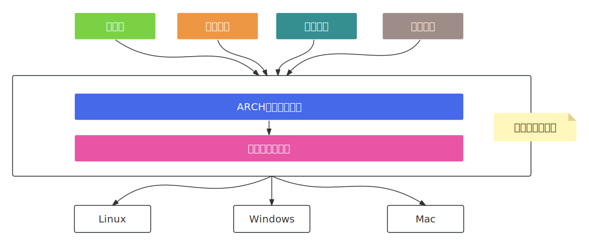

- [1. **跨平台框架**](#1-跨平台框架)
- [2. **跨平台接口根类型**](#2-跨平台接口根类型)
- [3. **跨平台接口集成**](#3-跨平台接口集成)
- [4. **核心抽象类**](#4-核心抽象类)
- [5. **平台层实现类**](#5-平台层实现类)
- [6. **宏定义映射系统**](#6-宏定义映射系统)


# 1. **跨平台框架**  
  

# 2. **跨平台接口根类型**

IInterface可以看做是该项目整个软件框架的根类型。  
```cpp
class IInterface
{
public:
    virtual ~IInterface() = default;
};
```

# 3. **跨平台接口集成**
跨平台抽象层中的Arch类使用多重继承模式，将所有平台特定的功能组合到一个统一的接口中，Arah类作为单例模式提供全局访问。  
```cpp
class Arch : public ARCH_DAEMON, 
             public ARCH_LOG, 
             public ARCH_MULTITHREAD, 
             public ARCH_NETWORK, 
             public ArchString
{/* ... */};
```
这些模块都继承自IInterface根类型，并且没有使用虚继承，但还是能编译的，因为这个公共基类没有成员，不会引发二义性。


# 4. **核心抽象类** 
系统定义了多个IArch*接口，这些接口定义了各个功能模块必须实现的功能，它们每一个都是单例。

|功能|核心抽象类型|
|-------------|-----------------|
|网络功能抽象|IArchNetwork|   
|多线程功能抽象|IArchMultithread|   
|守护进程功能抽象|IArchDaemon|  
|日志功能抽象|IArchLog|  
|字符编码转换|ArchString|  

# 5. **平台层实现类**  
|功能模块|Unix平台实现类|Windows平台实现类|抽象基类|
|---------|---------|-----------|-------------|
|网络|ArchNetworkBSD|ArchNetworkWinsock|IArchNetwork|
|多线程|ArchMultithreadPosix|ArchMultithreadWindows|IArchMultithread|
|守护进程|ArchDaemonNone|ArchDaemonWindows|IArchDaemon|
|日志| ArchLogUnix|ArchLogWindows|IArchLog|
|字符编码|ArchString|ArchString|ArchString|     

具体实现类（Arch*）提供不同平台的实现，对于每个模块，后面会有单独的篇章讲解。  


# 6. **宏定义映射系统**
例如Windows平台上，我们以**ARCH_MULTITHREAD**为例。      
**Arch.h**
```cpp
#pragma once

#include "arch/ArchString.h"
#include "common/Common.h"

#if SYSAPI_WIN32  // Win平台，预处理时引入Win实现的头文件
#include "arch/win32/ArchDaemonWindows.h"
#include "arch/win32/ArchLogWindows.h"
#include "arch/win32/ArchMultithreadWindows.h" // 多线程在Windows上的实现，也就是ArchMultithreadWindows类的定义
#include "arch/win32/ArchNetworkWinsock.h"

#elif SYSAPI_UNIX
#include "arch/unix/ArchDaemonUnix.h"
#include "arch/unix/ArchLogUnix.h"
#include "arch/unix/ArchMultithreadPosix.h"
#include "arch/unix/ArchNetworkBSD.h"

#endif
```

**ArchMultithreadWindows.h**
```cpp
#define ARCH_MULTITHREAD ArchMultithreadWindows

class ArchMultithreadWindows : public IArchMultithread
{
    // ...
};
```


