- [1. **多线程框架设计思路**](#1-多线程框架设计思路)
- [2. **不透明类型设计**](#2-不透明类型设计)
- [3. **平台实现**](#3-平台实现)
    - [3.1. **Posix**](#31-posix)
    - [3.2. **Win**](#32-win)
- [4. **IArchMultithread抽象基类的实现**](#4-iarchmultithread抽象基类的实现)


# 1. **多线程框架设计思路**
&emsp;&emsp;IArchMultithread是Deskflow中多线程功能的核心抽象接口，IArchMultithread是一个纯虚拟接口，承自IInterface，提供了线程管理、互斥锁、条件变量和信号处理等核心功能。   
   

---

# 2. **不透明类型设计**
- **ArchThread**：表示线程的不透明类型。
- **ArchMutex**：表示互斥锁的不透明类型。
- **ArchCond**：表示条件变量的不透明类型。

这些类型隐藏了平台特定的实现细节，它们实际上是指向具体实现类的指针，而具体实现位于对应平台的源码文件中。    

```cpp
// IArchMultithread.h 
#pragma once
#include "common/IInterface.h"

// 前向声明，不实现
class ArchCondImpl;
using ArchCond = ArchCondImpl *;

class ArchMutexImpl;
using ArchMutex = ArchMutexImpl *;

class ArchThreadImpl;
using ArchThread = ArchThreadImpl *;

// 线程接口
class IArchMultithread : public IInterface
{
    // ...
};
```

---

# 3. **平台实现**
## 3.1. **Posix**
在UNIX/POSIX系统上，ArchMultithreadPosix类实现了该接口（ArchMultithreadPosix.h），具体的实现类使用pthread库：  
- **ArchCondImpl**包含pthread_cond_t。  
- **ArchMutexImpl**包含pthread_mutex_t。  
- **ArchThreadImpl**包含pthread_t。   
```cpp
#include <pthread.h>

#define ARCH_MULTITHREAD ArchMultithreadPosix

class ArchCondImpl
{
public:
    pthread_cond_t m_cond;
};

class ArchMutexImpl
{
public:
    pthread_mutex_t m_mutex;
};

class ArchThreadImpl
{
public:
    ArchThreadImpl() = default;

public:
    int m_refCount = 1;
    IArchMultithread::ThreadID m_id = 0;
    pthread_t m_thread;                              // Posix线程句柄
    IArchMultithread::ThreadFunc m_func = nullptr;
    void *m_userData = nullptr;
    bool m_cancel = false;
    bool m_cancelling = false;
    bool m_exited = false;
    void *m_result = nullptr;
    void *m_networkData = nullptr;
};


// IArchMultithread 的 Posix 实现
class ArchMultithreadPosix : public IArchMultithread
{
    // ...
};
```


## 3.2. **Win**
在Windows系统上，ArchMultithreadWindows类提供实现，ArchMultithreadWindows.h。  
- **ArchCondImpl** 使用Windows事件对象HANDLE m_events[2]。  
- **ArchMutexImpl** 使用CRITICAL_SECTION。   

```cpp
// ArchMultithreadWindows.h
#include <Windows.h>

#define ARCH_MULTITHREAD ArchMultithreadWindows

// 条件变量实体
class ArchCondImpl
{
public:
  enum
  {
    kSignal = 0,
    kBroadcast
  };

  HANDLE m_events[2];          //
  mutable int m_waitCount;
  ArchMutex m_waitCountMutex;
};

// 互斥量实体
class ArchMutexImpl
{
public:
  CRITICAL_SECTION m_mutex;
};

// 线程句柄实体
class ArchThreadImpl
{
public:
  ArchThreadImpl();
  ~ArchThreadImpl();

public:
  int m_refCount;
  HANDLE m_thread;                       // 线程句柄
  DWORD m_id;
  IArchMultithread::ThreadFunc m_func;
  void *m_userData;
  HANDLE m_cancel;
  bool m_cancelling;
  HANDLE m_exit;
  void *m_result;
  void *m_networkData;
};


// IArchMultithread 的 Windows 实现
class ArchMultithreadWindows : public IArchMultithread
{
    // ...
};
```

---

# 4. **IArchMultithread抽象基类的实现**
```cpp
/* 1. 线程实体 */
using class ArchThreadImpl = ArchThreadImpl *;

/* 2. 操作线程实体的接口，通过操作ArchThreadImpl对象来实现线程功能 */
class IArchMultithread : public IInterface
{
public:
    // 线程任务函数类型
    using ThreadFunc = void *(*)(void *);
    // 线程 ID 类型
    using ThreadID = unsigned int;

    // 信号类型
    enum ESignal {
        kINTERRUPT,  // Ctrl+C
        kTERMINATE,  // Ctrl+Break
        kHANGUP,     // SIGHUP
        kUSER,       // SIGUSR2
        kNUM_SIGNALS
    };
    // 信号处理函数的类型
    using SignalFunc = void (*)(ESignal, void *userData);

    // 条件变量
    virtual ArchCond newCondVar() = 0;           // 创建条件变量
    virtual void closeCondVar(ArchCond) = 0;     // 销毁条件变量
    virtual void signalCondVar(ArchCond) = 0;    // 唤醒单个等待线程
    virtual void broadcastCondVar(ArchCond) = 0; // 唤醒单个等待线程
    virtual bool waitCondVar(ArchCond, ArchMutex, double timeout) = 0; // 带超时的条件等待 (取消点)

    // 互斥锁
    virtual ArchMutex newMutex() = 0;         // 创建互斥锁
    virtual void closeMutex(ArchMutex) = 0;   // 销毁互斥锁
    virtual void lockMutex(ArchMutex) = 0;    // 加锁
    virtual void unlockMutex(ArchMutex) = 0;  // 解锁

    // 线程对象操作
    virtual ArchThread newThread(ThreadFunc func, void *userData) = 0;  // 创建新线程
    virtual ArchThread newCurrentThread() = 0;                          // 返回一个表示当前（即调用）线程的对象的引用
    virtual ArchThread copyThread(ArchThread thread) = 0;               // 复制线程对象
    virtual void closeThread(ArchThread) = 0;                           // 释放线程引用
    virtual void cancelThread(ArchThread thread) = 0;                   // 请求线程取消
    virtual void setPriorityOfThread(ArchThread, int n) = 0;            // 设置线程优先级
    virtual void testCancelThread() = 0;                                // 显式取消点，应该是用于测试的
    virtual bool wait(ArchThread thread, double timeout) = 0;           // 等待线程结束 (取消点)
    virtual bool isSameThread(ArchThread, ArchThread) = 0;              // 线程对象比较
    virtual bool isExitedThread(ArchThread thread) = 0;                 // 检查线程是否退出
    virtual void *getResultOfThread(ArchThread thread) = 0;             // 获取线程退出码 (取消点)
    virtual ThreadID getIDOfThread(ArchThread thread) = 0;              // 获取线程ID（日志用）

    // 信号处理
    virtual void setSignalHandler(ESignal, SignalFunc func, void *userData) = 0;  // 设置信号处理函数
    virtual void raiseSignal(ESignal signal) = 0;                                 // 触发信号处理
};
```

