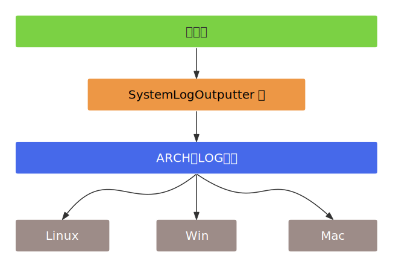

- [1. **ARCH层日志模块设计**](#1-arch层日志模块设计)
  - [1.1. **平台实现**](#11-平台实现)
    - [1.1.1. **Unix**](#111-unix)
    - [1.1.2. **Windows**](#112-windows)
  - [1.2. **日志级别系统**](#12-日志级别系统)
- [2. **适配器层**](#2-适配器层)


  

# 1. **ARCH层日志模块设计**
IArchLog是一个纯虚拟接口类，继承自IInterface基类，为跨平台的系统级日志记录提供了统一的接口设计，接口包含四个纯虚拟方法：   
```cpp
class IArchLog : public IInterface
{
public:

    // 1. 打开日志
    virtual void openLog(const char *name) = 0;
    
    // 2. 关闭日志，释放日志资源
    virtual void closeLog() = 0;
    
    // 3. 可视化日志展示，实现GUI，CLI逻辑
    virtual void showLog(bool showIfEmpty) = 0;

    // 4. 日志记录主入口
    virtual void writeLog(ELevel, const char *) = 0;

};
```
IArchLog通过ARCH单例被集成到更高层的日志系统中。SystemLogOutputter类通过ARCH宏访问平台特定的IArchLog实现，为上层日志系统提供系统日志输出功能。  
 
## 1.1. **平台实现**
### 1.1.1. **Unix**  
ArchLogUnix类实现了Unix平台的日志功能，使用系统的syslog机制：
- 使用openlog()函数初始化syslog。   
- 将ELevel枚举值转换为对应的syslog优先级。  

```cpp
void ArchLogUnix::openLog(const char *name) { openlog(name, 0, LOG_DAEMON); }
void ArchLogUnix::closeLog() { closelog(); }
void ArchLogUnix::showLog(bool) { /* do nothing */ }

void ArchLogUnix::writeLog(LogLevel level, const char *msg)
{
  // 将LogLevel转换为系统日志级别
  int priority;
  switch (level) {
    using enum LogLevel;
  case Error:
    priority = LOG_ERR;
    break;
  case Warning:
    priority = LOG_WARNING;
    break;
  case Note:
    priority = LOG_NOTICE;
    break;
  case Info:
    priority = LOG_INFO;
    break;
  default:
    priority = LOG_DEBUG;
    break;
  }

  // log it
  syslog(priority, "%s", msg);
}
```


### 1.1.2. **Windows**
ArchLogWindows类实现了Windows平台的日志功能 ArchLogWindows.h:17-18 ，使用Windows事件日志系统：
- 维护一个HANDLE m_eventLog成员变量来管理事件日志句柄。  
- 使用RegisterEventSource()和ReportEvent()等Windows API。  
```cpp
#define ARCH_LOG ArchLogWindows

class ArchLogWindows : public IArchLog
{
public:
  ArchLogWindows();
  ~ArchLogWindows() override = default;

  // IArchLog overrides
  void openLog(const char *name) override;
  void closeLog() override;
  void showLog(bool showIfEmpty) override;
  void writeLog(LogLevel, const char *) override;

private:
  HANDLE m_eventLog;  // 事件日志句柄
};
```

## 1.2. **日志级别系统**  
接口使用ELevel枚举来定义日志优先级，包含从最高到最低优先级的多个级别：kFATAL、kERROR、kWARNING、kNOTE、kINFO、kDEBUG等。   


# 2. **适配器层**
ILogOutputter是高层的日志输出接口，定义了日志输出器的通用操作方法供业务层使用。而IArchLog也同样  定义了日志输出器的通用操作方法供ILogOutputter。两个接口通过SystemLogOutputter类建立连接，SystemLogOutputter实现了ILogOutputter接口，但实际的日志任务是委托给ARCH层完成的。
```cpp
class SystemLogOutputter : public ILogOutputter
{
public:
  SystemLogOutputter() = default;
  ~SystemLogOutputter() override = default;

  // ILogOutputter overrides
  void open(const char *title) override;
  void close() override;
  void show(bool showIfEmpty) override;
  bool write(LogLevel level, const char *message) override;
};
```
成员函数通过调用ARCH层接口完成日志任务。  
```cpp
void SystemLogOutputter::open(const char *title)
{
  ARCH->openLog(title);
}
```

