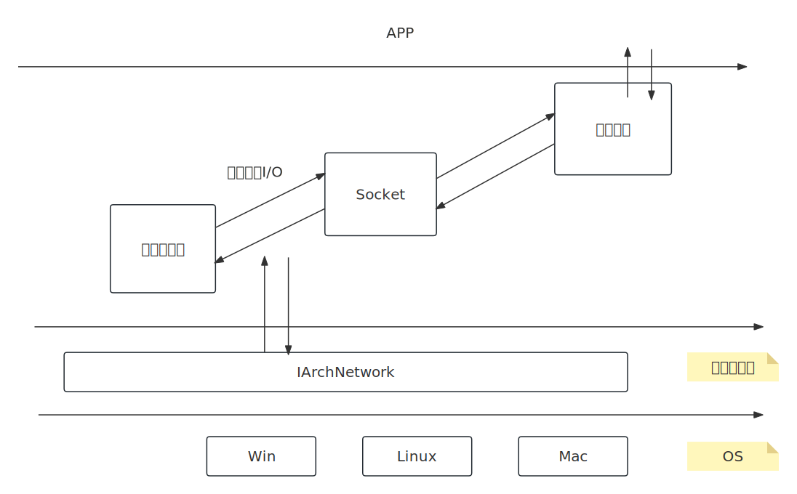
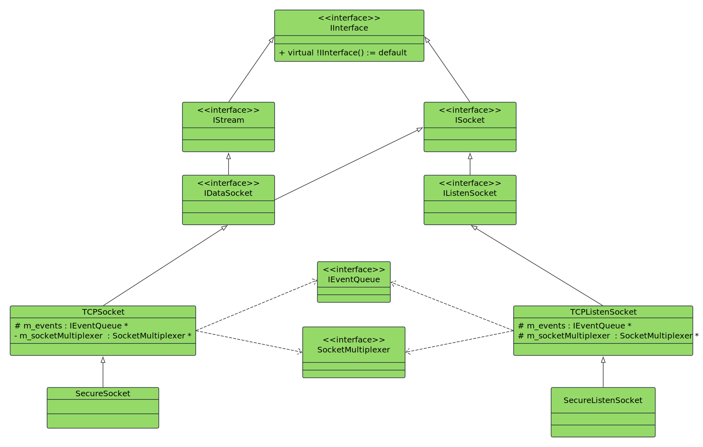

- [1. **整体设计**](#1-整体设计)
- [2. **类型设计**](#2-类型设计)
  - [2.1. **监听Socket**](#21-监听socket)
    - [2.1.1. **TCP监听Socket实现**](#211-tcp监听socket实现)
    - [2.1.2. **加密监听Socket实现**](#212-加密监听socket实现)
  - [2.2. **数据Socket**](#22-数据socket)
    - [2.2.1.  **TCP数据Socket**](#221--tcp数据socket)
    - [2.2.2. **加密的TCP数据Socket**](#222-加密的tcp数据socket)
- [3. **网络地址**](#3-网络地址)


# 1. **整体设计**
网络模块涉及到 4 个部分：  
1. 　`网络地址`： NetworkAddress，统一不同平台上网络地址的表示。   
2. 　`网络套接字`： ISocket，规定了套接字类型的核心接口，分为监听Socket和数据Socket，依赖于ARCH层和多路复用器处理网络事件。   
      - IDataSocket，数据Socket，实现异步数据I/O功能。   
      - IListenSocket，监听Socekt，实现服务端功能。   
3. 　`多路复用器`： SocketMultiplexer，监控网络I\O，例如客户端连接、数据收发，也是基于ARCH层的。   
4. 　`多路复用器任务`： ISocketMultiplexerJob，这是对于网络I/O的任务的封装。    
5.   `工厂模式`： 通过ISocketFactory创建不同的网络套接字。  
6.   `事件机制`： 接收的网络数据保存到缓冲区，然后通过事件通过业务层数据已到达。同时事件机制也要处理一些网络异常事件。  

  

# 2. **类型设计**

  

网络接口抽象如下，由派生类去实现不同类型的网络接口：   
```cpp
// 网络接口的抽象基类    
class ISocket : public IInterface
{
public:
    virtual void bind(const NetworkAddress &) = 0;
    virtual void close() = 0;

    /*  
     *  返回this，用于事件驱动架构中标识事件源，
     *  与EventQueue配合实现事件分发，作为回调函数上下文参数传递对象指针。
     */
    virtual void *getEventTarget() const = 0;
};
```

## 2.1. **监听Socket**  
```cpp
class IListenSocket : public ISocket
{
public:
    /* 向多路复用器中注册TcpServer任务 */
    virtual std::unique_ptr<IDataSocket> accept() = 0;

    void bind(const NetworkAddress &) override = 0;
    void close() override = 0;
    void *getEventTarget() const override = 0;
};
```

### 2.1.1. **TCP监听Socket实现**

```cpp
class TCPListenSocket : public IListenSocket
{
public:
    TCPListenSocket(IEventQueue *events, SocketMultiplexer *socketMultiplexer, IArchNetwork::AddressFamily family);
    TCPListenSocket(TCPListenSocket const &) = delete;
    TCPListenSocket(TCPListenSocket &&) = delete;
    ~TCPListenSocket() override;

    TCPListenSocket &operator=(TCPListenSocket const &) = delete;
    TCPListenSocket &operator=(TCPListenSocket &&) = delete;

    // ISocket overrides
    void bind(const NetworkAddress &) override;  // bind并且开始listen，也就是给多路复用器添加listen任务。
    void close() override;
    void *getEventTarget() const override;

    /* 
     * 启动TCPServer的监听服务。
     * 内部调用了 setListeningJob()  
     */
    std::unique_ptr<IDataSocket> accept() override;

    ISocketMultiplexerJob *serviceListening(ISocketMultiplexerJob *, bool, bool, bool);
protected:
  /* 
   *  给多路复用器添加一个任务（accept任务），用于监听客户端的连接。  
   *  这个任务的任务函数就是serviceListening。  
   */
    void setListeningJob();   

    IEventQueue *m_events;   
    ArchSocket   m_socket;                      // Socket实体
    SocketMultiplexer *m_socketMultiplexer;     // 关联的多路复用器
private:
    std::mutex m_mutex;
};
```


### 2.1.2. **加密监听Socket实现**
```cpp
// SecurityLevel枚举类，用于控制客户端与服务器的通信安全策略。
enum class SecurityLevel
{
  PlainText,  // 不加密
  Encrypted,  // 启用TLS加密
  PeerAuth    // 双向认证加密
};


class SecureListenSocket : public TCPListenSocket
{
public:
    SecureListenSocket(
        IEventQueue *events, SocketMultiplexer *socketMultiplexer, IArchNetwork::AddressFamily family,
        SecurityLevel securityLevel = SecurityLevel::PlainText
    );  

    std::unique_ptr<IDataSocket> accept() override;

private:
    const SecurityLevel m_securityLevel;
};
```


## 2.2. **数据Socket**
```cpp
// 数据Socket基类。  
class IDataSocket : public ISocket, public deskflow::IStream
{
public:
      /* 连接失败事件的附加信息 */
    class ConnectionFailedInfo
    {
    public:
        explicit ConnectionFailedInfo(const char *what) : m_what(what)
        {
          // do nothing
        }
        std::string m_what;
    };

    explicit IDataSocket(const IEventQueue *events)
    {
      // do nothing
    }

    virtual void connect(const NetworkAddress &) = 0;

    void bind(const NetworkAddress &) override = 0;

    /* 
     *  正常情况下这两货不会在这里重写，实际是在TCPSocket类型里重写。  
     *  但是，VC++6 对多重继承的支持存在缺陷，无法正确解析具有相同签名的方法。   
     *  在 VC++6 中，如果一个类从多个基类继承了相同签名的方法， 编译器会错误地认为这些方法是“未使用的局部变量”，并警告或移除它们。   
     *  所以这里通过提供非纯虚函数的默认实现，绕过编译器对多重继承的错误处理。  
     */
    void close() override;
    void *getEventTarget() const override;

    /* 流操作 */ 
    uint32_t read(void *buffer, uint32_t n) override = 0;
    void write(const void *buffer, uint32_t n) override = 0;
    void flush() override = 0;
    void shutdownInput() override = 0;
    void shutdownOutput() override = 0;
    bool isReady() const override = 0;
    uint32_t getSize() const override = 0;
    virtual bool isFatal() const = 0;
};
```

### 2.2.1.  **TCP数据Socket**  
实现了TCPSocket的异步的连接、I/O等等。  
```cpp
class TCPSocket : public IDataSocket
{
public:
    TCPSocket(
        IEventQueue *events, SocketMultiplexer *socketMultiplexer,
        IArchNetwork::AddressFamily family = IArchNetwork::AddressFamily::INet
    );
    TCPSocket(IEventQueue *events, SocketMultiplexer *socketMultiplexer, ArchSocket socket);
    ~TCPSocket() override;

    // ...
    // ...

    uint32_t read(void *buffer, uint32_t n) override;          // 从接收缓冲区读取n个字节到buffer中。
    void write(const void *buffer, uint32_t n) override;       // 将buffer中的字节写入发送缓冲区，并触发异步发送流程（发送事件）
    void flush() override;                                     // 等待发送缓冲区刷新完成。
    void shutdownInput() override;                             // 关闭Socket的接收端，清空发送缓冲区，并从多路复用器移除该Socket对应的任务。
    void shutdownOutput() override;
    bool isReady() const override;      // 接收缓冲区有数据
    uint32_t getSize() const override;  // 接收缓冲区字节数

    // 发起连接，并向多路复用器注册读写任务。
    void connect(const NetworkAddress &) override;

    /*  
    *  创建并返回与套接字关联的异步I/O任务对象(多路复用器任务)。 
    *  如果suocket还没有建立连接，就创建连接建立任务，也就是serviceConnecting。
    *  如果已经建立建立，那就创建读写任务，也就是serviceConnected。
    */
    virtual ISocketMultiplexerJob *newJob(); 

protected:

    /* 表示任务执行的结果，多路复用器是以 “任务链” 的形式运行任务 */
    enum class JobResult
    {
      Break = -1, // 强制终止任务链，用于处理不可恢复错误（如断开连接）
      Retry,      // 保持当前任务继续执行，适用于暂时性阻塞（如等待I/O）
      New         // 需要创建新任务，上一个任务已经完成。
    };

    // ...

    /* 
    * 非阻塞I/O，并处理网络断开情况，由serviceConnected调用。  
    * doRead():  读取网络数据保存到接收缓冲区中，当输入缓冲区从空变为有数据时，通过事件队列通知上层有数据到达当输入缓冲区从空变为有数据时，通过事件队列通知上层有数据到达。  
    * doWrite()：将发送缓冲区中的数据发送出去。 
    */
    virtual JobResult doRead();  
    virtual JobResult doWrite();

    /*  
    * 注册任务到多路复用器。
    * 如果参数为nullptr，就移除多路复用器中与当前Socket绑定的任务。
    * 如果不为nullptr，就注册该任务到多路复用器。
    */ 
    void setJob(ISocketMultiplexerJob *);

    // ...
    // 获取/设置状态的接口
    // ...

    void sendEvent(EventTypes);

    /* 刷新发送缓冲区（从输出缓冲区移除已成功发送的字节数），并唤醒所有等待m_flushed的线程。*/
    void discardWrittenData(int bytesWrote);

    IEventQueue *m_events;
    StreamBuffer m_inputBuffer;     // 接收缓冲区
    StreamBuffer m_outputBuffer;    // 发送缓冲区

private:
    void init();  // 初始化TCP套接字的状态并配置网络参数，并且禁用禁用Nagle算法。

    void sendConnectionFailedEvent(const char *);
    void onInputShutdown();   // 清空接收缓存区。
    void onOutputShutdown();
    void onConnected();       // 建立连接后更新Socekt状态。
    void onDisconnected();    // 断开连接后更新Socket状态。

    /* 多路复用器任务 */
    ISocketMultiplexerJob *serviceConnecting(ISocketMultiplexerJob *, bool, bool, bool);
    ISocketMultiplexerJob *serviceConnected(ISocketMultiplexerJob *, bool, bool, bool);

    bool m_readable;   // Socket是否可读
    bool m_writable;
    bool m_connected;  // 连接状态
    Mutex m_mutex;
    ArchSocket m_socket;
    CondVar<bool> m_flushed; // 用于在多线程场景下同步TCP套接字的"数据刷新完成"状态。当发送缓冲区的数据被完全发送到网络后，通过 m_flushed 通知等待的线程继续执行。
    SocketMultiplexer *m_socketMultiplexer;
};
```

### 2.2.2. **加密的TCP数据Socket**  
继承自TCPSocket，在TCPSocket基础上增加了SSL加密。   
```cpp
class SecureSocket : public TCPSocket
{
    // ...
}
```

# 3. **网络地址**
```cpp
class NetworkAddress
{
public:
  NetworkAddress() = default;
  explicit NetworkAddress(int port);                          // port： 端口
  NetworkAddress(const std::string &hostname, int port = 0);  // 使用主机名，端口构造
  NetworkAddress(const NetworkAddress &);
  ~NetworkAddress();

  NetworkAddress &operator=(const NetworkAddress &);

  size_t resolve(size_t index = 0);                          // 将主机名解析为网络地址（IP地址 + 端口）

  bool operator==(const NetworkAddress &address) const;
  bool operator!=(const NetworkAddress &address) const;

  bool isValid() const;                      // m_address不为空时返回true        

  const ArchNetAddress &getAddress() const;  // 返回 m_address

  int getPort() const;                       // m_port

  std::string getHostname() const;           // m_hostname

private:
  void checkPort() const;                   // 端口是否有效，0 ~ 65535

private:
  ArchNetAddress m_address = nullptr;
  std::string m_hostname;
  int m_port = 0;
};
```

