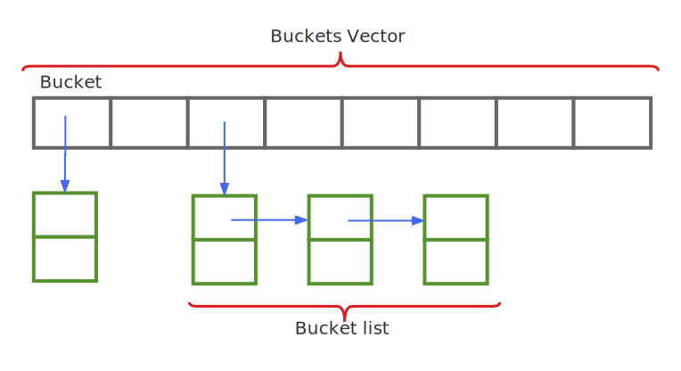

# 1. 无序关联容器（Hash容器） 
无序关联容器，内部存储使用vector和hash结构，插入元素时通过Hash映射存储到vector数组中，hash容器实现了“[]”运算符，所以可以使用随机访问的形式访问元素：  
  
buckets vector中存储buckets list的链表头指针。   
**与set/map相比：**   
1. `查找性能更好，平均时间复杂度O(1)`    
通常情况下，buckets list中的元素很少，甚至只有一个，此时查找效率很高。     
2. `不适合使用迭代器遍历`      
3. `插入操作一些情况下会慢`    
如果buckets list很长，容器会重新Hash，就是创建新的较大的Buckets Vector，然后重新计算所有元素的Hash值，并添加到对应的buckets list中，这个过程要创建新的vector并释放之前的vector，所以性能较差。  
4. `“键”必须支持“hash运算”与“==”`  
“==”运算较慢，因为当buckets list中有多个元素时，会对buckets list中的元素进行排序，然后逐一比较，C++标准库中提供了一个算法: std::is_permutation(lhs_eq1, lhs_eq2, rhs_eq1) == true，该算法将要比较的对象进行排序然后比较，内部实现还是比较复杂的，所以当buckets list中有多个元素时，“==”运算较慢。    
5. `不支持容器级关系运算，除了“==”`  

# 2. 无序关联容器有那些
`不允许键重复:  `     
unordered_set;        “键”就是“值”；   
unordered_map;        每个节点都是一个“键值对”；    
`允许键重复:  `   
unordered_multiset;   允许存储相同的元素；   
unordered_multimap;   允许对个键相同的键值对；   

# 3. 使用场景
由于Hash容器的底层原理，所以查找元素的效率比有序关联容器要高，但是插入效率有时会更低，比如说vector满了，此时插入新元素时就会创建一块新的大一点的vector，并将数据拷贝到新vector中，如此一来效率就低了，所以啊，无序关联容器可以使用在这种场景：在程序启动时就创建并插入所有的元素，在程序运行时，只有访问行为，例如Qemu代码架构中，由于使用的是C语言，所以Qemu就创建了一套面向对象的机制（QOM），在QOM中，使用了GCC编译器的constructor属性，使用`__attribute__((constructor))`，修饰的函数在main()函数前被自动调用，QOM凭借这种机制将Qemu的所有类型的“名称”以及类型的“构造函数”保存到Hash表中，这样在运行时，程序就可以通过“类型名称”找到类型的构造函数，并创建对应的实例。

