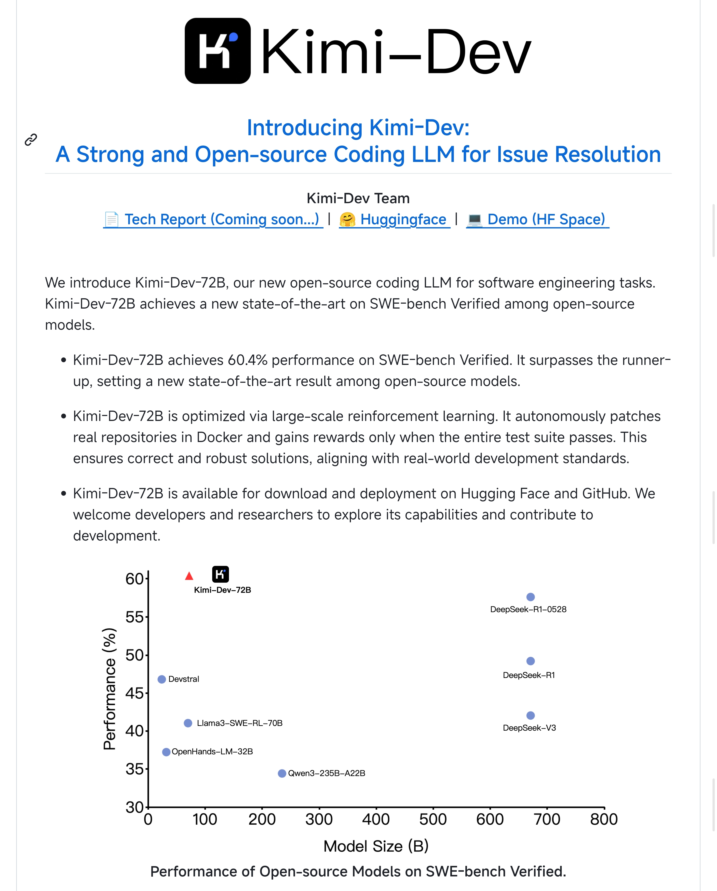

&emsp;&emsp;6月17号，Kimi发布了一款新编程模型——Kimi-Dev，在SWE-bench Verified上，以60.4的成绩获得了开源Sota，仅次于Gemini 2.5 Pro和Claude了，模型仅有72B参数，该模型的设计中包含了两个对抗角色： BugFixer和TesWriter，其中BugFixer职业解决Bug， TesWriter专门编写测试用例，用于测试。这两个模块都是基于共同的最小框架，包含两个阶段，File Localization和Code Edits，就是先定位要修改的文件，然后修改代码中的Bug，kimi团队收集了Github上的大量Issue和Pull Request，基于这些内容学习推理与解决额问题。   
&emsp;&emsp;看起来这款新模型是一种“Agent”的思路，在底层模型不占优势的情况下，通过Agent的思路来提升模型的使用性能，这应该是Kimi团队在产品路线上的调整。自从Depseek R1发布之后， 国内AI圈子的流量都在DeepSeek和千问上，Kimi一直沉寂，实际上大模型基础建设只适合资本大户来做，对于中小企业更适合在模型之上提供服务，对于模型进行优化，提供特定场景下的创新与性能。  

