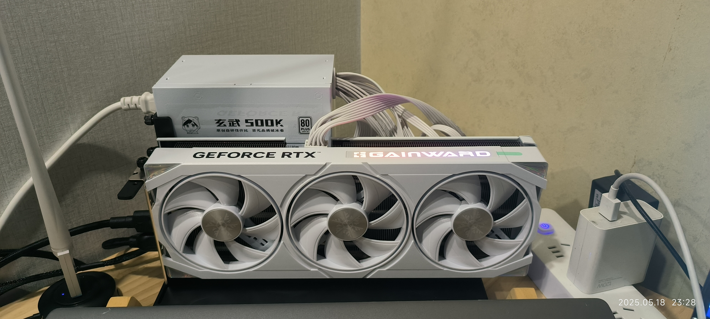
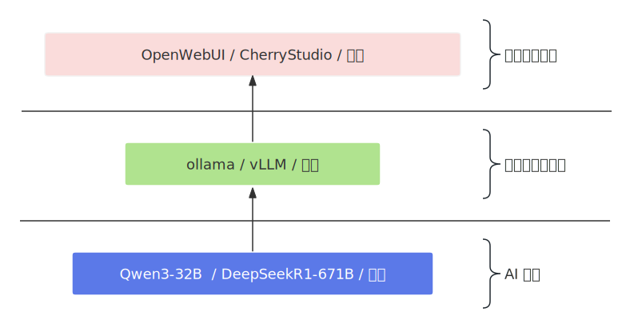
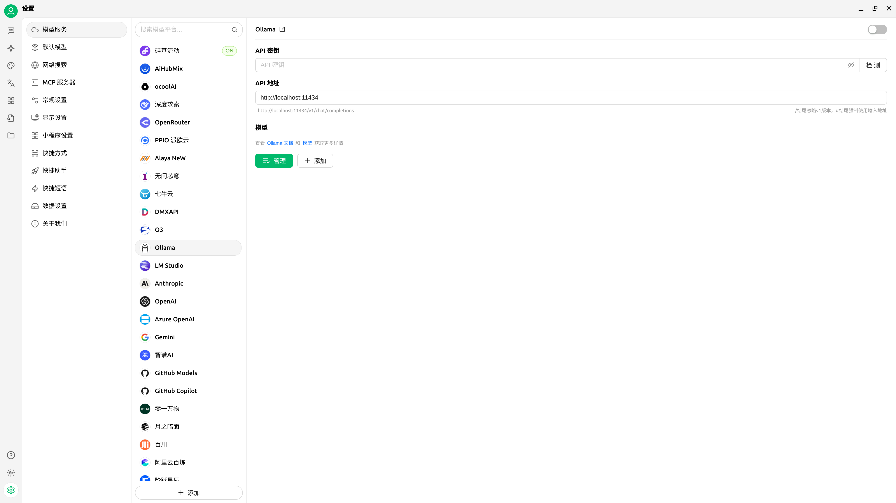
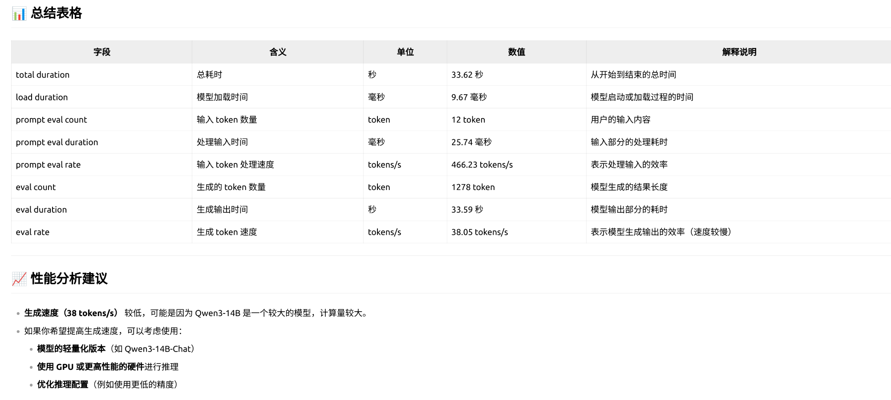

- [1. 本地环境](#1-本地环境)
- [2. CUDA安装](#2-cuda安装)
- [3. AI部署框架](#3-ai部署框架)
- [4. 安装ollama](#4-安装ollama)
- [5. AI 模型部署](#5-ai-模型部署)
- [6. 前端接入](#6-前端接入)
- [7. 效果展示](#7-效果展示)


# 1. 本地环境

**1. 主机**  
- 主机：天钡 GEM12 Pro   
- CPU: AMD Ryzen 7 PRO 8845HS   
- 内存：32GB

**2. 系统**  
- 发行版：Fedora Linux 41 (Workstation Edition)   
- 内 核：6.14.6-200.fc41.x86_64  

**3. 显卡** 
NVIDIA GTX 5060 Ti 16GB  


# 2. CUDA安装
登陆[nvidia developer官网](https://developer.nvidia.com/)，进入CUDA Toolkit，并选择需要的版本。根据下面网页的提示选择系统版本后，页面下方会给出对应的安装过程，根据指示安装即可，安装完成后可以在终端查看显卡信息：     
```bash
zcli@fedora:~$ nvidia-smi 
Sun May 18 22:05:08 2025       
+-----------------------------------------------------------------------------------------+
| NVIDIA-SMI 575.51.03              Driver Version: 575.51.03      CUDA Version: 12.9     |
|-----------------------------------------+------------------------+----------------------+
| GPU  Name                 Persistence-M | Bus-Id          Disp.A | Volatile Uncorr. ECC |  # 第一行标题
| Fan  Temp   Perf          Pwr:Usage/Cap |           Memory-Usage | GPU-Util  Compute M. |  # 第二行标题，其中Perf表示当前性能状态（P0 ~ P15，P0 是最高性能，P12/P15 是节能模式）
|                                         |                        |               MIG M. |  # 第三行标题
|=========================================+========================+======================|
|   0  NVIDIA Graphics Device         On  |   00000000:01:00.0  On |                  N/A |  # 第一行数据，对应第一行标题
|  0%   47C    P5             10W /  180W |    1346MiB /  16311MiB |      0%      Default |  # 第二行数据，对应第二行标题
|                                         |                        |                  N/A |  # 第三行数据，对应第三行标题
+-----------------------------------------+------------------------+----------------------+
                                                                                         
+-----------------------------------------------------------------------------------------+
| Processes:                                                                              |
|  GPU   GI   CI              PID   Type   Process name                        GPU Memory |  # 进程列表
|        ID   ID                                                               Usage      |
|=========================================================================================|
|    0   N/A  N/A           36667      G   /usr/bin/gnome-shell                    393MiB |  # 几个使用GPU进程的进程以及使用的显存
|    0   N/A  N/A           37509    C+G   /usr/bin/ptyxis                          73MiB |
|    0   N/A  N/A           37546      G   /usr/bin/Xwayland                        38MiB |
|    0   N/A  N/A           37828      G   ...ess --variations-seed-version        207MiB |
|    0   N/A  N/A           38479    C+G   /opt/microsoft/msedge/msedge              6MiB |
|    0   N/A  N/A           38542      G   ...per --variations-seed-version        415MiB |
|    0   N/A  N/A           38747      G   /usr/bin/clash-verge                      2MiB |
+-----------------------------------------------------------------------------------------+
```

# 3. AI部署框架
模型只是一堆参数，需要通过推理工具来运行，推理工具将模型参数加载到显存中，并依据输入的文字生成输出。   
  
我们接下来要完成:   
1. 大模型框架部署(推理工具)，以Ollama为例；   
2. 模型部署，以Qwen32-14B为例；
3. 前端接入，以CherryStudio为例；   

# 4. 安装ollama

参考【Ollama部署】篇。    

# 5. AI 模型部署
因为Ollama服务已经启动了，所以就不必再次运行`ollama serve`命令了。直接开run：    
`提示：` `ollama run qwen3:14b`会从Ollama服务器拉取模型，国内网络可能不太行，可以使用`ollama run modelscope.cn/Qwen/Qwen3-14B-GGUF`。    
```bash
zcli@fedora:~$ ollama run qwen3:14b  # 如果模型还没有下载就会先下载模型，等待即可
pulling manifest 
pulling a8cc1361f314: 100% ▕██████████████████████████████████████████████████████████████████████████████████████████████▏ 9.3 GB                         
pulling eb4402837c78: 100% ▕██████████████████████████████████████████████████████████████████████████████████████████████▏ 1.5 KB                         
pulling d18a5cc71b84: 100% ▕██████████████████████████████████████████████████████████████████████████████████████████████▏  11 KB                         
pulling cff3f395ef37: 100% ▕██████████████████████████████████████████████████████████████████████████████████████████████▏  120 B                         
pulling 78b3b822087d: 100% ▕██████████████████████████████████████████████████████████████████████████████████████████████▏  488 B                         
verifying sha256 digest 
writing manifest 
success 
>>> Send a message (/? for help)
```
好了，可以开始提问了，按照惯例先Hello Word:  
```bash
>>> 你好呀！
<think>
好的，用户发来“你好呀！”，我需要友好回应。首先，要保持亲切，用表情符号增加温度。然后，可以询问用户是否需要帮助，但不要显得太正式。可能用户只是打招呼，
所以简单回应即可，留出空间让用户继续交流。注意用词口语化，避免复杂句子。检查有没有拼写错误，确保回复自然。最后，保持开放态度，让用户知道我随时准备帮助他
们。
</think>

你好呀！😊 很高兴见到你！今天过得怎么样呀？需要我帮忙做点什么吗？

>>> Send a message (/? for help)
```
此时的显存占用：`11490MiB /  16311MiB`，看来，16G显存部署一个14B刚刚好。


`--verbose参数： 显示推理过程的耗时情况`   
```bash
zcli@fedora:~$ ollama run qwen3:14b --verbose
>>> 西红柿怎么吃？
<think>
嗯，用户问的是“西红柿怎么吃？”，这个问题看起来挺简单的，但其实可能需要更深入的思考。首先，我得考虑用户可能的背景。他们可能是刚开始接触西红柿，或者想找
一些新的吃法。也可能他们之前吃过，但想尝试更多不同的做法。
......
......    # 这个就略了吧
</think>
西红柿（番茄）是一种非常百搭的食材，既可以直接生吃，也可以通过多种烹饪方式制作成美味佳肴。以下是常见的吃法和一些创意做法，供你参考：
......
......   # 这个也略吧
根据你的口味和需求，可以灵活选择以上吃法！如果需要具体菜谱或步骤，也可以告诉我哦 😊   
# 下面的输出是重点
total duration:       33.622874783s      # 总耗时33.6秒
load duration:        9.67421ms          # 模型加载耗时9.67ms
prompt eval count:    12 token(s)        # 输入提示（prompt）的 token 数量，输入提示词被分词为 12 个 token。
prompt eval duration: 25.738437ms        # 处理这 12 个 token 的提示词用了约 25.7 毫秒。
prompt eval rate:     466.23 tokens/s    # 处理输入提示的速度（token/s），默认启用 enable_thinking=True（思考模式）。
eval count:           1278 token(s)      # 模型生成输出的 token 总数。
eval duration:        33.587006893s      # 生成输出的总耗时，占总耗时的 99.9%（total duration 的 33.62 秒）。说明生成阶段是性能瓶颈。。
eval rate:            38.05 tokens/s     # 生成输出的速度（token/s），生成速度较慢（38 tokens/s），这与 14B 参数量的 Dense 模型特性一致，
                                         # Qwen3 的 MoE 模型（如 Qwen3-30B-A3B）通过激活部分参数（30B 总参数，仅激活 3B）实现更高的生成速度。
```
模型文件位于目录：`/usr/share/ollama`下。    

# 6. 前端接入
Ollama默认是在11434端口提供服务。明白了这个就可以到`www.cherry-ai.com`下载Cherry Studio了。    
安装好后，选择『设置』，然后在『设置』中选择『Ollama』：     
     
点击『添加』，然后填写“模型ID”，“模型名称”，“分组名称”，这些信息通过`ollama list`命令获取，注意了，这里的“模型ID”是`ollama list`命令输出的“NAME”，而不是ID,然后点击右上角的“检测”，提示“连接成功”就OK了，至于API密钥，随便填个什么就行，最后将默认助手的模型设置为我们刚刚添加的模型就可以使用了。  

# 7. 效果展示
以上文提到的西红柿问题为例，我们让qwen3-14b自己评价自己性能表现：     



