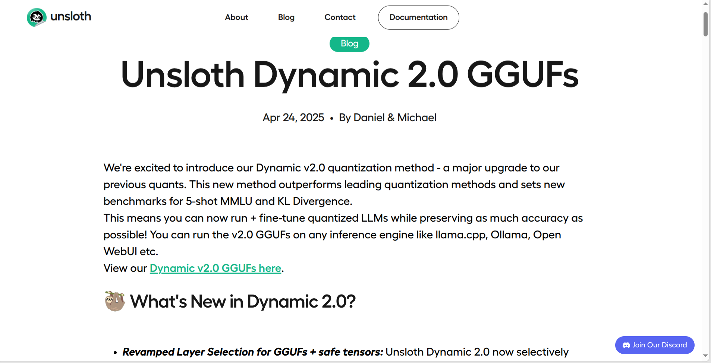
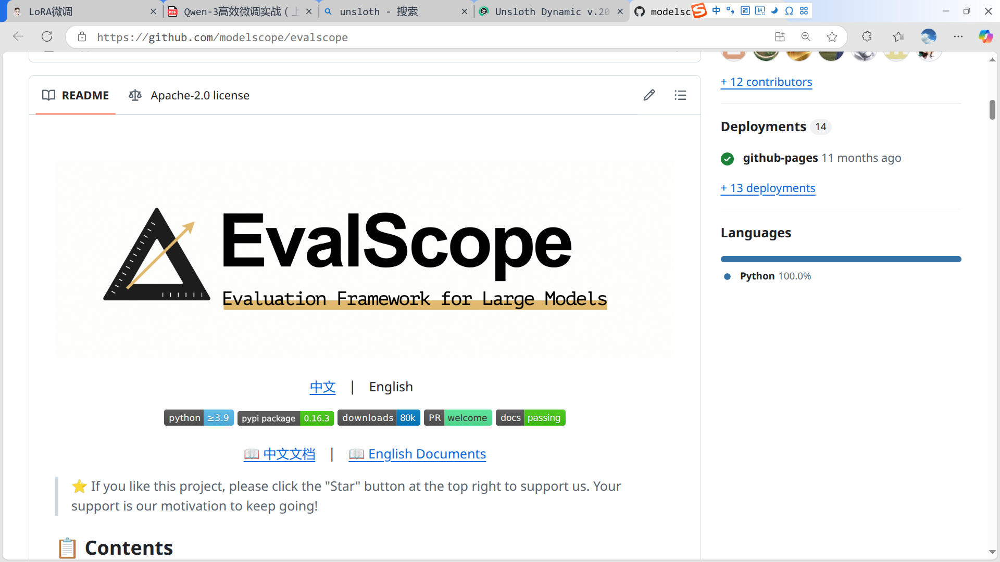

- [1. 全量微调与高效微调](#1-全量微调与高效微调)
- [2. 模型微调的优劣势分析](#2-模型微调的优劣势分析)
- [3. 高效微调与LoRA、QLoRA](#3-高效微调与loraqlora)
  - [3.1. LoRA 与 QLoRA 二者对比如下](#31-lora-与-qlora-二者对比如下)
  - [3.2. 高效微调的应用场景](#32-高效微调的应用场景)
- [4. 主流微调工具](#4-主流微调工具)
  - [4.1. unsloth](#41-unsloth)
  - [4.2. ms-SWIFT](#42-ms-swift)
  - [4.3. 模型性能评估框架EvalScope](#43-模型性能评估框架evalscope)

&emsp;&emsp;所谓大模型微调，指的在已有的大规模预训练模型基础上，使用特定的数据集进行训练，进一步优化模型的表现，以适应特定任务或场景的需求。不同于RAG或者Agent技术，通过搭建工作流，关联外部工具等等来优化模型表现，微调是通过修改模型参数来优化模型能力，是一种能够让模型“永久”掌握某种能力的方法。  

# 1. 全量微调与高效微调
&emsp;&emsp;从方法的大类上来划分，微调又可以划分为`全量微调`和`高效微调`，全量微调就是带入全部数据进行微调，一般是由大模型研发团队完成，例如DepSeek研发团队，千问研发团队。高效微调是只带入部分数据进行微调，适合用户拿到模型后，使用特定数据集进行微调，以改善模型在特定场景下的表现。    

# 2. 模型微调的优劣势分析
&emsp;&emsp;尽管模型微调能够通过修改模型参数的方式，永久的修改模型的能力，但这其实是一把双刃剑，如果处理不当，很可能造成模型原始能力的灾难性遗忘、即会导致模型原始能力丢失，对于复杂模型尤其如此。而为了能够满足微调最初目标，我们必须小心谨慎的设计模型微调数据集和微调训练流程，并经过反复多次训练验证，得到一个最佳模型。

# 3. 高效微调与LoRA、QLoRA
&emsp;&emsp;尽管全量微调可以对模型的能力进行深度改造，但要带入模型全部参数进行训练，需要消耗大量的算力，且有一定的技术门槛。相比之下，在绝大多数场景中，如果我们只想提升模型某个具体领域的能力，那高效微调会更加合适。尽管在2020年前后，深度学习领域诞生了很多高效微调的方法，但现在适用于大模型的最主流的高效微调方法只有一种——LoRA。  

&emsp;&emsp;LoRA（Low-Rank Adaptation）微调是一种参数高效的微调方法，旨在通过引入低秩矩阵来减少微调时需要调整的参数数量，从而显著降低显存和计算资源的消耗。具体来说，LoRA 微调并不直接调整原始模型的所有参数，而是`通过在某些层中插入低秩的适配器（Adapter）层来进行训练`。   

**LoRA的原理：**　　  
- 在标准微调中，我们会修改模型的所有权重，而在 LoRA 中，只有某些低秩矩阵（适配器）被训练和调整。这意味着原始模型的参数保持不变，只是通过少量的新参数来调整模型的输出。  
- 低秩矩阵的引入可以在显存和计算能力有限的情况下，依然有效地对大型预训练模型进行微调，从而让 LoRA 成为显存较小的设备上的理想选择。  

**LoRA的优势：**
1. 显存优化： 只需要调整少量的参数（适配器），显著减少了显存需求，适合显存有限的GPU。　　
2. 计算效率： 微调过程中的计算负担也更轻，因为减少了需要调整的参数量。　　　
3. 灵活性： 可以与现有的预训练模型轻松结合使用，适用于多种任务，如文本生成、分类、问答等。　　　

&emsp;&emsp;而QLoRA（Quantized Low-Rank Adaptation） 则是 LoRA 的一个扩展版本，它结合了 LoRA 的低秩适配器和量化技术。QLoRA 进一步优化了计算效率和存储需求，特别是在极端显存受限的环境下。与 LoRA 不同的是，QLoRA 会将插入的低秩适配器层的部分权重进行量化（通常是量化为 INT4 或INT8），在保持性能的同时显著降低模型的存储和计算需求。　　　　　

－　**核心思想**： 在 LoRA 的基础上加入量化技术，减少权重表示的位数，从而降低显存和计算需求。QLoRA 结合了低秩适配器和量化的优点，能够在显存有限的设备上进行更高效的微调。    
－　**量化**： 通过将模型权重量化为低精度（如 INT4），减少内存占用，并提高推理和训练速度。    
－　**优势**：   
   - 在显存非常有限的情况下仍能进行微调。     
   - 可以处理更大规模的模型。    
   - 适合用于边缘设备和需要低延迟推理的场景。   

## 3.1. LoRA 与 QLoRA 二者对比如下
|特性|Lora|QLoRA|
|-----------|----------------------|--------------------------|
|核心技术    |低秩适配器             |低秩适配器 + 量化技术         |
|适用场景    |显存有限，但是设备性能好 |显存极限受限或需要快速推理      |
|计算效率    |较高                  |更高                        |
|量化技术    |无量化                |将权重量化为低精度(int4或int8) |
|内存消耗    |较低                  |更低                        |
|训练复杂度  |较简单                 |较复杂，需要量化与适配         |

## 3.2. 高效微调的应用场景
&emsp;&emsp;在实际大模型应用场景中，高效微调主要用于以下四个方面：  
- **对话风格微调***：高效微调可以用于根据特定需求调整模型的对话风格。例如，针对客服系统、虚拟助理等场景，模型可以通过微调来适应不同的 语气、礼貌程度 或 回答方式，从而在与用户互动时提供更符合要求的对话体验。通过微调少量的参数（例如对话生成的策略、情感表达等），可以使模型表现出更具针对性和个性化的风格。  
- **知识灌注**：知识灌注是指将外部知识或领域特定的信息快速集成到已有的预训练模型中。通过高效微调，模型可以更好地学习新领域的专有知识，而无需重新从头开始训练。例如，对于法律、医疗等专业领域，可以使用少量的标注数据对预训练模型进行微调，帮助模型理解特定行业的术语、规则和知识，进而提升专业领域的问答能力。  
- **推理能力提升**：高效微调还可以用于提升大模型的推理能力，尤其是在处理更复杂推理任务时。通过微调，模型能够更加高效地理解长文本、推理隐含信息，或者从数据中提取逻辑关系，进而在多轮推理任务中提供更准确的答案。这种微调方式可以帮助模型在解答复杂问题时，提高推理准确性并减少错误。  
- **Agent能力（Function calling能力、或者MCP能力）提升**：在多任务协作或功能调用场景中，高效微调能够显著提升模型的Agent能力，使得模型能够有效地与其他系统进行交互、调用外部API或执行特定任务。通过针对性微调，模型可以学会更精准的功能调用策略、参数解析和操作指令，从而在自动化服务、智能助手或机器人控制等领域表现得更加高效和智能。   

# 4. 主流微调工具
&emsp;&emsp;unsloth、Llama、Factory、ms-SWIFT和ColossalAI。除此之外，也可以借助更加底层的库，如peft、LoRA、transformer等实现高效微调。对于初学者来说，首先使用现成工具来进行微调，四种工具基本说明如下。

## 4.1. unsloth
&emsp;&emsp;unsloth 是一个专为大型语言模型（LLM）设计的动态量化与微调框架，unsloth 与 HuggingFace 生态兼容，可以很容易地transformers、peft、trl 等库结合，以实现模型的监督微调（SFT）和直接偏好优化（DPO）。
    
&emsp;&emsp;Unsloth 的动态量化方法，最新的 Dynamic 2.0 版本，旨在在尽量减少性能损失的同时显著压缩大型语言模型（LLMs）的体积。对于 Qwen3 模型，尤其是 4-bit 动态量化版本，现有的评测显
示其性能下降非常有限，甚至在某些任务上与原始模型相当。
  
&emsp;&emsp;动态量化由利也有弊，其好处在于可以极大程度压缩模型运行所需占用的显存大小，同时几乎不损失性能，但问题在于动态量化的模型，无论是推理还是微调，只能单卡运行，这就使得其吞吐量有限，无法在一台物理机上实现多GPU并行从而扩大吞吐量。  

## 4.2. ms-SWIFT
&emsp;&emsp;ms-swift是由魔搭社区（ModelScope）开发的高效微调和部署框架，旨在为研究人员和开发者提供一站式的大模型与多模态大模型的训练、推理、评测、量化和部署解决方案。支持超过 450 种大型模型（LLMs）和 150多种多模态大模型（MLLMs）的训练和部署。   

## 4.3. 模型性能评估框架EvalScope
[EvalScope](https://github.com/modelscope/evalscope)是由阿里巴巴魔搭社区（ModelScope）推出的一款开源模型评估框架，旨在为大语言模型（LLM）和多模态模型提供统一、系统化的性能评估方案。该框架具备高度的自动化和可扩展性，适用于研究机构、工业界以及模型开发者在模型验证与性能对比场景中的广泛需求。  
  

