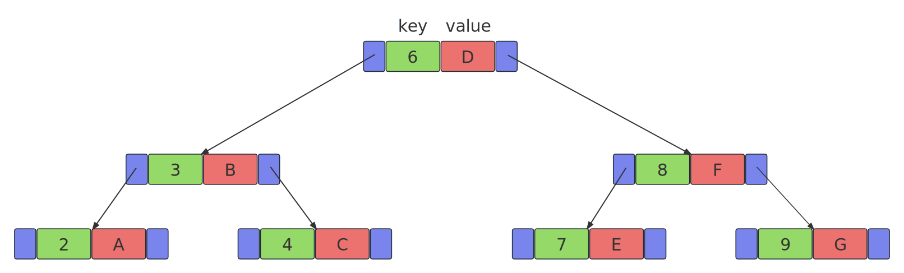

# 1. std::pair类模板
```cpp
template<
    class T1,
    class T2
> struct pair;
```
该类模板用于创建“键值对”对象，T1，T2可以内置类型，也可以是自定义类型。     

# 2. map
```cpp
#include <map>
```
在map中树的每一个节点都是一个std::pair，由于map底层时红黑树，所以`pair.first`的类型必须支持“<”运算，或者自定义比较函数。  
  
map的迭代器所指向的对象的“Key”是const的，“Key”本身是不能修改的，这样避免红黑树的平衡结构被改变，当前“value”是可以改变的。   


```cpp
#include <iostream>
#include <map>

int main()
{
    std::map<int,bool> m{{3, true}, {4, false}, {1, true}};
    for (auto p : m) 
    {
        std::cout << p.first << ' ' <<p.second << std::endl;
    }
}
```
```cpp
#include <iostream>
#include <map>

int main()
{
    std::map<int,bool> m{{3, true}, {4, false}, {1, true}};
    for (auto [k, v] : m) 
    {
        std::cout << k << ' ' << v << std::endl;
    }
}
```


# 3. 插入元素
## 3.1. insert
```cpp
int main()
{
    std::map<int, bool> m;
    m.insert(std::pair<const int, bool>(3,true));
}
```

# 4. 删除元素
## 4.1. erase
```cpp
iterator erase( iterator pos );                               // (constexpr since C++26)
iterator erase( const_iterator pos );                         // (since C++11)   (constexpr since C++26)
iterator erase( const_iterator first, const_iterator last );  // (since C++11)   (constexpr since C++26)
size_type erase( const Key& key );                            // (constexpr since C++26)
template< class K > size_type erase( K&& x );                 // (since C++23)   (constexpr since C++26)
```

# 5. 查找
## 5.1. contains
```cpp
bool contains( const Key& key ) const;   // (1)	(since C++20) (constexpr since C++26)

template< class K >
bool contains( const K& x ) const;       // (2)	(since C++20) (constexpr since C++26)
```

## 5.2. []和at()
### 5.2.1. []
```cpp
int main()
{
    std::map<int, bool> m;
    m.insert(std::pair<const int, bool>(6, true));
    std::cout << m[6] << std::endl;
}
```
对于`m[6]`，如果树的Key中没有6这个Key，map会向树中插入一个新元素，该节点的Key为6，value使用value类型的默认初始化方式，既然“[]”可能会插入新节点，那么const的map对象是不能使用“[]”的，请看如下代码：
```cpp
void fun(const std::map<int, int>& m)
{
    m[3];  //编译期报错，因为m是const的，是不能修改的。
}

int main()
{
    std::map<int, int> m;
    m.insert(std::pair<const int, int>(3, 100));
    fun(m);
}
```

### 5.2.2. at
```cpp
int main()
{
    std::map<int, bool> m;
    m.insert(std::pair<const int, bool>(6, true));
    std::cout << m.at(6) << std::endl;
}
```
对于`m[6]`，树的Key中没有6这个Key，代码会报错，程序终止。


# 6. 其他
extract等等。