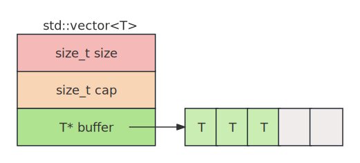

# 1. vector
模板类，动态数组，维护一块连续的存储空间，容量可动态改变。       
      
size:   当前元素个数。      
cap:    当前容量。       
buffer: 指向一块连续的存储空间。    


# 2. 容量
1. empty、size，capacity方法。
2. shrink_to_fit()，如果不再需要填充元素了，那就可以调用shrink_to_fit()方法，将容量缩减到size大小。本质就是在申请一块size大小的内存，然后将原来的元素拷贝到新的内存中，然后释放原来的内存。


# 3. 访问
1. 下标访问，和array一样，可以使用[]访问元素。     
2. 支持front、back、data方法。   
3. swap方法，交换两个vector对象，实际是交换指针，所以比array要快(注意是交换两个vector对象，而不是一个vector对象中的两个元素)。     
4. 关于swap方法，有一个常用的技巧是结合它来“清空”一个向量并释放其内存:   
```cpp
std::vector<int>().swap(vec1);
```
`std::vector<int>()` 创建了一个临时的、空的 vector<int> 对象，`.swap(vec1)` 调用了这个临时对象的 swap 方法，将它与 vec1 的内容交换。   
交换后，vec1 变成一个空的 vector（和临时对象交换后的结果），临时对象现在持有原来 vec1 的所有内存资源，当这行语句结束时，临时对象超出作用域并被销毁，它所持有的内存也被一并释放，如果使用clear()，则vec1会被清空，容量没有重置，内存不会被释放。

# 4. 比较
和array不同，vector的大小可以动态改变，即使是大小不同的两个vector对象也可以比较，但是元素类型还是要相同的。

# 5. 构造vector对象

## 5.1. reserve
```cpp
// 构造一个初始容量为1024的vector对象。
std::vector<int> v;
v.reserve(1024);     
```
```cpp
// vecitor对象的初始容量为6，每个元素的值都被初始化为1024。
std::vector<int> v(6, 1024);
```

## 5.2. push_back和emplace_back
两者都是向容器末尾添加元素，但是工作原理不同：  
**push_back**:     
将一个已经构造好的对象添加到容器的末尾，若传递右值（如临时对象），会调用移动构造函数（若存在）；若传递左值，则调用拷贝构造函数，也就是涉及到拷贝。
```cpp
std::vector<Person> vec;
Person alice("Alice", 30);
vec.push_back(alice);             // 拷贝构造
vec.push_back(Person("Bob", 25)); // 移动构造
```
**emplace_back**:      
直接传递构造对象所需的参数列表，通过完美转发在容器内存中直接构造对象，避免临时对象的创建，也就是在容器末尾原地构造一个对象出来。   
```cpp
vec.emplace_back("Charlie", 40); // 直接构造，无拷贝或移动
```

# 6. 移除
## 6.1. insert和emplace
两者都是向容器中指定位置插入元素，返回指向新插入元素的迭代器，区别参考push_back和emplace_back。  
两个第一个参数都是迭代器，新元素会插入到迭代器指向的元素之前。  
`insert`:   
```cpp
iterator insert( const_iterator pos, const T& value );                   // (1) 	(constexpr since C++20)

iterator insert( const_iterator pos, T&& value );                        // (2) 	(since C++11) (constexpr since C++20)

iterator insert( const_iterator pos, size_type count, const T& value );  // (3) 	(constexpr since C++20)

template< class InputIt >
iterator insert( const_iterator pos, InputIt first, InputIt last );      // (4) 	(constexpr since C++20)

iterator insert( const_iterator pos, std::initializer_list<T> ilist );
```

`emplace`:    
```cpp
template< class... Args >
iterator emplace( const_iterator pos, Args&&... args );  //(since C++11)   (constexpr since C++20)
```

## 6.2. pop_back和erase和clear
`pop_back`:        
```cpp
void pop_back();  // (constexpr since C++20)
```
移除最后一个元素。

`erase`:     
```cpp
iterator erase( const_iterator pos );                          // (since C++11) (constexpr since C++20)
iterator erase( const_iterator first, const_iterator last );   // (since C++11) (constexpr since C++20)
```
移除指定位置的元素，后边的元素要前移，因为vector是连续存储的。

`clear`:     
```cpp
void clear();  // (constexpr since C++20)
```
移除 vector 中所有元素，使其size()变为0，但是容量（capacity()）不变。clear() 会遍历容器中的每个元素，并调用其析构函数。这一步的目的是销毁对象的逻辑内容（如释放对象内部动态分配的资源），但vector对象申请的内存不会被释放。

# 7. 内存释放
clear() 不释放内存：若需释放内存，需手动调用 shrink_to_fit()（但这是非强制请求）：     
```cpp
vec.clear();
vec.shrink_to_fit(); // 请求释放未使用内存，capacity() 可能变为 0
```
替代方案：直接赋值空容器（更简洁）：      
```cpp
vec = {}; // 等价于 clear() + shrink_to_fit()（依赖实现，可能释放内存）
```


# 8. 其他
不提供push_front和pop_front方法。
写操作可能会导致迭代器失效，就是发生变化了，这个迭代器指向的已经不是原来的那个元素了。