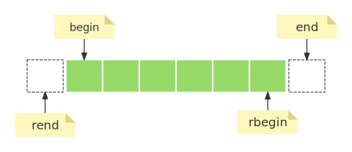

- [1. 迭代器分类](#1-迭代器分类)
- [2. 常规迭代器](#2-常规迭代器)
  - [2.1. 输入迭代器 InputIt](#21-输入迭代器-inputit)
  - [2.2. 输出迭代器 OutputIt](#22-输出迭代器-outputit)
  - [2.3. 前向迭代器 ForwardIt](#23-前向迭代器-forwardit)
  - [2.4. 双向迭代器 BidirIt](#24-双向迭代器-bidirit)
  - [2.5. 随机访问迭代器 RandomIt](#25-随机访问迭代器-randomit)
- [3. 特殊迭代器](#3-特殊迭代器)
  - [3.1. 插入迭代器](#31-插入迭代器)
    - [3.1.1. back\_insert\_iterator](#311-back_insert_iterator)
    - [3.1.2. front\_insert\_iterator](#312-front_insert_iterator)
    - [3.1.3. insert\_iterator](#313-insert_iterator)
    - [3.1.4. 为什么要引入插入“迭代器”](#314-为什么要引入插入迭代器)
  - [3.2. 流迭代器](#32-流迭代器)
    - [3.2.1. istream\_iterator](#321-istream_iterator)
    - [3.2.2. ostream\_iterator](#322-ostream_iterator)
    - [3.2.3. 流迭代器的开始与结束位置](#323-流迭代器的开始与结束位置)
  - [3.3. 反向迭代器](#33-反向迭代器)
  - [3.4. 移动迭代器](#34-移动迭代器)
- [4. 迭代器哨兵的概念](#4-迭代器哨兵的概念)


# 1. 迭代器分类
- **输入迭代器**&emsp;：&emsp;可读，可递增，典型应用为find算法。   
- **输出迭代器**&emsp;：&emsp;可写，可递增，典型用应用为copy算法。   
- **前向迭代器**&emsp;：&emsp;可读，可写，可递增，典型应用为算法如replace。     
- **双向迭代器**&emsp;：&emsp;可读，可写，可递增，可递减，典型应用为reverse算法。      
- **随机访问迭代器**&emsp;：&emsp;可读，可写，可递增一个整数(随机跳跃)，下标访问，迭代器距离，典型应用为sort算法。    

&emsp;&emsp;泛型算法可以根据迭代器类型的不同引入相应的优化。   
&emsp;&emsp;不管是哪一个类型，根源上，都是从同一个抽象基类型派生出来的。

# 2. 常规迭代器
## 2.1. 输入迭代器 InputIt
以std::find为例：   
```cpp
template< class InputIt, class T >
InputIt find( InputIt first, InputIt last, const T& value );
```
实现逻辑如下：  
```cpp
template<class InputIt, class T = typename std::iterator_traits<InputIt>::value_type>
constexpr InputIt find(InputIt first, InputIt last, const T& value)
{
    for (; first != last; ++first)
        if (*first == value)  // 只是访问，不改变
            return first;
 
    return last;
}
```

## 2.2. 输出迭代器 OutputIt
以std::copy为例：   
```cpp
template< class InputIt, class OutputIt >
OutputIt copy( InputIt first, InputIt last,
               OutputIt d_first );
```
实现逻辑如下：
```cpp
template<class InputIt, class OutputIt>
OutputIt copy(InputIt first, InputIt last, OutputIt d_first)
{   
    for (; first != last; (void)++first, (void)++d_first)
        *d_first = *first;  // 可以改变迭代器指向的对象的值
 
    return d_first;
}
```

## 2.3. 前向迭代器 ForwardIt   
```cpp
template< class ForwardIt, class T >
void replace( ForwardIt first, ForwardIt last,
              const T& old_value, const T& new_value );
```
实现案例如下： 
```cpp
template<class ForwardIt,
         class T = typename std::iterator_traits<ForwardIt>::value_type>
void replace(ForwardIt first, ForwardIt last, const T& old_value, const T& new_value)
{
    // 前向迭代器支持 “++” 操作
    for (; first != last; ++first)
        if (*first == old_value)
            *first = new_value;
}
```

## 2.4. 双向迭代器 BidirIt
```cpp
template< class BidirIt >
void reverse( BidirIt first, BidirIt last );
```
实现案例如下：  
```cpp
template<class BidirIt>
constexpr // since C++20
void reverse(BidirIt first, BidirIt last)
{
    // 翻转[frist, last)区间的元素。
    // 双向迭代器支持 “++”和“--”操作。     
    using iter_cat = typename std::iterator_traits<BidirIt>::iterator_category;

    // 进行条件编译
    if constexpr (std::is_base_of_v<std::random_access_iterator_tag, iter_cat>) // 判断iter_cat是否继承自std::random_access_iterator_tag
    {
        if (first == last)
            return;
 
        for (--last; first < last; (void)++first, --last)
            std::iter_swap(first, last);
    }
    else
        while (first != last && first != --last)
            std::iter_swap(first++, last);
}
```
&emsp;&emsp;上面代码涉及到std::random_access_iterator_tag类型，这里简单提一下，是 C++ 中用于标识随机访问迭代器的结构体，如果iter_cat是否继承自std::random_access_iterator_tag返回true,那么iter_cat就属于随机访问迭代器类型，随机访问迭代器支持“<”、“>”操作，算法根据迭代器类型不同来优化实现。   


## 2.5. 随机访问迭代器 RandomIt
&emsp;&emsp;随机访问迭代器支持的特性最多，可读，可写，可递增一个整数(随机跳跃)，下标访问，迭代器距离，支持<, <=, >, >=，但是不支持==。  
```cpp
template< class RandomIt >
void sort( RandomIt first, RandomIt last );
```
排序算法实现路线较多，不同的实现路线要求不同的访问元素的方式，所以就选用了随机访问迭代器。  


# 3. 特殊迭代器
- **插入迭代器** &emsp;：&emsp; insert_iterator、back_insert_iterator、front_insert_iterator。
- **流迭代器**  &emsp;：&emsp; istream_iterator、ostream_iterator。
- **反向迭代器**  &emsp;：&emsp; reverse_iterator。 
- **移动迭代器**  &emsp;：&emsp; move_iterator。     

## 3.1. 插入迭代器
insert_iterator、back_insert_iterator、front_insert_iterator是标准库提供的3个类模板。

### 3.1.1. back_insert_iterator
```cpp
template< class Container >
class back_insert_iterator;
```
&emsp;&emsp;构成函数：  
```cpp
constexpr explicit back_insert_iterator( Container& c );   // (since C++20)
```
&emsp;&emsp;使用容器来初始化back_insert_iterator迭代器，所以这个迭代器对象与一个容器关联，使用该迭代器的“=”运算符可以将元素插入到容器的尾部。使用示例：   
```cpp
#include <iostream>
#include <iterator>
#include <deque>

int main()
{
    std::deque<int> q;  
    std::back_insert_iterator<std::deque<int>> it(q);

    for(int i = 0; i < 10; i++)
        it = i;  // 将元素插入到容器的尾部, q.push_back(i);

    for (auto& elem : q) std::cout << elem << ' ';
    std::cout << '\n';
}
```
```cpp
#include <iostream>
#include <vector>
#include <algorithm>

int main()
{
    std::vector<int> v;
    std::fill_n(std::back_inserter_iterator(v), 10, 3);
    for (auto& elem : v) std::cout << elem << ' ';
}
// 输出： 
```
&emsp;&emsp;std::back_inserter_iterator也可以使用std::back_inserter替换，其实现逻辑如下：  
```cpp
template<class Container>
std::back_insert_iterator<Container> back_inserter(Container& c)
{
    return std::back_insert_iterator<Container>(c); // 返回一个back_insert_iterator迭代器
}
```
  
### 3.1.2. front_insert_iterator
&emsp;&emsp; 和back_insert_iterator类似， 容器必须支持push_front操作。当然C++也提供了std::front_insert操作来简化使用。   


### 3.1.3. insert_iterator
&emsp;&emsp; 更加一般化的插入迭代器。   
```cpp
template< class Container >
class insert_iterator;
```
&emsp;&emsp; 构造函数：   
```cpp
constexpr insert_iterator( Container& c, ranges::iterator_t<Container> i );
```
&emsp;&emsp; 这个insert_iterator在构造的时候需要一个容器和容器的迭代器，每一次使用“=”操作，实际上是调用容器的insert方法，每次插入操作都会调用容器的 insert 方法，在 i 所指向的位置插入元素（插入到i前面）。      
```cpp
#include <algorithm>
#include <iostream>
#include <iterator>
#include <list>
#include <vector>
 
int main()
{
    std::vector<int> v{1, 2, 3, 4, 5};
    std::list<int> l{-1, -2, -3};
    std::copy(v.begin(), v.end(), // may be simplified with std::inserter
              std::insert_iterator<std::list<int>>(l, std::next(l.begin()))); 
    for (int n : l)
        std::cout << n << ' ';
    std::cout << '\n';
}
```
&emsp;&emsp;这个insert_iterator也是有简化操作的： 
```cpp
// 返回一个insert_iterator迭代器。
template< class Container >
constexpr std::insert_iterator<Container>
    inserter( Container& c, ranges::iterator_t<Container> i );
```

### 3.1.4. 为什么要引入插入“迭代器”  
&emsp;&emsp;对容器进行写操作，我们必须保证目标容器有足够大的空间，如果不能够确保，那么就可以使用插入迭代器，通过push_back/push_front操作将元素插入到容器中，即使容器空间不够，也可以完成写操作。很显然，一个容器要想使用插入迭代器， 就必须支持push_back()/push_front方法。 


## 3.2. 流迭代器

### 3.2.1. istream_iterator
```cpp
template< class T,
          class CharT = char,
          class Traits = std::char_traits<CharT>,
          class Distance = std::ptrdiff_t >
class istream_iterator;
```
构造函数：  
```cpp
constexpr istream_iterator();
istream_iterator( istream_type& stream );  
istream_iterator( const istream_iterator& other ) = default;
```

&emsp;&emsp;除了参数T，其他带都有默认值。使用案例如下：  
```cpp  
#include <iostream>
#include <iterator>
#include <sstream>

int main()
{
    std::istringstream iss("1 2 3 4 5");
    std::istream_iterator<int> is(iss);   //使用构造函数istream_iterator( istream_type& stream ); 
    std::cout << *is << std::endl;
    ++is;
    std::cout << *is << std::endl;
    // 输出：
    // 1 
    // 2
}
```

### 3.2.2. ostream_iterator

```cpp
template< class T,
          class CharT = char,
          class Traits = std::char_traits<CharT> >
class ostream_iterator;
```

&emsp;&emsp;构造函数：   
```cpp
ostream_iterator( ostream_type& stream, const CharT* delim ); // delim 间隔符  	
ostream_iterator( ostream_type& stream );                     // 
```

&emsp;&emsp;使用示例：  
```cpp
#include <algorithm>
#include <iostream>
#include <iterator>
#include <numeric>
 
int main()
{
    std::ostream_iterator<char> oo{std::cout};        // 关联到 std::cout
    std::ostream_iterator<int> i1{std::cout, ", "};
    std::fill_n(i1, 5, -1);                           // -1, -1, -1, -1, -1,
    *oo++ = '\n';
 
    std::ostream_iterator<double> i2{std::cout, "; "};
    *i2++ = 3.14;
    *i2++ = 2.71;
    *oo++ = '\n';

    // 输出：
    // -1, -1, -1, -1, -1,
    // 3.14; 2.71;
}
```

### 3.2.3. 流迭代器的开始与结束位置
```cpp

#include <algorithm>
#include <iostream>
#include <iterator>
#include <sstream>
 
int main()
{
    std::istringstream stream("1 2 3 4 5");
    std::copy(
        std::istream_iterator<int>(stream),
        std::istream_iterator<int>(),
        std::ostream_iterator<int>(std::cout, " ")
    );
}
```

```cpp
#include <iostream>
#include <iterator>
#include <sstream>

int main()
{
    std::istringstream iss("1 2 3 4 5");
    std::istream_iterator<int> x(iss);  // 相当于开始位置
    std::istream_iterator<int> y{};     // 相当于结束位置    
    std::cout << *is << std::endl;
    for (; x != y; ++x)
    {
        std::cout << *x << std::endl;
    }
}
```

```cpp
#include <iostream>
#include <iterator>
#include <sstream>

int main()
{
    std::istringstream iss("1 2 3 4 5");
    std::istream_iterator<int> x(iss);  
    std::istream_iterator<int> y{};     
    int res=std::accumulate(x, y, 0);   
    std::cout << res << std::endl;   
}
```

## 3.3. 反向迭代器
&emsp;&emsp;就是rbegin和rend。   
  
&emsp;&emsp;从图中可以看到，迭代器区间是一个左闭右开区间，所以尾迭代器指向的是最后一个元素的下一个位置。   


## 3.4. 移动迭代器
```cpp
template< class Iter >
class move_iterator;
```
&emsp;&emsp;使用案例：   
```cpp
#include <algorithm>
#include <iomanip>
#include <iostream>
#include <iterator>
#include <ranges>
#include <string>
#include <string_view>
#include <vector>
 
void print(const std::string_view rem, const auto& v)
{
    std::cout << rem;
    for (const auto& s : v)
        std::cout << std::quoted(s) << ' ';
    std::cout << '\n';
};
 
int main()
{
    std::vector<std::string> v{"this", "_", "is", "_", "an", "_", "example"};
    print("Old contents of the vector: ", v);

    std::string concat;
    for (auto begin = std::make_move_iterator(v.begin()),
              end = std::make_move_iterator(v.end());
         begin != end; ++begin)
    {
        std::string temp{*begin}; // moves the contents of *begin to temp
        concat += temp;
    }
 
    // Starting from C++17, which introduced class template argument deduction,
    // the constructor of std::move_iterator can be used directly:
    // std::string concat = std::accumulate(std::move_iterator(v.begin()),
    //                                      std::move_iterator(v.end()),
    //                                      std::string());
 
    print("New contents of the vector: ", v);
    print("Concatenated as string: ", std::ranges::single_view(concat));
}
```
&emsp;&emsp;输出：  
```bash
Old contents of the vector: "this" "_" "is" "_" "an" "_" "example"
New contents of the vector: "" "" "" "" "" "" ""
Concatenated as string: "this_is_an_example"
```
&emsp;&emsp;移动迭代器的主要作用是移动迭代器所迭代的元素，也就是说我们通过移动迭代器读取元素后，该元素的值就会被移动走了(std::move)，再次访问就是空的，请看如下代码：   
```cpp
int main()
{
    std::string str = "this is an example";
    auto y = std::move(str);
    std::cout << x << std::endl;  // x置为空
    std::cout << y << std::endl;  // y正常输出: this is an example
}
```


#  4. 迭代器哨兵的概念
&emsp;&emsp;对于一个迭代器区间: first,last，first不断++，直到first == last，我们就认为到达迭代器结尾了，那么last就是一个哨兵，first和哨兵不一定是一个类型，但是一定能够进行“==”运算。     


 
