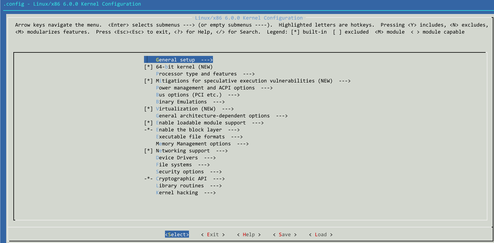

# 1. 内核中的Makefile、Kconfig、config

1. **Makefile**：编译源文件的方法。  
2. **Kconfig**：内核的配置菜单。  
3. **.config**：根据配置菜单生成的配置，根据该配置编译内核。  

# 2. Makefile
内核中的Makefile中有三种编译规则：   
1. 编译进入内核。   
```make
obj-y += xxx/                 # 进入子Makefile
```   
```make
obj-y += xxx.o
```

2. 根据.config决定是否编译进入内核。  
```make
obj-$(CONFIG_XXX) += xxx/               # 进入子Makefile
```   
```make
obj-$(CONFIG_XXX) += xxx.o
```

3. 编译为模块
执行make modules时被编译
```make
obj-m += xxx.o
```
# 3. Kconfig
执行make menuconfig时会展示一个菜单，就是Kconfig的功劳。
1. **linux-6.0**目录下的Kconfig:  
```bash
# SPDX-License-Identifier: GPL-2.0
#
# For a description of the syntax of this configuration file,
# see Documentation/kbuild/kconfig-language.rst.
#
mainmenu "Linux/$(ARCH) $(KERNELVERSION) Kernel Configuration"

source "scripts/Kconfig.include"
# ...... 表示省略一堆代码
# ......

source "drivers/Kconfig"
# ......
# ......

source "Documentation/Kconfig"
```

2. **linux-6.0/drivers**目录下的Kconfig:    
```bash
# SPDX-License-Identifier: GPL-2.0
menu "Device Drivers"

# Keep I/O buses first

# ......
# ......

source "drivers/video/Kconfig"
## ......
## ......

```
3. **linux-6.0/drivers/video**目录下的Kconfig:
```bash
# SPDX-License-Identifier: GPL-2.0-only
#
# Video configuration
#

menu "Graphics support"

# ......  
# ......

source "drivers/gpu/drm/Kconfig"
# ......
# ......

endmenu
```
4. **linux-6.0/drivers/gpu/drm**目录下的Kconfig:  
```bash
# ......
# ......
source "drivers/gpu/drm/display/Kconfig"

# ......
#......

source "drivers/gpu/drm/amd/amdgpu/Kconfig"
source "drivers/gpu/drm/nouveau/Kconfig"
source "drivers/gpu/drm/i915/Kconfig"
source "drivers/gpu/drm/rockchip/Kconfig"

source "drivers/gpu/drm/qxl/Kconfig"
source "drivers/gpu/drm/virtio/Kconfig"

source "drivers/gpu/drm/xen/Kconfig"
source "drivers/gpu/drm/vboxvideo/Kconfig"

```
5. **drivers/gpu/drm/qxl/Kconfig**: 
```bash
# SPDX-License-Identifier: GPL-2.0-only
config DRM_QXL
        tristate "QXL virtual GPU"
        depends on DRM && PCI && MMU
        select DRM_KMS_HELPER
        select DRM_TTM
        select DRM_TTM_HELPER
        select CRC32
        help
          QXL virtual GPU for Spice virtualization desktop integration.
          Do not enable this driver unless your distro ships a corresponding
          X.org QXL driver that can handle kernel modesetting.                                                              
```
下面详细分析一下这个Kconfig文件的内。

## 3.1. Kconfig文件内容分析
**第1行**
```
# SPDX-License-Identifier: GPL-2.0-only
```
声明此文件的许可证为 GPL-2.0-only（GNU通用公共许可证第2版，仅限此版本）。这是一个开源许可证，表示任何人可以自由使用、修改和分发此代码，但必须保留相同的许可证条款。only 表示只能使用 GPL-2.0，不能升级到更新的版本（如 GPL-3.0）。    
**第2行**
```
config DRM_QXL # 使用config关键字定义一个选项
```
定义了一个选项，省略了CONFIG_，全称是CONFIG_DRM_QXL，在对应的Makefile文件中使用。如下：   
`drivers/gpu/drm/Makefile`
```make
obj-$(CONFIG_DRM_QXL) += qxl/
```
`drivers/gpu/drm/qxl/Makefile`
```make
obj-$(CONFIG_DRM_QXL)+= qxl.o
```
**第3行**
```
tristate "QXL virtual GPU"
```
声明 DRM_QXL 是一个 三态选项（tristate），可选值为 Y（内置）、M（模块）、N（禁用），并为其添加描述文本 "QXL virtual GPU"。
Y（Yes）：驱动直接编译进内核。   
M（Module）：驱动编译为可加载的内核模块（.ko 文件）。   
N（No）：不编译此驱动。   

**第4行**
```
depends on DRM && PCI && MMU
```
指定 DRM_QXL 的依赖条件，只有当 DRM、PCI 和 MMU 都被启用时，DRM_QXL 才能被选择。

**第5~8行**
```
        select DRM_KMS_HELPER
        select DRM_TTM
        select DRM_TTM_HELPER
        select CRC32
```
反向依赖关系，该选项选中时，同时选中select后面定义的那一项。。

**第9~13行**
```
        help
          QXL virtual GPU for Spice virtualization desktop integration.
          Do not enable this driver unless your distro ships a corresponding
          X.org QXL driver that can handle kernel modesetting.
```
为 DRM_QXL 提供帮助信息，在配置工具中按 ? 可以查看。

# 4. .config文件
使用make menuconfig生成的配置文件。

# 5. make menuconfig
运行make menuconfig命令，会显示一个配置菜单:  
  
使用“上”“下”方向键选择选项，使用“空格”键选择或取消选择选项，使用“Enter”键进入子菜单。使用“左”“右”保存、后退、加载已有的.config文件。配置完后保存为.config文件，然后运行**make**命令进行开始编译。