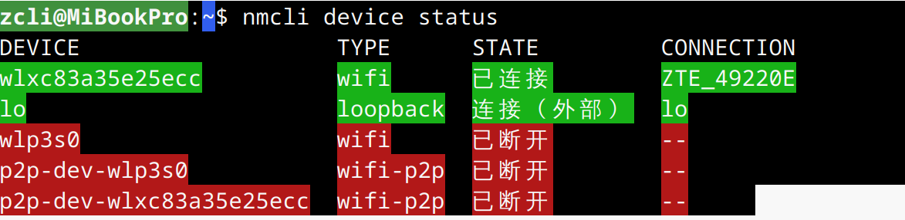
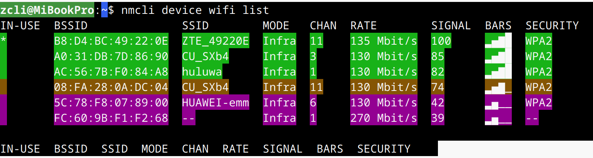
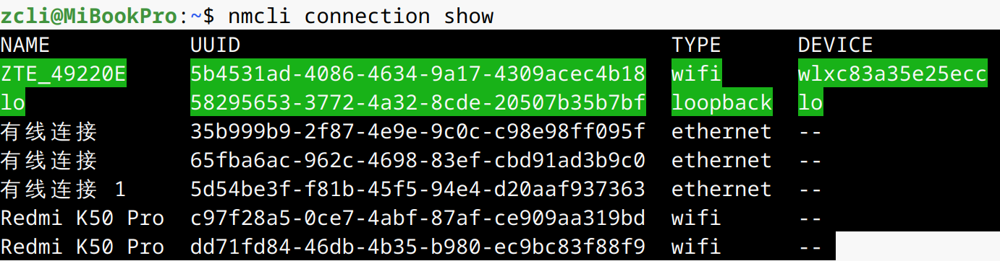

# 1. Network-Manager网络管理工具
在Debian系统中，NetworkManager（NM） 是一个功能强大的网络管理工具，支持有线、无线、VPN、代理等多种网络连接方式。  

## 1.1. 安装NetworkManager
```bash
sudo apt install network-manager
```
## 1.2. 启动并启用 NetworkManager 服务
```bash
sudo systemctl start NetworkManager
sudo systemctl enable NetworkManager
```
检查服务运行状态：  
```bash
sudo systemctl status NetworkManager
```

## 1.3. 配置NetworkManager
默认情况下，NetworkManager 可能不会管理某些接口（如以太网或无线接口）。需要修改配置文件以确保接口由 NetworkManager 管理。  
`修改 /etc/NetworkManager/NetworkManager.conf`:       
```
[main]
plugins=ifupdown,keyfile

[ifupdown]
managed=true
```
managed=true 表示 NetworkManager 会接管所有接口的配置。   
managed=false 表示 NetworkManager 不会管理接口（默认值）。   

`修改完成后，重启 NetworkManager 服务`：     
```bash
sudo systemctl restart NetworkManager
```

## 1.4. 使用 nmcli 命令行工具管理网络
nmcli 是 NetworkManager 的命令行工具，用于管理网络连接。      
`(1) 查看网络设备状态`   
```bash
nmcli device status
```
命令输出(CONNECTION 列显示当前使用的连接配置)：   



`(2) 扫描并列出可用的 WiFi 网络`   
```bash
nmcli device wifi list   
```
命令输出(IN-USE 标记 * 表示当前已连接的网络)：   



`(3) 连接 WiFi 网络`  
```bash
nmcli device wifi connect "SSID名称" password "WiFi密码"
```

`(4) 查看已保存的连接`   
```bash
nmcli connection show
```
  


`(5) 修改密码`   
```bash
nmcli connection modify "MyWiFi" wifi-sec.psk "新密码"  
```

`(6) 删除连接`   
```bash
nmcli connection delete "MyWiFi"
```

## 1.5. nmcli其他用法
nmcli还可以用于配置静态IP、配置代理服务器、配置多网卡（同时使用两个网卡，分别连接不同网络）等等，用到的时候再记录。  