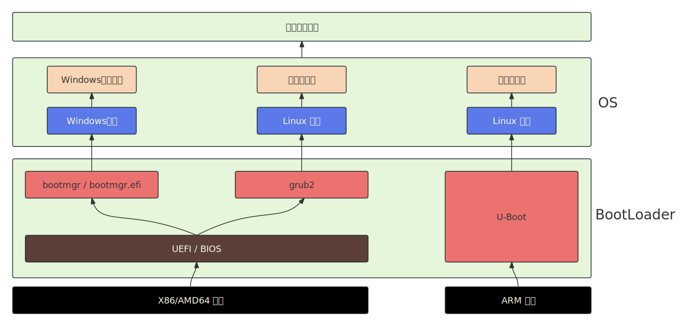
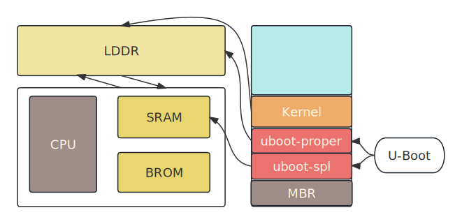

# 1. BootLoader
Bootloader是操作系统的“引导程序”以及“引导管理程序”，操作系统的启动流程可以简单理解为：  
**[上电]** --> **[UEFI]** --> **[bootloader]** --> **[内核]** 。  
显然，Bootloader的作用就是将内核加载到内存中，然后由于内核来加载操作系统的其他组件/服务，如文件系统，文件管理器，图形界面等。在linux生态中，常见的Bootloader有两种，Grub(用于X86架构)，U-Boot(用于ARM架构)。其中`引导`就是进行一些硬件的检测、初始化的任务，然后将内核加载到内存中来启动内核，`引导管理`就是当有多个内核时，在屏幕上显示一个菜单让用户选择要启动的哪个内核。


# 2. Grub
`grub程序保存在那里？`  
grub程序保存在EFI分区中，EFI分区挂在于位于/boot/efi目录下。  
`grub配置文件保存在那里？`  
1. /boot/grub/grub.cfg文件，定义了grub是如何引导内核的。
2. /etc/default/grub文件，定义grub全局行为和启动参数，然后生成/boot/grub/grub.cfg文件，下面讲解以下该配置文件的内容：  
```bash
GRUB_TIMEOUT=5                # 启动菜单的超时时间，超时后启动默认内核,-1表示无限等待。
GRUB_TIMEOUT_STYLE=menu        # 启动菜单的样式，menu表示菜单样式，hidden表示隐藏菜单。
GRUB_DISTRIBUTOR="$(sed 's, release .*$,,g' /etc/system-release)"   # 动态提取发行版名称
GRUB_DEFAULT=saved             # 默认启动项由上一次保存的选择决定
GRUB_DISABLE_SUBMENU=true       # 禁用子菜单，所有内核和启动项直接显示在主菜单中。若设为 false，旧内核会折叠到“Advanced options”子菜单下。
GRUB_TERMINAL_OUTPUT="console"   # 强制GRUB仅使用文本控制台输出，禁用图形化终端（如gfxterm）。
GRUB_CMDLINE_LINUX="rhgb quiet"  # rhgb：启用Plymouth图形启动动画（常见于RHEL/CentOS/Fedora）。quiet：隐藏内核启动日志，仅显示简要信息。
GRUB_DISABLE_RECOVERY="true"   # 禁止恢复模式（Recovery Mode）的启动项。
GRUB_ENABLE_BLSCFG=true      # 启用 Boot Loader Specification (BLS) 配置，取代传统的grub.cfg生成方式。
```

# 3. U-Boot
1. XIP设备  
非XIP设备中存储的代码需要从存储设备中加载到内存中，然后才能执行，而XIP存储设备中的代码可以直接执行，XIP设备有SRAM、BROM等等，非XIP设备有EMMC、NANDFLASH、SD卡等等。  
2. ARM-Linux启动流程  
U-Boot一般分为两个阶段，uboot-SPL和uboo-proper，CPU上电首先执行BROM中的程序(由芯片厂写入)，该程序会根据芯片的引脚电平或者寄存器配置确定启动模式(从那个设备启动系统)，例如系统安装在SD卡，BROM中的程序会初始化SD卡，然后拷贝uboot-spl到SRAM中，开始执行uboot-spl中的程序，uboot-spl程序会初始化LDDR内存、pll、gpio等等硬件，然后从SD卡中加载uboot-proper到LDDR中，并跳转到程序的入口地址执行uboot-proper程序。uboot还会初始化一些其他设备，例如网卡等，然后从SD卡中加载内核文件。  
  
`参考`:  
https://linux-sunxi.org/Bootable_SD_card#SD_Card_Layout     


# 4. 修改Grub配置
GRUB配置文件： `/boot/grub2/grub.cfg`，但是该配置文件是生成的，不可直接手动修改，我们通过修改`/etc/default/grub`文件和`/etc/grub.d/`目录下的配置文件生成的。    

## 4.1. Fedora系统
修改`/etc/default/grub`文件，然后执行`sudo grub2-mkconfig -o /boot/grub2/grub.cfg`命令来生成新的`/boot/grub2/grub.cfg`文件。

## 4.2. Debian系统
修改`/etc/default/grub`文件，然后执行`sudo update-grub`命令来生成新的`/boot/grub/grub.cfg`文件。

# 5. 查看Grub配置信息
## 5.1. Fedora系统
### 5.1.1. grubby命令
1. 查看默认引导项 

```bash
sudo grubby --info=DEFAULT
```

2. 列出所有引导项
```bash
sudo grubby --info=ALL
```

3. 列出所有引导项的索引
```bash
sudo grubby --info=0  # 0是引导项的索引，使用sudo grubby --info=ALL命令查看
```
## 5.2. Debian系统
使用grep命令查看即可。