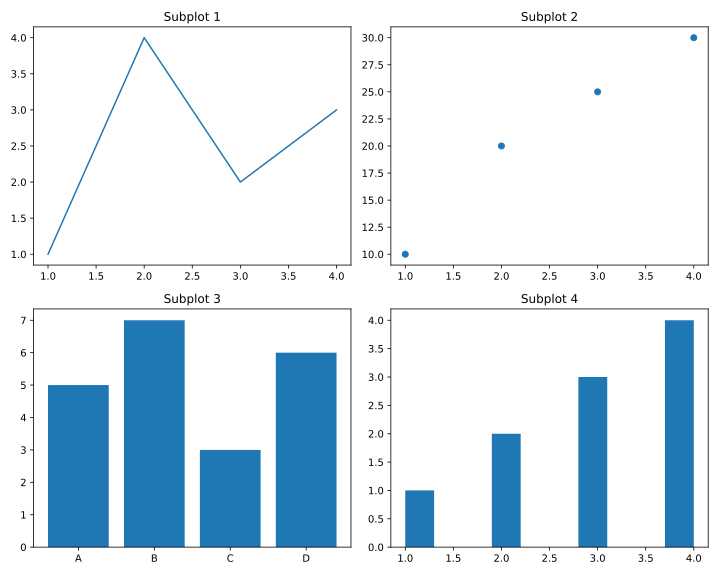
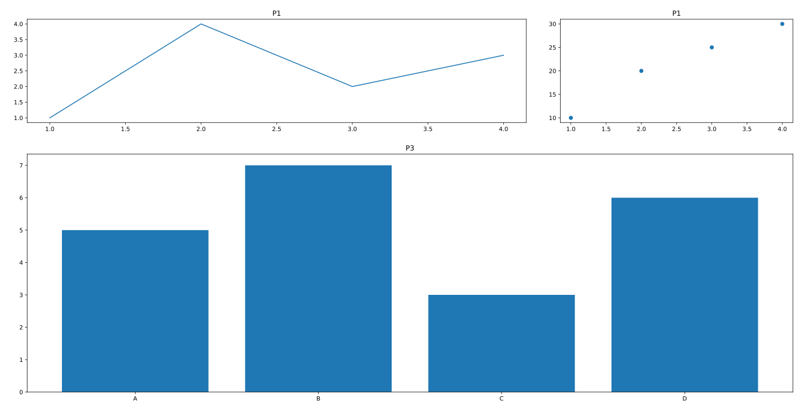

- [1. 创建画布](#1-创建画布)
- [2. 多个子图](#2-多个子图)
  - [2.1. 一行多列](#21-一行多列)
  - [2.1.1. 多行多列](#211-多行多列)
  - [2.1.2. 自定义子图大小](#212-自定义子图大小)


# 1. 创建画布
```python
import matplotlib.pyplot as plt

# 创建画布
# 返回一个Figure对象和一个Axes对象；
# Figure对象表示整个画布，Axes对象表示坐标系。
fig, ax = plt.subplots(figsize=(6, 6))
```

# 2. 多个子图
## 2.1. 一行多列 
```python
import matplotlib.pyplot as plt

fig, axs = plt.subplots(1, 2, figsize=(10, 6))

# 子图：  axs[i]
axs[0].set_title('P1')
axs[1].set_title('P2')

# 自动调整子图参数以填充整个区域
plt.tight_layout()
plt.show()
```


## 2.1.1. 多行多列
```python
import matplotlib.pyplot as plt

fig, axs = plt.subplots(2, 2, figsize=(10, 6))


# 子图：  axs[i, j]
axs[0,0].set_title('P1')
axs[0,1].set_title('P2')
axs[1,0].set_title('P3')
axs[1,1].set_title('P4')


plt.tight_layout()
plt.show()
```


**Demo:**
```python
import matplotlib.pyplot as plt

fig, axs = plt.subplots(2, 2, figsize=(10, 8))

# 绘制每个子图的内容
axs[0, 0].set_title('Subplot 1')
axs[0, 1].set_title('Subplot 2')
axs[1, 0].set_title('Subplot 3')
axs[1, 1].set_title('Subplot 4')


axs[0, 0].plot([1, 2, 3, 4], [1, 4, 2, 3])
axs[0, 1].scatter([1, 2, 3, 4], [10, 20, 25, 30])
axs[1, 0].bar(['A', 'B', 'C', 'D'], [5, 7, 3, 6])
axs[1, 1].hist([1, 2, 2, 3, 3, 3, 4, 4, 4, 4])


plt.tight_layout()
plt.show()
```



## 2.1.2. 自定义子图大小
```python
import matplotlib.pyplot as plt
import matplotlib.gridspec as gridspec

fig = plt.figure(figsize=(10, 8))
# 将画布划分为3行3列的子图网格结构
gs = gridspec.GridSpec(3, 3)

# 我们在第一行放置两个子图，前两列放置一个子图，最后一列放置一个子图
# 第二行和第三行的所有列放置一个子图


ax1 = fig.add_subplot(gs[0, :2]) # 第一行，前两列
ax2 = fig.add_subplot(gs[0, 2])  # 第一行，最后一列
ax3 = fig.add_subplot(gs[1:, :]) # 第二、三行，所有列

ax1.set_title('P1')
ax2.set_title('P1')
ax3.set_title('P3')


# 绘图
ax1.plot([1, 2, 3, 4], [1, 4, 2, 3])
ax2.scatter([1, 2, 3, 4], [10, 20, 25, 30])
ax3.bar(['A', 'B', 'C', 'D'], [5, 7, 3, 6])


plt.tight_layout()
plt.show()
```

