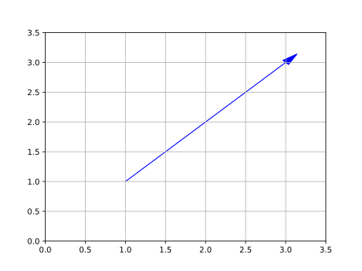

- [1. arrow函数](#1-arrow函数)


# 1. arrow函数
Matplotlib库给pyplot封装了一个arrow函数，用于绘制带有箭头的线段。
```python
# (x,y) 表示向量向量的起点。  
# (x+dx,y+dy) 表示向量的终点, 也就是箭头的位置。
# gca()， 获取当前坐标系（Axes对象）
# 返回一个FancyArrow对象
def arrow(x: float, y: float, dx: float, dy: float, **kwargs) -> FancyArrow:
    return gca().arrow(x, y, dx, dy, **kwargs)
```
**Demo:**  
```python
import matplotlib.pyplot as plt

# 向量
plt.arrow(2, 1, 1, 2, head_width=0.1, head_length=0.2, fc='blue', ec='blue')

# 设置坐标范围
plt.xlim(0, 5)
plt.ylim(0, 5)
plt.grid()
plt.show()
```
  
