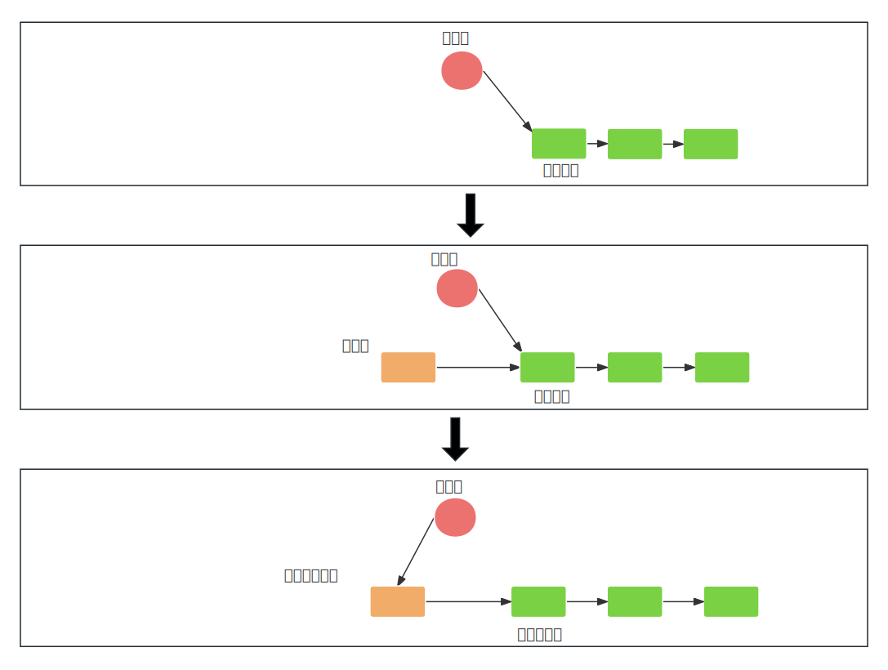
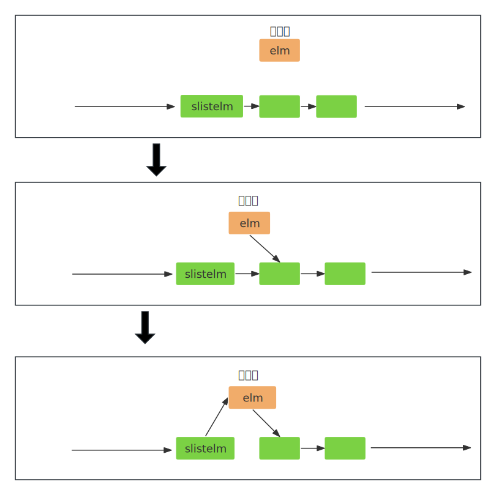
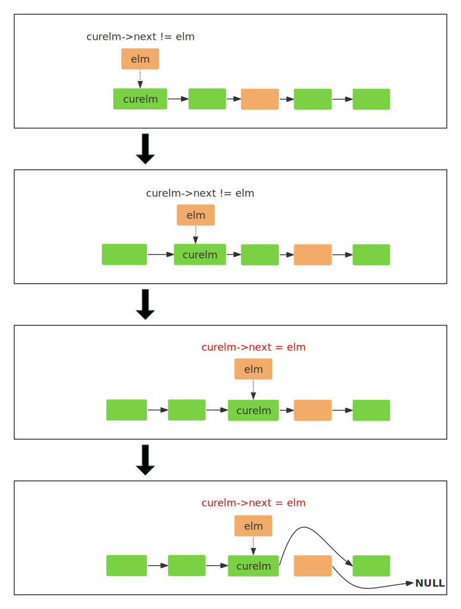

- [1. 单向链表](#1-单向链表)
  - [1.1. 定义](#11-定义)
  - [1.2. 使用案例](#12-使用案例)
- [2. 访问链表的宏](#2-访问链表的宏)
- [3. 操作链表的宏](#3-操作链表的宏)
  - [3.1. 插入节点](#31-插入节点)
    - [3.1.1. 从头部插入节点](#311-从头部插入节点)
    - [3.1.2. 在指定元素后插入节点](#312-在指定元素后插入节点)
    - [3.1.3. 线程安全的头部插入](#313-线程安全的头部插入)
  - [3.2. 遍历链表](#32-遍历链表)
    - [3.2.1. QSLIST\_FOREACH](#321-qslist_foreach)
    - [3.2.2. QSLIST\_FOREACH\_SAFE](#322-qslist_foreach_safe)
  - [3.3. 移除节点](#33-移除节点)
    - [3.3.1. 移除首元节点](#331-移除首元节点)
    - [3.3.2. 移除指定节点](#332-移除指定节点)


# 1. 单向链表

## 1.1. 定义

```c
// qemu-8.2.2/include/qemu/queue.h


// 链表头 
#define QSLIST_HEAD(name, type)                                         \
struct name {                                                           \
        struct type *slh_first;                                         \
}

// 链表初始化
#define QSLIST_HEAD_INITIALIZER(head)                                   \
        { NULL }


// 链表连接域，指向下一个节点
#define QSLIST_ENTRY(type)                                              \
struct {                                                                \
        struct type *sle_next;                                          \
}
```
链表初始化：  
```c
#define QSLIST_INIT(head) do {                                           \
        (head)->slh_first = NULL;                                       \
} while (/*CONSTCOND*/0)
```

## 1.2. 使用案例
&emsp;&emsp;以如下节点类型为例(qemu-8.2.2/target/arm/kvm.c)：   
```c
typedef struct KVMDevice {
    struct kvm_arm_device_addr kda;
    struct kvm_device_attr kdattr;
    uint64_t kda_addr_ormask;
    MemoryRegion *mr;
    QSLIST_ENTRY(KVMDevice) entries;  // 链表节点连接域
    int dev_fd;
} KVMDevice;
```


&emsp;&emsp;**创建链表头：**  
```c
static QSLIST_HEAD(, KVMDevice) kvm_devices_head;
```
宏替换后就是：   
```c
struct {
        struct KVMDevice *slh_first;
} kvm_devices_head;
```


&emsp;&emsp;**插入节点：**   
```c
void kvm_arm_register_device(MemoryRegion *mr, uint64_t devid, uint64_t group,
                             uint64_t attr, int dev_fd, uint64_t addr_ormask)
{
    KVMDevice *kd;

    if (!kvm_irqchip_in_kernel()) {
        return;
    }

    // 链表是否为空：QSLIST_EMPTY(head) 
    if (QSLIST_EMPTY(&kvm_devices_head)) {
        memory_listener_register(&devlistener, &address_space_memory);
        qemu_add_machine_init_done_notifier(&notify);
    }
    kd = g_new0(KVMDevice, 1);
    kd->mr = mr;
    kd->kda.id = devid;
    kd->kda.addr = -1;
    kd->kdattr.flags = 0;
    kd->kdattr.group = group;
    kd->kdattr.attr = attr;
    kd->dev_fd = dev_fd;
    kd->kda_addr_ormask = addr_ormask;
    QSLIST_INSERT_HEAD(&kvm_devices_head, kd, entries);  // 在头部插入节点
    memory_region_ref(kd->mr);
}
```


# 2. 访问链表的宏
```c
#define QSLIST_EMPTY(head)       ((head)->slh_first == NULL)
#define QSLIST_FIRST(head)       ((head)->slh_first)
#define QSLIST_NEXT(elm, field)  ((elm)->field.sle_next)
```

# 3. 操作链表的宏

## 3.1. 插入节点
### 3.1.1. 从头部插入节点
```c
#define QSLIST_INSERT_HEAD(head, elm, field) do {                        \
        (elm)->field.sle_next = (head)->slh_first;                       \
        (head)->slh_first = (elm);                                       \
} while (/*CONSTCOND*/0)
```
- head: &emsp;链表头。   
- ele: &emsp;要插入的节点。   
- field: &emsp;链表节点的连接域，就是使用宏`QSLIST_ENTRY(type)`创建的字段。  
   

### 3.1.2. 在指定元素后插入节点
```c
#define QSLIST_INSERT_AFTER(slistelm, elm, field) do {                   \
        (elm)->field.sle_next = (slistelm)->field.sle_next;             \
        (slistelm)->field.sle_next = (elm);                             \
} while (/*CONSTCOND*/0)
```


### 3.1.3. 线程安全的头部插入
```c
#define QSLIST_INSERT_HEAD_ATOMIC(head, elm, field) do {                     \
        typeof(elm) save_sle_next;                                           \
        do {                                                                 \
            save_sle_next = (elm)->field.sle_next = (head)->slh_first;       \
        } while (qatomic_cmpxchg(&(head)->slh_first, save_sle_next, (elm)) !=\
                 save_sle_next);                                             \
} while (/*CONSTCOND*/0)
```
&emsp;&emsp;`qatomic_cmpxchg`是Qemu中实现的一个`原子比较交换操作`，基于硬件原子操作特性，在多线程环境下安全地修改共享数据，无需使用锁，多用于内核场景。
```c
/*
 * 将(head)->slh_first和save_sle_next比较，
 * 如果相同就将(head)->slh_first更新为elm，并返回save_sle_next，
 * 如果不同就返回(head)->slh_first。
 */ 
qatomic_cmpxchg(&(head)->slh_first, save_sle_next, (elm))
```
插入的过程和QSLIST_INSERT_HEAD是一样的。  


## 3.2. 遍历链表
### 3.2.1. QSLIST_FOREACH
&emsp;&emsp;不需要删除节点时使用。   
```c
#define QSLIST_FOREACH(var, head, field)                                 \
        for((var) = (head)->slh_first; (var); (var) = (var)->field.sle_next)
```
&emsp;&emsp;宏`QSLIST_FOREACH(var, head, field)`声明了for循环的for(; ; ;)部分。使用示例如下：   
```c
static void kvm_arm_devlistener_add(MemoryListener *listener,
                                    MemoryRegionSection *section)
{
    KVMDevice *kd;

    QSLIST_FOREACH(kd, &kvm_devices_head, entries) {
        if (section->mr == kd->mr) {
            kd->kda.addr = section->offset_within_address_space;
        }
    }
}
```
宏替换后：   
```c
    QSLIST_FOREACH(kd, &kvm_devices_head, entries) 
    for((kd) = (&kvm_devices_head)->slh_first; (kd); (kd) = (kd)->entries.sle_next)
    {
        if (section->mr == kd->mr) {
            kd->kda.addr = section->offset_within_address_space;
        }
    }
```

### 3.2.2. QSLIST_FOREACH_SAFE
&emsp;&emsp;需要删除节点时使用，提供一种安全遍历单向链表的方法，常见于内核中。    
```c
#define QSLIST_FOREACH_SAFE(var, head, field, tvar)                      \
        for ((var) = QSLIST_FIRST((head));                               \
            (var) && ((tvar) = QSLIST_NEXT((var), field), 1);            \
            (var) = (tvar))
```
- 使用tvar保存下一个节点，允许在遍历过程中安全地删除当前节点，而不会破坏遍历过程。
- (<expression>, 1)，使得表达式始终返回的1。   


&emsp;&emsp;使用案例：   
```c
static void kvm_arm_machine_init_done(Notifier *notifier, void *data)
{
    KVMDevice *kd, *tkd;

    // 遍历kvm_devices_head链表
    QSLIST_FOREACH_SAFE(kd, &kvm_devices_head, entries, tkd) {
        if (kd->kda.addr != -1) {
            kvm_arm_set_device_addr(kd);
        }
        memory_region_unref(kd->mr);
        QSLIST_REMOVE_HEAD(&kvm_devices_head, entries);  // 从链表中移除当前头节点
        g_free(kd);                                      // 释放节点内存
    }
    memory_listener_unregister(&devlistener);
}
```

## 3.3. 移除节点
### 3.3.1. 移除首元节点
```c
#define QSLIST_REMOVE_HEAD(head, field) do {                             \
        typeof((head)->slh_first) elm = (head)->slh_first;               \
        (head)->slh_first = elm->field.sle_next;                         \
        elm->field.sle_next = NULL;                                      \
} while (/*CONSTCOND*/0)
```
只是从链表中移除当前头节点，需要另外执行内存的销毁，可以参考QSLIST_FOREACH_SAFE的使用案例。    

### 3.3.2. 移除指定节点
```c
#define QSLIST_REMOVE(head, elm, type, field) do {                      \
    if ((head)->slh_first == (elm)) {                                   \
        QSLIST_REMOVE_HEAD((head), field);                              \
    } else {                                                            \
        struct type *curelm = (head)->slh_first;                        \
        while (curelm->field.sle_next != (elm))                         \
            curelm = curelm->field.sle_next;                            \
        curelm->field.sle_next = curelm->field.sle_next->field.sle_next; \
        (elm)->field.sle_next = NULL;                                   \
    }                                                                   \
} while (/*CONSTCOND*/0)
```
&emsp;&emsp;elm就是要删除的节点，整体上是一个if-else语句，if部分判断这个节点是否是首元节点，如果是就删除该元素，如果不是就是进入else部分，这部分对链表进行遍历，直到找到一个节点，且该节点的Next就是elm，则从队列中移除该节点的Next节点，过程如下：   



