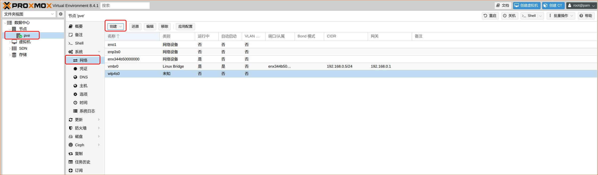
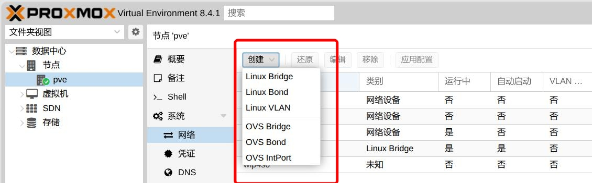
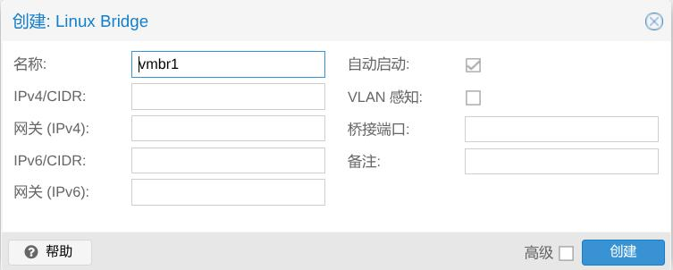
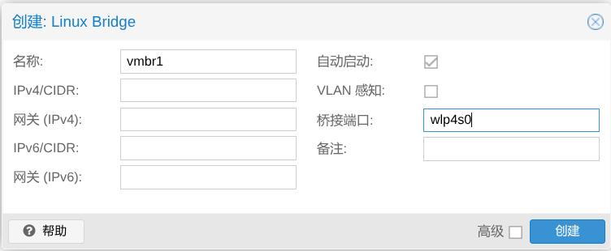
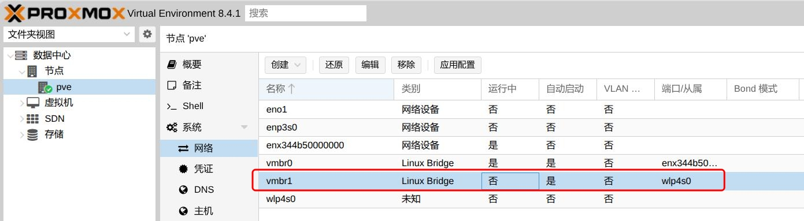
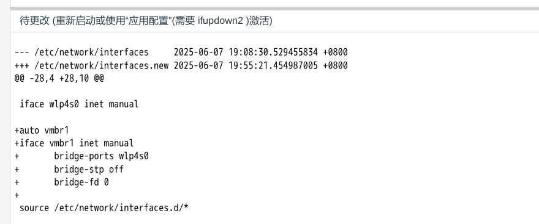
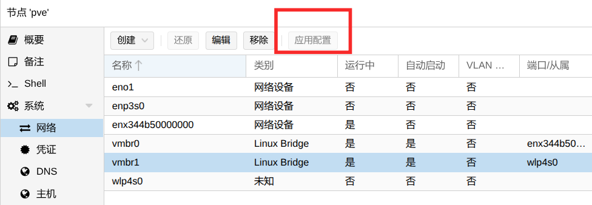
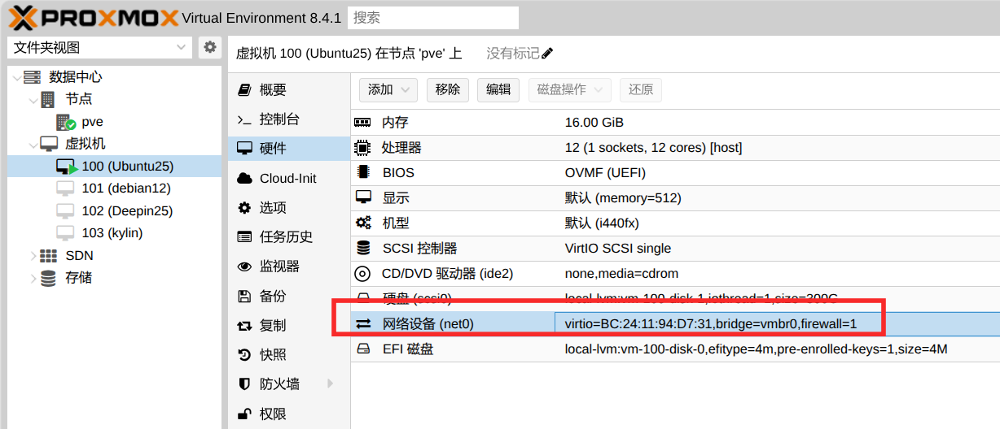

# 1. Pve桥接网络
如果是在`文件夹视图`下可以： `节点` -> `选择一个节点` -> `系统` -> `网络` -> `创建`    
   
               

# 2. 创建桥接网络
第一步： 选择 `Linux Bridge`      
    
第二步： `桥接端口` 必须填写，其他的根据实际网络配置填写：    
    
第三步： 配置结果如下：    
 

# 3. 创建成功后的配置
   
   
注意图片中的提示： `待更改（重新启动或使用"使用应用配置"（需要ifupdown2）激活）  `，可以重启，也可以点击 `应用配置`：   
   

# 4. 客户机网络配置
连接客户机网卡到桥接网络：   

创建好桥接网络后，并将客户机绑定到该网络后，还需要在客户机中手动配置静态ip后才能访问网络。  

